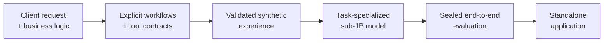

# MiniAgent

MiniAgent is a recipe for building your own policy-following agent with a
sub-1B model. A coding agent can drive the complete lifecycle: workflow and
tool design, synthetic data generation, training, evaluation, runtime
implementation, and deployment.



## Why MiniAgent

- **Specialized performance.** A sub-1B policy can outperform tested frontier
  systems on its defined workflow while responding faster.
- **Client-owned business logic.** A coding agent compiles the client's rules
  into policies governing when the application asks questions, acts, branches,
  completes, and refuses.
- **Bounded actions.** Typed schemas and a dispatch allowlist connect the model
  to the exact business capabilities it needs.
- **Synthetic experience.** Workflow routes and deterministic tool evidence
  produce validated training conversations without per-example human labels.
- **Complete-task evaluation.** Sealed cases score the full sequence of
  questions, tool calls, result-dependent branches, and final completion.
- **Small-model deployment.** The selected policy is packaged with its runtime
  and supports local, CPU, edge, and GPU-backed deployments.
- **Coding-agent operation.** Explicit artifacts, commands, and gates let a
  coding agent build and reproduce the application end to end.

## Example application: CN Travel

CN Travel trained two small language models—Qwen3.5-0.8B and LFM2.5-350M—with
LoRA to answer travel questions and call tools according to the client's
business rules. The application defines five workflows and 24 routes,
generates synthetic training data, trains specialist policies, and evaluates
them on a sealed 101-case suite.

[CN Travel README](apps/cn_travel/README_CN%20TRAVEL.md) ·
[Project directory](apps/cn_travel/)

The trained 0.8B agent achieved the highest exact workflow-trace score, with a
median latency of 1.13 seconds versus 20.02 seconds for the strongest tested GPT
system. Every leaderboard row uses the same sealed cases and scorer. Local
policies use native vLLM tool calling; cloud systems use their CLI tool-call
channels, so the table compares complete agent systems on this application.

Current top 10, ranked by exact trace:

| Rank | System                                   |     Exact trace | Tool-call match |       Latency p50 / p95 |
| ---: | ---------------------------------------- | --------------: | --------------: | ----------------------: |
|    1 | **Qwen3.5-0.8B-SFT-GRPO-per-step** | **81.2%** |           83.5% | **1.13 / 2.86 s** |
|    2 | Qwen3.5-0.8B-SFT-GRPO-per-user-turn      |           79.2% |           78.7% |           1.00 / 2.87 s |
|    3 | GPT-5.6 Sol (medium effort)              |           78.2% | **86.6%** |         20.02 / 36.24 s |
|    4 | Qwen3.5-0.8B-SFT                         |           77.2% |           84.3% |           1.15 / 2.92 s |
|    5 | Qwen3.5-0.8B-SFT-GRPO-per-user-turn-KL   |           76.2% |           81.9% |           1.12 / 2.69 s |
|    6 | GPT-5.6 Terra                            |           75.3% |           84.3% |         21.20 / 31.63 s |
|    7 | LFM2.5-350M-SFT-GRPO-per-step            |           75.3% |           81.9% |           0.57 / 1.65 s |
|    8 | LFM2.5-350M-SFT-GRPO-per-trajectory-run3 |           75.3% |           81.1% |           0.54 / 1.62 s |
|    9 | LFM2.5-350M-SFT-GRPO-per-trajectory      |           75.3% |           80.3% |           0.53 / 1.61 s |
|   10 | LFM2.5-350M-SFT                          |           74.3% |           80.3% |           0.54 / 1.63 s |

[The complete leaderboard](apps/cn_travel/eval/leaderboard.html) contains all
16 runs and per-workflow results.

## Quick start

```bash
git clone https://github.com/jerryandjerry/MiniAgent.git
cd MiniAgent
uvx copier copy ./template apps/order_status
```

Complete `apps/order_status/BUSINESS_BRIEF.md`, then ask a coding agent to
follow the [build skill](skills/build-miniagent/SKILL.md). See
[Getting Started](docs/GETTING_STARTED.md) for prerequisites and commands.

## The recipe

The [Recipe](docs/RECIPE.md) defines the stages, artifacts, validation gates,
and release criteria.

## Repository layout

```text
MiniAgent/
├── README.MD                         project overview and five-minute start
├── docs/                             recipe and user manuals
├── contracts/                        machine-readable artifact schemas
├── skills/build-miniagent/           portable coding-agent workflow
├── template/                         Copier application template
└── apps/
    ├── cn_travel/                    completed reference application
    └── <application>/                one self-contained product
        ├── BUSINESS_BRIEF.md         client input
        ├── README.md                 compiled application specification
        ├── Makefile                  stable application commands
        ├── data/                     generators, dataset payloads, and manifests
        ├── train/                    trainers, configurations, and run manifests
        ├── eval/                     evaluator, releases, results, and leaderboard
        └── src/                      standalone deployable Python project
```

The repository root is a dependency-free recipe kit. Each application owns its
Python project, dependency lock, configuration, datasets, training runs,
evaluator, selected artifacts, tests, and deployable runtime.

The runtime dependency direction is:

```text
API / CLI -> Agent -> Service -> Tool / Model
```

## Manuals

- [Getting Started](docs/GETTING_STARTED.md) — business idea to running agent
- [Recipe](docs/RECIPE.md) — stages, artifacts, gates, and completion criteria
- [Application Contract](docs/APPLICATION_CONTRACT.md) — required application
  structure and interfaces
- [Operations](docs/OPERATIONS.md) — training, evaluation, promotion, and serving

Copyright © 2026 Jerry Huang. All rights reserved.
