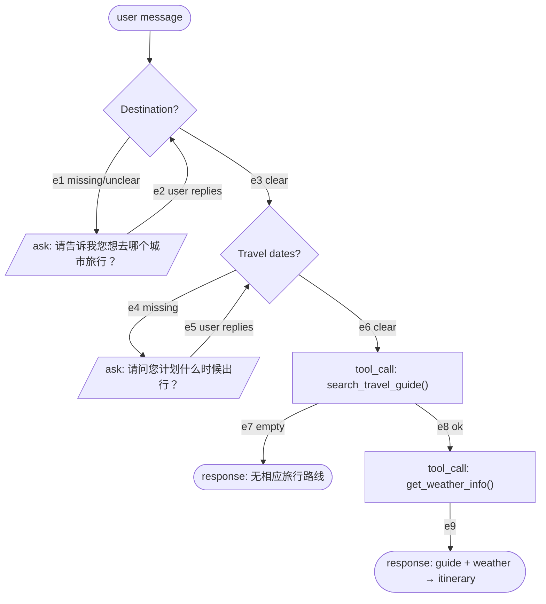
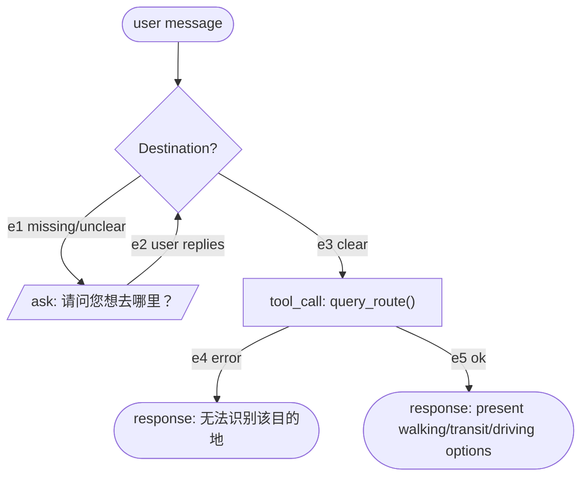
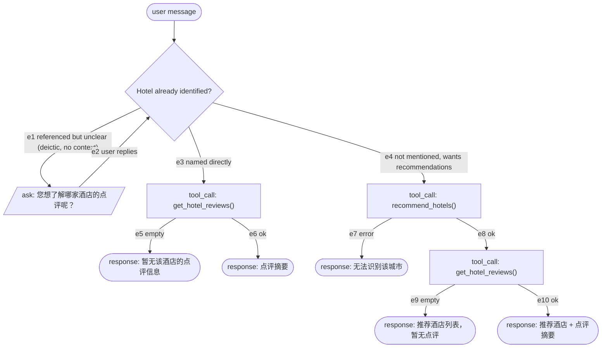
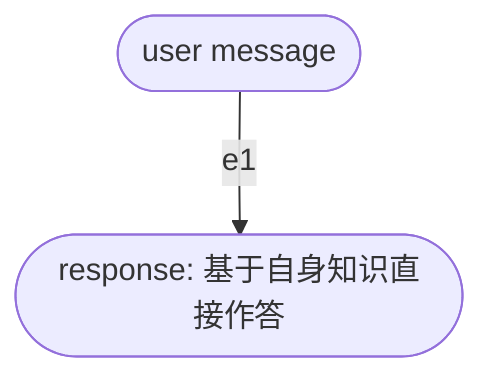
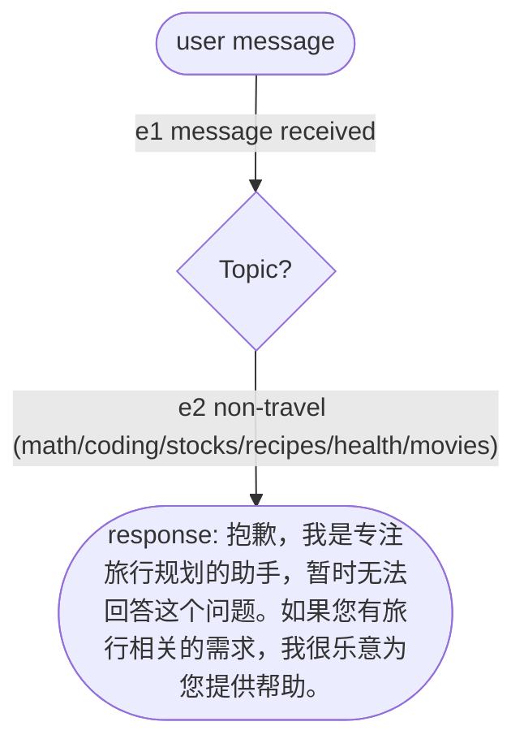
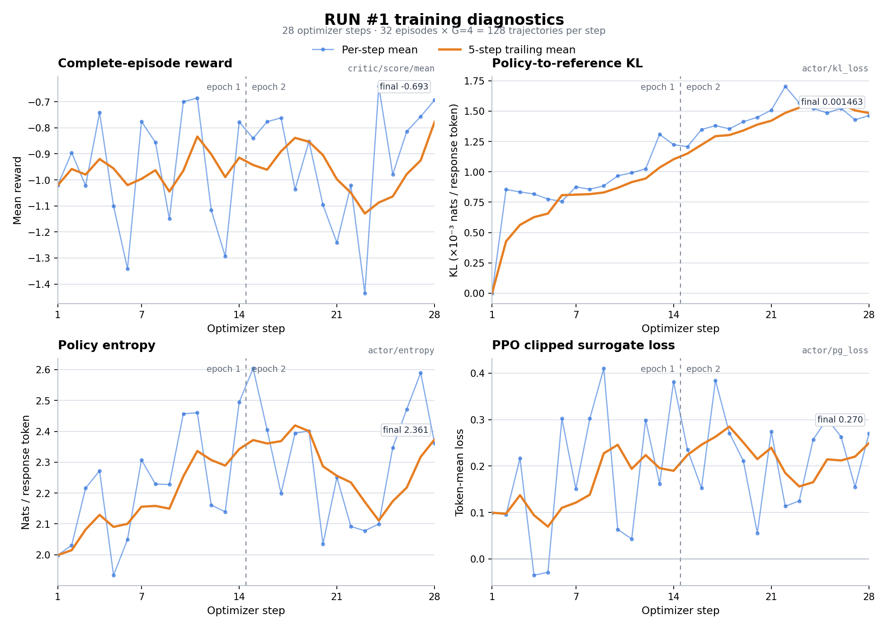
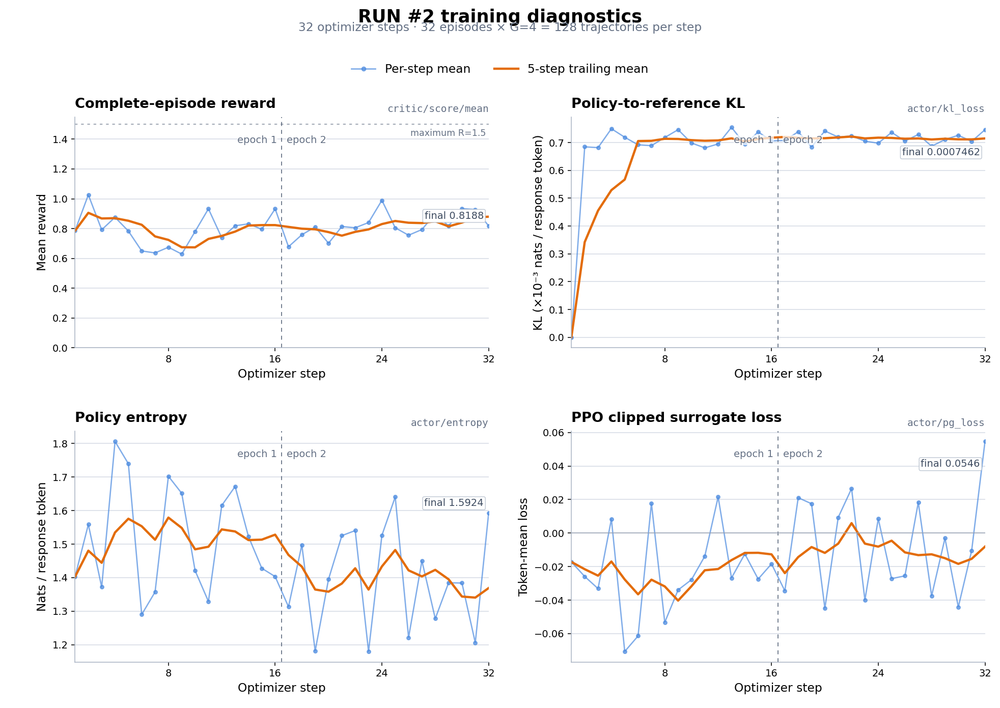
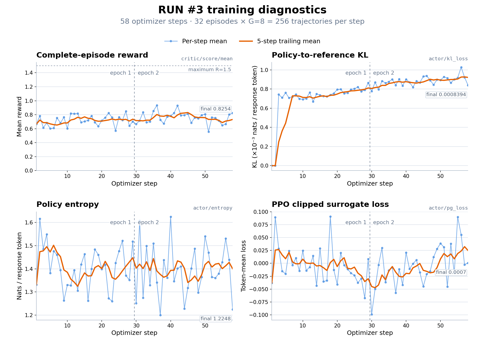

# 🏔️ CN City Travel Assistant

This recipe trains a small LLM (**Qwen3.5-0.8B** and **LFM2.5-350M**, LoRA) to be a travel assistant that can intelligently call tools/functions to help users with:

---

## 1. Business Logic

### 1.1 Core Workflows (5 types):

1. **Travel Planning** - Recommends destinations, creates itineraries, searches travel guides and weather
2. **Route Navigation** - Provides directions between locations using map APIs
3. **Hotel Services** - Recommends hotels and retrieves reviews
4. **Travel Chitchat** - Answers general travel questions
5. **Rejection** - Politely declines non-travel related queries

### 1.2 Knowledge base

|                 |                                                                                              |
| --------------- | -------------------------------------------------------------------------------------------- |
| Guides          | 725                                                                                          |
| Coverage        | 34 / 34 province-level divisions                                                             |
| Source corpus   | `data/knowledge_base/travel_guides/` — `{城市编码}_{城市名}_travel_guide.txt` |
| Runtime index   | `src/cn_travel/tool/guide/knowledge_base/milvus.db`, 7.3 MB (Milvus Lite single-file format) |
| Embedding model | `embeddinggemma-300m`, local, 768 dimensions                                               |

Each guide covers the city overview, transport, accommodation, a day-by-day
itinerary, food, shopping, practical tips and a budget estimate.

## 2. Quick Start

#### 1. Environment Setup

```bash
# Run from the CN Travel application directory.
make install
cp src/.env.example src/.env
make fetch-models
```

Place the release artifacts matching
`src/cn_travel/deployment_manifest.json` at these promotion source paths:

- selected policy adapter:
  `train/qwen3_5_0_8b_lora/GRPO_TRL/adapter/`
- sealed guide index: `data/knowledge_base/milvus.db`
- matching embedding fingerprint: `data/knowledge_base/.embedding_model.json`

Set `AMAP_KEY` in `src/.env`, then promote the verified release bundle:

```bash
make promote-runtime
```

`make fetch-models` retrieves the manifest-pinned public Qwen base and embedding
checkpoints. `make promote-runtime` verifies the source artifacts and installs
the selected policy under
`src/cn_travel/model/policy/` and the retrieval artifacts under
`src/cn_travel/tool/guide/knowledge_base/`.

The LFM training base is fetched when that training path is selected:

```bash
make fetch-models MODEL_NAMES='qwen lfm embedding'
```

#### 2. Run Travel Assistant

For an interactive terminal session, run:

```bash
make serve-policy   # terminal 1: promoted Qwen policy on :8000
make chat           # terminal 2: in-process agent and tools
```

`make chat` connects directly to the policy endpoint. For the HTTP deployment,
keep the policy server running and start the FastAPI application:

```bash
make serve          # terminal 2: agent and retrieval API on :8010
curl -X POST http://127.0.0.1:8010/chat \
  -H 'Content-Type: application/json' \
  -d '{"message":"帮我规划北京一日游"}'
```

#### 3. Train

Every launcher reads the JSON config beside it and resolves the application
root from its own location.
The application `src/uv.lock` covers runtime, data, evaluation, and tests. SFT/TRL
and VERL run in their separately versioned training environments.

```bash
# §5.1 SFT  (train-env: transformers + peft)
bash train/qwen3_5_0_8b_lora/SFT/run.sh
bash train/lfm2_5_350m_lora/SFT/run.sh

# §5.2 GRPO per step / §5.3 GRPO per user-turn  (train-env: TRL); CONFIG= selects another config
bash train/qwen3_5_0_8b_lora/GRPO_TRL/run.sh
bash train/qwen3_5_0_8b_lora/GRPO_TRL/run_traj.sh
CONFIG=train/lfm2_5_350m_lora/GRPO_TRL/train_traj_config.json \
  bash train/qwen3_5_0_8b_lora/GRPO_TRL/run_traj.sh

# §5.4 GRPO per trajectory  (verl-env; PYTHON= points at that venv's interpreter)
CONFIG=train/lfm2_5_350m_lora/GRPO_VERL/verl_traj_config_run3.json \
  bash train/lfm2_5_350m_lora/GRPO_VERL/run_verl.sh
```

Run 2 and Run 3 reproduction outputs use their `*_reproduction_run*`
directories. Section 5.4 records the published adapter paths.

#### 4. Test

```bash
make test-offline    # deterministic data, train, eval, and src suites
make test-standalone # standalone runtime-package acceptance
```

#### 5. Evaluate (§6.2)

```bash
make eval EVAL_ARGS='--system <leaderboard name> --model <served model> \
    --base-url http://<vllm-host>:8000/v1'
```

---

## 3. Design Routes

### 3.1 Agent behavior

#### **System Prompt Overview**

Every training conversation begins with a **system message** that contains:

- User information (name, city, departure date, coordinates)
- Detailed instructions for 5 workflows
- Tool calling rules and sequences
- Follow-up question guidelines
- Error handling procedures

The system prompt is embedded in the training data to teach the model:

1. **When** to call which tools
2. **How** to handle missing information
3. **What** to ask in follow-up questions
4. **Conditional logic** for tool calling

The exact system message is frozen by Step 2 and rendered by Step 3. Its user
context must contain the frozen user name, logical current date, current city
display name, weather-service city ID, departure window and start coordinates.
The workflow policy portion must be identical across one sealed Step 3 run.

#### **Workflow Details**

##### **Workflow 1: 旅行规划 (Travel Planning)**

**Samples**: 450 (400 no follow-up + 50 with follow-up)
**Tools Used**: `search_travel_guide` → `get_weather_info` (conditional)

**Trigger Conditions**:

- User wants to plan a trip
- Asks for travel guides or destination recommendations
- Requests itinerary creation

**Process Flow**:



**Routes** — a route is the sequence of edges traversed; this is the blueprint tag

Eight routes: {no ask, ask city, ask dates, ask both} × {guide ok, guide empty}.
The graph has cycles, so in principle a check can be re-entered more than once
(`随便` after being asked for a city); the blueprint bounds each loop to one
iteration.

| Tag      | Edges                          | Turns | Tool calls                                      | Example question (illustration)                |
| -------- | ------------------------------ | ----- | ----------------------------------------------- | ---------------------------------------------- |
| `W1-A` | e3, e6, e8, e9                 | 1     | `search_travel_guide` → `get_weather_info` | 我想去北京旅游，帮我制定旅行计划               |
| `W1-B` | e3, e6, e7                     | 1     | `search_travel_guide`                         | 我想去平壤旅游，帮我制定旅行计划               |
| `W1-C` | e1, e2, e3, e6, e8, e9         | 2     | `search_travel_guide` → `get_weather_info` | 我想出去旅游，有什么推荐的地方吗？ → 想去温州 |
| `W1-D` | e1, e2, e3, e6, e7             | 2     | `search_travel_guide`                         | 帮我规划一下行程 → 想去平壤                   |
| `W1-E` | e3, e4, e5, e6, e8, e9         | 2     | `search_travel_guide` → `get_weather_info` | 我想去北京旅游 → 下周三出发                   |
| `W1-F` | e3, e4, e5, e6, e7             | 2     | `search_travel_guide`                         | 我想去平壤旅游 → 下周三出发                   |
| `W1-G` | e1, e2, e3, e4, e5, e6, e8, e9 | 3     | `search_travel_guide` → `get_weather_info` | 帮我规划一下行程 → 想去北京 → 下周三出发     |
| `W1-H` | e1, e2, e3, e4, e5, e6, e7     | 3     | `search_travel_guide`                         | 帮我规划一下行程 → 想去平壤 → 下周三出发     |

---

##### **Workflow 2: 问路/地图导航 (Route Navigation)**
**Samples**: 120 (100 no follow-up + 20 with follow-up)  
**Tools Used**: `query_route`

**Trigger Conditions**:
- User asks how to get from one place to another
- Asks for directions, navigation, or the route to a destination

**Process Flow**:



**Routes** — a route is the sequence of edges traversed; this is the blueprint tag

Four routes: {no ask, ask destination} × {route ok, destination unresolvable}.
`query_route` returns `error` when it cannot resolve the destination, and that is
the reachable failure — a resolvable point is inside China, and driving connects
any two of those, so `empty` never occurs in practice.

| Tag | Edges | Turns | Tool calls | Example question (illustration) |
|---|---|---|---|---|
| `W2-A` | e3, e4 | 1 | `query_route` | 从这里到曾母暗沙怎么走？ |
| `W2-B` | e3, e5 | 1 | `query_route` | 我在国家博物馆，怎么走到天安门？ |
| `W2-C` | e1, e2, e3, e4 | 2 | `query_route` | "我该怎么走？"（追问后回复："曾母暗沙"） |
| `W2-D` | e1, e2, e3, e5 | 2 | `query_route` | "帮我导航一下"（追问后回复："天安门"） |

**Key Features**:
- No follow-up needed if landmarks mentioned (火车站, 医院, 学校, etc.)
- Direct tool call for clear destinations
- Default start point from user coordinates

**Example Questions**:
- "从北京到上海怎么走？"
- "去火车站怎么走？"
- "如何到达故宫？"

---

##### **Workflow 3: 酒店查询 (Hotel Search)**
**Samples**: 240 (200 no follow-up + 40 with follow-up)  
**Tools Used**: `get_hotel_reviews` (direct) | `recommend_hotels` → `get_hotel_reviews` (chained)

**Trigger Conditions**:
- User wants hotel recommendations for a city
- User asks about a specific hotel's reputation or reviews
- User wants hotel suggestions along with what other guests said about them

**Process Flow**:



**Routes** — a route is the sequence of edges traversed; this is the blueprint tag

Ten routes: {no ask, ask} × {hotel named: reviews ok, reviews empty} ∪ {no ask, ask} × {recommend error, recommend ok + reviews empty, recommend ok + reviews ok} — i.e. {no ask, ask} × 5 terminal outcomes.

| Tag | Edges | Turns | Tool calls | Example question (illustration) |
|---|---|---|---|---|
| `W3-A` | e4→e8→e9 | 1 | `recommend_hotels` → `get_hotel_reviews` | 推荐几家性价比高的酒店 |
| `W3-B` | e4→e8→e10 | 1 | `recommend_hotels` → `get_hotel_reviews` | 帮我推荐几家北京798附近的酒店，顺便看看大家的评价 |
| `W3-C` | e3→e5 | 1 | `get_hotel_reviews` | 如家酒店天安门店的点评怎么样 |
| `W3-D` | e3→e6 | 1 | `get_hotel_reviews` | 北京饭店的点评怎么样，好不好 |
| `W3-E` | e4→e7 | 1 | `recommend_hotels` | 推荐几家外滩看夜景的五星级酒店 |
| `W3-F` | e1→e2→e4→e8→e9 | 2 | `recommend_hotels` → `get_hotel_reviews` | "这家酒店口碑怎么样？" → 追问 → "算了，直接帮我推荐几家附近的酒店吧" |
| `W3-G` | e1→e2→e4→e8→e10 | 2 | `recommend_hotels` → `get_hotel_reviews` | "这个酒店好不好？" → 追问 → "算了，帮我推荐几家酒店，最好带点评的" |
| `W3-H` | e1→e2→e3→e5 | 2 | `get_hotel_reviews` | "这家酒店评价怎么样？" → 追问 → "亚朵酒店望京店" |
| `W3-I` | e1→e2→e3→e6 | 2 | `get_hotel_reviews` | "这个酒店好不好？" → 追问 → "北京饭店" |
| `W3-J` | e1→e2→e4→e7 | 2 | `recommend_hotels` | "这家酒店怎么样？" → 追问 → "不用了，帮我推荐几家崇礼滑雪场附近的酒店" |

**Critical Rule**: **NEVER** return hotel recommendations without reviews. Must call both tools in sequence — `e8` always leads to `get_hotel_reviews()`. This governs the call, not the result: `e9` (reviews empty) still counts as having called it.

**Example Questions**:
- "推荐一些北京300元的酒店"
- "上海有什么好的酒店推荐？"
- "北京酒店哪家比较好？"

---

##### **Workflow 4: 旅行相关闲聊 (Travel Chitchat)**
**Samples**: 100  
**Tools Used**: none — answers from the agent's own knowledge

**Trigger Conditions**:
- User greets the agent (打招呼、寒暄)
- User asks a general travel question that names no specific city, date, hotel, or route — nothing a corpus/API lookup is needed for
- User makes small talk about travel in general, or asks about the agent itself

**Process Flow**:



**Routes** — a route is the sequence of edges traversed; this is the blueprint tag

Zero branch points (no slots, no tool call): 1 route.

| Tag | Edges | Turns | Tool calls | Example question (illustration) |
|---|---|---|---|---|
| `W4-A` | e1 | 1 | — | 你好，出国旅行一般要提前多久办签证？ |

**Example Questions**:
- "你好，我是第一次使用旅行助手"
- "旅行的时候需要注意什么安全问题？"
- "出国旅行需要准备什么？"
- "旅行保险重要吗？"
- "什么季节旅行最好？"

---

##### **Workflow 5: 拒答 (Rejection)**
**Samples**: 100  
**Tools Used**: none

**Trigger Conditions**:
- User's message has no travel intent at all (math, coding, stocks, recipes, health, movies, etc.)
- Query cannot be served by any travel tool because it names no travel action

**Process Flow**:



**Routes** — a route is the sequence of edges traversed; this is the blueprint tag

One route: zero branch points — every non-travel topic collapses onto the same single edge because none of them differs in turn count or tool calls (a plain decline, no tool, one turn), so the topic category is content, not shape.

| Tag | Edges | Turns | Tool calls | Example question (illustration) |
|---|---|---|---|---|
| `W5-A` | e1→e2 | 1 | — | 1+1等于几？ |

**Example Questions**:
- "帮我算一下1+1等于几？"
- "你能帮我写一段Python代码吗？"
- "今天股市怎么样？"
- "如何做红烧肉？"
- "推荐几部电影"


### 3.2 Tool Design

The travel assistant has access to 5 tools:

1. **`search_travel_guide`** - Searches travel guides via RAG
2. **`get_weather_info`** - Gets weather information 
3. **`query_route`** - Gets navigation/route information
4. **`recommend_hotels`** - Recommends hotels based on requirements 
5. **`get_hotel_reviews`** - Gets hotel reviews by name 

#### How each tool works

A tool is a function with a fixed input/output shape. Which backend sits behind
it is an implementation detail and may be swapped, as long as the returned dict
satisfies the return contracts in `src/cn_travel/business_logic/contracts.py`.
Three rules:

- Always return a dict carrying `status` (`ok` / `empty` / `error`) and `source`.
- `empty` is not `error` — "the lookup succeeded but found nothing" versus "the
  lookup failed". Conflating them makes the model report an outage as "there is
  no guide for this city".
- No tool calls another tool. Each resolves what it needs internally.

| Tool                    | Implementation                                    | Backend                     | How it works                                                                                              |
| ----------------------- | ------------------------------------------------- | --------------------------- | --------------------------------------------------------------------------------------------------------- |
| `search_travel_guide` | `src/cn_travel/tool/guide/get_guide.py`                      | packaged Milvus index       | retrieve in process; a hit whose city does not match the query is discarded                                |
| `get_weather_info`    | `src/cn_travel/tool/get_weather.py::get_weather_by_date`     | AMap district → Open-Meteo | resolve the place name to coordinates, then fetch the daily forecast; past dates use the archive endpoint |
| `query_route`         | `src/cn_travel/tool/get_route.py::query_routes`              | AMap POI + directions       | resolve the destination nearest to the user's coordinates, then compute walking / transit / driving       |
| `recommend_hotels`    | `src/cn_travel/tool/get_hotel.py::get_hotel_recommendations` | AMap POI `types=100000`     | search by city adcode; recognized tier/type wording selects the POI keyword, and a budget ceiling filters hotels with known prices |
| `get_hotel_reviews`   | `src/cn_travel/tool/get_hotel.py`                            | web search + extraction     | search real review pages, extract rating / price / review text; `null` when not found                      |

**Fail-closed requirements**

A tool that cannot determine the answer must return `error` or `empty`, never an
approximation:

1. If a place name cannot be resolved, return `error`. Never substitute a
   default coordinate.
2. A retrieved guide's city must match the query, otherwise discard it.
3. Generic facilities (火车站 / 医院 / 学校) resolve to the nearest match from the
   user's coordinates, not a nationwide search.

**Price**: AMap does not expose hotel prices. `recommend_hotels` gets `price_cny`
from `src/cn_travel/tool/_hotel_price.py`; when unavailable it is `None`, never
estimated. Budget filtering retains unknown-price hotels and removes known-price
hotels above the parsed ceiling. Generic requirements use the `酒店` POI keyword.

#### Retrieval path

```
POST /chat → api.py → agent.py → service/agent.py
                                  ↓
                           service/tools.py
                                  ↓
                    tool/guide/get_guide.py
                                  ↓
                    tool/guide/retrieval.py
                                  ↓
            tool/guide/knowledge_base/milvus.db
            + tool/guide/knowledge_base/embedding/
```

- **Engine**: Milvus Lite (SQLite-based)
- **Index**: AUTOINDEX (Knowhere engine)
- **Embedding Model**: embeddinggemma-300m, local (768 dimensions)
- **Metric**: Inner Product (IP) / Cosine Similarity
- **Size**: 7.3 MB with 725 travel guides

#### **Tool Usage Summary**

| Workflow                   | Tools                                           | Conditional Logic                 | Follow-ups               |
| -------------------------- | ----------------------------------------------- | --------------------------------- | ------------------------ |
| **Travel Planning**  | `search_travel_guide` → `get_weather_info` | Weather only if guide has results | Destination, dates       |
| **Route Navigation** | `query_route`                                 | None                              | Destination (if unclear) |
| **Hotel Search**     | `recommend_hotels` → `get_hotel_reviews`   | Reviews only if hotels found      | Hotel identity; city when abandoning an unresolved reference |
| **Travel Chitchat**  | None                                            | None                              | None                     |
| **Rejection**        | None                                            | None                              | None                     |

#### **Step 1 Storyboard Distribution**

- Workflow 1: 450 rows
- Workflow 2: 120 rows
- Workflow 3: 240 rows
- Workflow 4: 100 rows
- Workflow 5: 100 rows
- **Total**: 1,010 storyboard rows

Candidate, retry, tool-call, split and enhancement counts are process outputs.
The selected Step 2 and Step 3 deliverables are not variable: each must contain
exactly 1,010 valid records with the fixed distribution listed above. Failed or
deferred candidates remain outside the selected set and never reduce its size.

## 4. Data Pipeline

The `data/` area owns all seven stages, their tests, and generation clients.
Unprefixed pipeline paths in this section are relative to `data/`; model clients
used to author synthetic data reside in `data/clients/`.

### **Step 1: Storyboard** (`1_storyboard.py`)
- **Input**: None (draws from the route table, the city registry and the feasibility pre-proof)
- **Output**: `1_storyboard.json` (1,010 structural rows, no content)
- **Process**:
  - Enumerates the fixed 24-route quota across the 5 workflows
  - Each row is a pure label — workflow, route, edges, turns, expected outcome, slots, omit
  - Carries no user text, entities or dates: only the immutable structural skeleton

**Example Input/Output:**
```json
# 1_storyboard.py emits one structural row per selected index:
{
  "workflow": 1,
  "route": "W1-A",
  "edges": ["e3", "e6", "e8", "e9"],
  "turns": 1,
  "expect": "ok",
  "slots": {"city": "天门", "in_corpus": true},
  "omit": []
}
```

### **Step 2: Grounded Materialization** (`2_materialize.py`)
- **Input**: `1_storyboard.json` (1,010 rows)
- **Output**: `2_materialized/{idx:04d}.json` (1,010 records) + sealed `manifest.json`
- **Process**:
  - Resolves canonical context, dates, turn intents, entities and response policy from `seed`, `idx`, and candidate `attempt`
  - Builds schema-valid synthetic tool evidence from the frozen corpus and registry plus the configured generation client for hotel evidence
  - Single-flights cacheable execution keys and freezes every accepted result
  - Validates every record and preserves the complete Step-1 row as immutable `metadata`

**Example Input/Output:**
```json
# Input (storyboard row idx 2): {"workflow": 1, "route": "W1-A", "slots": {"city": "天门"}, ...}

# Output (2_materialized/0002.json - frozen scenario + tool trace):
{
  "metadata": {"idx": 2, "workflow": 1, "route": "W1-A", "edges": ["e3","e6","e8","e9"], "turns": 1, "expect": "ok", "slots": {"city": "天门", "in_corpus": true}, "omit": []},
  "resolved": {"canonical_slots": {"city": "天门", "start_date": "2026-09-03", "num_days": 1, "weekday": "周四"}, ...},
  "visible_tool_trace": [
    {"name": "search_travel_guide", "arguments": {"location": "天门", "search_mode": "hybrid"},
     "result": {"status": "ok", "source": "synthetic:local-corpus", "location": "天门", "guides": [...]}},
    {"name": "get_weather_info", "arguments": {"location": "天门", "start_date": "2026-09-03", "num_days": 1},
     "result": {"status": "ok", "source": "synthetic:registry-geo", "days": [{"date": "2026-09-03", "day_weather": "多云", "temp_min_c": 16, "temp_max_c": 24}]}}
  ]
}
```

### **Step 3: Conversation** (`3_conversation.py`)
- **Input**: `2_materialized/` (verified against the sealed manifest hash)
- **Output**: `3_conversations/{idx:04d}.json` (1,010 conversations, OpenAI function-calling format)
- **Process**:
  - Writes natural user/final prose around the frozen Step-2 plan and tool trace (teacher: `claude-sonnet-5`)
  - Replays the frozen tool trace value-for-value — performs no live tool calls
  - Every sample carries the unchanged Step-1 `metadata` as its label

**Example Input/Output:**
```python
# Input: 2_materialized/0002.json (frozen 天门 plan + guide/weather trace)

# Output (3_conversations/0002.json - REAL TRAINING EXAMPLE):
{
  "conversation": [
    {"role": "system", "content": "## 用户信息\n- 今天日期: 2026-08-22\n- 当前城市: 义乌\n\n[详细工作流程说明]"},
    {"role": "user", "content": "我在义乌这边，9月3号想去天门玩一天，能帮我规划一下吗"},
    {"role": "assistant", "content": "", "tool_calls": [{"id": "call_0002_0", "type": "function", "function": {"name": "search_travel_guide", "arguments": "{\"location\": \"天门\", \"search_mode\": \"hybrid\"}"}}]},
    {"role": "tool", "content": "{\"status\": \"ok\", \"source\": \"synthetic:local-corpus\", ...}", "tool_call_id": "call_0002_0"},
    {"role": "assistant", "content": "", "tool_calls": [{"id": "call_0002_1", "type": "function", "function": {"name": "get_weather_info", "arguments": "{\"location\": \"天门\", \"start_date\": \"2026-09-03\", \"num_days\": 1}"}}]},
    {"role": "tool", "content": "{\"status\": \"ok\", \"days\": [{\"date\": \"2026-09-03\", \"day_weather\": \"多云\", \"temp_min_c\": 16, \"temp_max_c\": 24}]}", "tool_call_id": "call_0002_1"},
    {"role": "assistant", "content": "好的，义乌到天门可以安排这样一天：\n\n**天气提醒**：2026-09-03天门天气多云，最低16℃，最高24℃..."}
  ],
  "metadata": {"idx": 2, "workflow": 1, "route": "W1-A", "turns": 1, "expect": "ok", "slots": {"city": "天门", "in_corpus": true}, "omit": []}
}
```

### **Step 4: Grouped 9:1 Split** (`4_split.py`)
- **Input**: `3_conversations/` (1,010 accepted conversations)
- **Output**:
  - `4_split/train_validation/{idx:04d}.json` (909 rows — training + validation pool)
  - `4_split/leaderboard_eval/{idx:04d}.json` (101 rows — held-out leaderboard)
- **Process**:
  - Each file byte-identical to the same-index Step-3 conversation; filenames stay the sparse Step-1 indices; disjoint sides whose union is `0000..1009`
  - Workflow-level 9:1 exact (leaderboard W1 45 / W2 12 / W3 24 / W4 10 / W5 10) with all 24 routes on both sides
  - Keeps equivalent model-visible tool evidence on one side: indices sharing any byte-identical tool result form one evidence group placed wholly in one partition (solved as an integer program over the groups)

**Example Input/Output:**
```text
# Input: 3_conversations/0000.json .. 3_conversations/1009.json (1,010 files)

# Output (two disjoint sides, same bytes, filenames = source indices):
4_split/
├── train_validation/   # 909 files: 0000.json, 0001.json, 0004.json, ...  (sparse)
└── leaderboard_eval/    # 101 files: 0002.json, 0003.json, 0017.json, ...  (sparse)
```

### **Step 5: Merge** (`5_merge.py`)
- **Input**: `4_split/train_validation/` and `4_split/leaderboard_eval/`
- **Output**:
  - `5_merged/train_validation.json` (909-row array)
  - `5_merged/leaderboard_eval.json` (101-row array)
- **Process**: Collects each side's per-index files, in index order, into one JSON array — values unchanged

**Example Input/Output:**
```json
# Input: 4_split/train_validation/{0000,0001,0004,...}.json  (909 single-object files)

# Output (5_merged/train_validation.json):
[
  {"conversation": [...], "metadata": {"idx": 0, "route": "W3-D", ...}},
  {"conversation": [...], "metadata": {"idx": 1, "route": "W1-B", ...}},
  // ... 909 total rows
]
```

### **Step 6: Multi-turn Enhancement** (`6_multiturn.py`)
- **Input**: `5_merged/train_validation.json` (909 samples)
- **Output**: `6_multiturn/train_validation.json` (3,632 samples, training side); `6_multiturn/leaderboard_eval.json` (101 samples, byte-identical to Step 5)
- **Process**: applies to the training side only; the held-out leaderboard remains untouched; every derived sample preserves its source metadata label

#### **Code Logic:**
```python
# 1. No tool messages -> keep as-is, no splitting
has_tool_messages = any(message.get('role') == 'tool' for message in conversation)
if not has_tool_messages:
    result.append({'conversation': conversation, 'metadata': metadata})
    continue

# 2. Find all assistant positions
assistant_indices = [i for i, m in enumerate(conversation) if m.get('role') == 'assistant']

# 3. Cumulative split at each assistant (metadata carried onto every sample)
for assistant_idx, end_pos in enumerate(assistant_indices):
    split = {'conversation': conversation[:end_pos + 1], 'metadata': metadata}
    result.append(split)

    # 4. Duplicate the last assistant sample 2x (3 copies total)
    if assistant_idx == len(assistant_indices) - 1:
        result.append(copy.deepcopy(split))  # Copy 1
        result.append(copy.deepcopy(split))  # Copy 2
```

#### **Processing Examples:**

**No-Tool Conversations (W4 / W5):**
- **Condition**: No `role: "tool"` messages in conversation
- **Action**: Keep as-is (no splitting)
- **Result**: 1 sample

**Single-Round Tool Calls (e.g. W2 / W3-reviews):**
- **Condition**: Has `role: "tool"` messages, 2 assistant positions `[2, 4]`
- **Splits into**: 4 samples
  - Sample 1: `system → user → assistant (tool call)`
  - Sample 2: `system → user → assistant (tool call) → tool → assistant (response)`
  - Sample 3-4: `system → user → assistant (tool call) → tool → assistant (response)` [COPY x2]

**Two-Round Tool Calls (e.g. W1 travel-plan: guide + weather):**
- **Condition**: Has `role: "tool"` messages, 3 assistant positions `[2, 4, 6]`
- **Splits into**: 5 samples
  - Sample 1: `system → user → assistant (guide call)`
  - Sample 2: `system → user → assistant (guide call) → tool → assistant (weather call)`
  - Sample 3-5: `system → user → ... → tool → assistant (final answer)` [COPY x3]

- **Result**: 909 → 3,632 samples (~4x expansion)

**Example Input/Output:**
```python
# Input (one W1 training conversation, 3 assistant positions):
{
  "conversation": [
    {"role": "system", "content": "..."},
    {"role": "user", "content": "我在义乌这边，9月3号想去天门玩一天，能帮我规划一下吗"},
    {"role": "assistant", "content": "", "tool_calls": [...]},   # guide call
    {"role": "tool", "content": "...", "tool_call_id": "..."},
    {"role": "assistant", "content": "", "tool_calls": [...]},   # weather call
    {"role": "tool", "content": "...", "tool_call_id": "..."},
    {"role": "assistant", "content": "好的，义乌到天门可以安排这样一天：..."}
  ],
  "metadata": {"idx": 2, "route": "W1-A", ...}
}

# Output (5 samples; metadata copied onto each):
[
  {"conversation": [system, user, assistant(guide call)], "metadata": {...}},
  {"conversation": [system, user, assistant(guide call), tool, assistant(weather call)], "metadata": {...}},
  {"conversation": [system, user, ..., tool, assistant(final answer)], "metadata": {...}},   # x3
  ...
]
```

### **Complete Data Pipeline Summary**
```
Storyboard (1,010 structural rows)
    ↓ 1_storyboard.py
Grounded Materialization (1,010 frozen scenarios + sealed manifest)
    ↓ 2_materialize.py
Conversation (1,010 OpenAI-format conversations)
    ↓ 3_conversation.py
Grouped 9:1 Split (909 train_validation + 101 leaderboard_eval)
    ↓ 4_split.py
Merge (909-row + 101-row arrays)
    ↓ 5_merge.py
Multi-turn Enhancement (3,632 training samples; leaderboard untouched)
    ↓ 6_multiturn.py
Final Training Data (6_multiturn/train_validation.json)
```
---

## 5. Training

Wall-clock record (one row per completed training run; times from the run's
own trainer log / `trainer_state.json`):

| Run | Hardware | Steps | Wall time | Record source |
| --- | --- | --- | --- | --- |
| SFT Qwen3.5-0.8B (§5.1) | RTX 3080 20GB | 454 | **15,456 s ≈ 4 h 18 min** | 3,391 s start→checkpoint-100 (training log) + 12,065 s resume→454 (`trainer_state.json`) |
| SFT LFM2.5-350M (§5.1) | RTX 3080 20GB | 454 | **1,400 s ≈ 23 min** | `train/lfm2_5_350m_lora/SFT/adapter/trainer_state.json` |
| GRPO per-step Qwen3.5-0.8B (§5.2) | RTX 4090 24GB | 454 | **45,870 s ≈ 12 h 44 min** | trainer log, run of 2026-08-26/27 |
| GRPO per-user-turn Qwen3.5-0.8B (§5.3, run 202608280341) | RTX 4090 24GB | 98 | **5,402 s ≈ 1 h 30 min** | trainer log |
| GRPO per-user-turn Qwen3.5-0.8B (§5.3, run 202608281450) | RTX 4090 24GB | 98 | **6,034 s ≈ 1 h 41 min** | trainer log |
| GRPO per-user-turn LFM2.5-350M (§5.3) | RTX 4090 24GB | 104 | **1,316 s ≈ 22 min** | trainer log, run of 2026-08-28 |
| GRPO per-trajectory LFM2.5-350M (§5.4 Run #1) | RTX 4090 24GB | 28 | **4,213 s ≈ 1 h 10 min** | VERL trainer log |
| GRPO per-trajectory LFM2.5-350M (§5.4 Run #2) | RTX 4090 24GB | 32 | **5,519 s ≈ 1 h 32 min** | VERL trainer log |
| GRPO per-trajectory LFM2.5-350M (§5.4 Run #3) | RTX 4090 24GB | 58 | **17,605 s ≈ 4 h 53 min** | VERL trainer log |
| GRPO per-step LFM2.5-350M (§5.2 recipe) | RTX 4090 24GB | 454 | **7,585 s ≈ 2 h 06 min** | trainer log, run of 2026-08-29 |

### 5.1 SFT

#### **Spec**

* Initial model: base `Qwen3.5-0.8B`, untrained — 765.17 M params, of which
  the LoRA makes 12.78 M trainable (1.67 %); the base stays frozen.
* Data: `data/6_multiturn/train_validation.json`, 3,632 sealed rows; each row's
  final assistant turn is the supervised target (loss-masked), everything
  before it is context.
* Stack: transformers (HF `Trainer`) + peft, dedicated `train-env` venv with
  `qwen3_5` support; no vLLM at train time.
* VRAM estimate (per component; capacity 20 GiB, sequences up to 5,989 tokens):

  | Component | Formula | GiB |
  | --- | --- | --- |
  | Base weights, bf16 | checkpoint bytes (1,746,942,600 B) | 1.63 |
  | LoRA + grads + AdamW states | 12.78 M × 2 B × (1+1+2) | 0.10 |
  | Activations (grad-checkpointed) | L·B·T·H·2 B = 24 × 1 × 5,989 × 1,024 × 2 | 0.27 |
  | Logits + loss transient | [B=1, T=5,989, V=248,320]: bf16 2.77 + fp32 5.54 | 2.8 – 8.3 |
  | CUDA context + fragmentation | headroom | ≈ 0.8 |
  | **Estimated peak** | | **5.6 – 11.1** |

  Fits the 20 GiB card with margin at typical lengths; the longest-sequence
  logits transient is the only pressure point.

* Run: 454 optimizer steps = 1 epoch over 3,632 samples (batch 1 × accum 8);
  **wall time 15,456 s ≈ 4 h 18 min** on RTX 3080 20GB, final train loss
  0.6816 (mean over the resumed segment).
* leaderboard: **trace 77.2 % / toolcall 84.3 % / p50 1.15 s** — against the
  untrained base row (9.9 % / 24.4 %).

#### **Training pipeline** (deterministic contract)

| | |
| --- | --- |
| **Base model** | `train/base/Qwen3.5-0.8B` (`qwen3_5`, byte-pinned local checkpoint — the same bytes served as the vanilla baseline row) |
| **Data** | `data/6_multiturn/train_validation.json` — 3,632 sealed samples, one supervised assistant emission each (Step 6 cumulative split) |
| **Objective** | SFT next-token cross-entropy with **last-assistant-only loss masking**: `labels = -100` everywhere except the final assistant message's token span (prefix-differencing over the chat template; user/tool/context tokens contribute zero gradient) |
| **Rendering contract** (train ≡ serve) | Each sample is rendered by the base model's **own** `chat_template.jinja` with the 5 tool schemas passed via `tools=` (`src/cn_travel/business_logic/tool_schemas.json`) — the same template vLLM applies at inference, so the supervised target is byte-wise the XML-parameter `<tool_call>` emission that the stock `qwen3_xml` parser decodes. `tool_calls.arguments` are parsed JSON-string → dict at load time only (the template iterates key/value pairs); the sealed data on disk is unchanged |
| **Method** | LoRA, r=32, α=64, dropout 0.05, `bias="none"`, target modules `q/k/v/o_proj + gate/up/down_proj` scoped to the language model (never the vision tower); no quantization |
| **Hyperparameters** | From the run's config file — nothing hardcoded — values carried verbatim from the accepted v2 run: lr 2e-5, 1 epoch, per-device batch 1 × grad-accum 8, cosine schedule, warmup 0.03, bf16, gradient checkpointing, `max_seq_length` 20000 (longest sample: 5,989 tokens — zero truncation), seed 42 |
| **Trainer** | The application `train.py` (HF `Trainer` + peft) with `training.masking.JsonlConversations`; runs on a CUDA box in a dedicated venv (transformers with `qwen3_5` support) |
| **Output** | `train/qwen3_5_0_8b_lora/SFT/` — `train_config.json` (the config the run consumed), `run.sh`, `adapter/` (LoRA weights + `trainer_state.json` + `adapter.sha256`, written by `train.py` at save so the evaluated artifact is content-addressed) |

```
data/6_multiturn/train_validation.json  (3,632 samples, sealed)
    ↓ render: base chat template + tools=  →  last-assistant loss mask
    ↓ train/qwen3_5_0_8b_lora/SFT/train.py  (LoRA, config file, seed 42)
train/qwen3_5_0_8b_lora/SFT/adapter   (+ adapter.sha256)
    ↓ vLLM serve  base + adapter  --tool-call-parser qwen3_xml   (§6.2 channel)
    ↓ eval/evaluate.py  (101 sealed tasks → score → leaderboard row)
trained row vs vanilla row  =  the training delta
```


### 5.2 GRPO (per step, started from SFT model)

#### **Data**
* the same sealed file as §5.1 — `data/6_multiturn/train_validation.json`,
  3,632 rows, byte-identical. Different use: SFT supervises the golden
  emission's tokens; GRPO uses each row only as a prompt, and the golden turn
  enters only through the verifier (reward)

#### **Reward** (deterministic; pure function of sealed data + emission)

```
match     = calls_correct / calls_required            if calls_required > 0
          = 1 if silence else 0                       if calls_required = 0
            (silence ≡ no parsed call AND no malformed <tool_call> attempt)
extra     = max(0, calls_made − calls_required)       calls beyond the golden count
            (a wrong-args call occupying a golden slot is penalized once via
             `match`, never double-counted as extra)
structure = 1 iff no malformed block AND calls_made = calls_required AND
            every position matches (tool + `_compare`-equal arguments)

R = clip( w_call·match + w_struct·structure − w_extra·extra − w_format·unparseable,
          clip_min, clip_max )
```

#### **Pipeline**

```
data/6_multiturn/train_validation.json  (3,632 sealed prefixes; tool results in-context)
    ↓ train/qwen3_5_0_8b_lora/GRPO_TRL/train.py
    ↓        (TRL GRPOTrainer) — G sampled emissions per prefix (vLLM colocate);
    ↓        no tool executes, no tool world is touched, no network, no live LLM
    ↓ reward = verifier(golden calls, emission)            [deterministic, above]
    ↓ group-normalized advantage → policy update — LoRA continues from the
    ↓        §5.1 SFT adapter; G, temperature, lr, KL β, weights, clip from
    ↓        train_config.json; checkpoint + auto-resume; writes adapter.sha256
train/qwen3_5_0_8b_lora/GRPO_TRL/adapter
    ↓ vLLM serve (qwen3_xml, §6.2 channel) → eval/evaluate.py → leaderboard row
GRPO row vs the SFT row  =  the RL delta
```

#### **RUN #1** Initial model - base `Qwen3.5-0.8B` + the §5.1 SFT adapter

* Initial model: base `Qwen3.5-0.8B` + the §5.1 SFT adapter
* Stack: TRL 1.10.0 · transformers 5.15.1 · vLLM 0.27.1 (colocate, `gpu_memory_utilization` 0.75).
* VRAM estimate (per component, training phase = the peak; capacity 23.52 GiB):

  | Component | Formula | GiB |
  | --- | --- | --- |
  | vLLM engine reservation | 0.75 × 23.52 (gpu_memory_utilization) | 17.64 |
  | Policy weights, training copy | checkpoint bytes, bf16 (1,746,942,600 B) | 1.63 |
  | LoRA + grads + AdamW states | 12.78 M × 2 B × (1+1+2) | 0.10 |
  | Activations (grad-checkpointed) | L·B·T·H·2 B = 24 × 4 × 5,500 × 1,024 × 2 | 1.03 |
  | Logprob logits transient | [B=4, T≤1,024, V=248,320]: bf16 2.03 + fp32 4.07 | 2.6 – 6.1 |
  | CUDA context + fragmentation | headroom | ≈ 0.8 |
  | **Estimated peak** | | **23.8 – 27.3** |

  Measured during the run: steady 21.8–22.4 GiB, peak 23.3 GiB

* Run: 454 optimizer steps = 1 epoch over the 3,632 governed prefixes × G=4
  (14,528 scored rollouts); **wall time 45,870 s ≈ 12 h 44 min**.
* leaderboard: **trace 81.2 % / toolcall 83.5 % / p50 1.13 s**

#### **RUN #2** Initial model -  base `LFM2.5-350M` + the §5.1 SFT adapter

* Initial model: base `LFM2.5-350M` + the §5.1 SFT adapter
* Stack: TRL 1.10.0 · transformers 5.15.1 · vLLM 0.27.1 (colocate, `gpu_memory_utilization` 0.75).
* VRAM estimate (per component, training phase = the peak; capacity 23.52 GiB):

  | Component | Formula | GiB |
  | --- | --- | --- |
  | vLLM engine reservation | 0.75 × 23.52 (gpu_memory_utilization) | 17.64 |
  | Policy weights, training copy | checkpoint bytes, bf16 (708,984,464 B) | 0.66 |
  | LoRA + grads + AdamW states | 10.03 M × 2 B × (1+1+2) | 0.08 |
  | Activations (grad-checkpointed) | L·B·T·H·2 B = 16 × 4 × 5,500 × 1,024 × 2 | 0.67 |
  | Logprob logits transient | [B=4, T≤1,024, V=65,536]: bf16 0.54 + fp32 1.07 | 0.7 – 1.6 |
  | CUDA context + fragmentation | headroom | ≈ 0.8 |
  | **Estimated peak** | | **20.6 – 21.5** |

  Measured during the run: 23.0–23.5 GiB, peak 23.5 GiB.

* Run: 454 optimizer steps = 1 epoch over the 3,632 governed prefixes × G=4
  (14,528 scored rollouts); **wall time 7,585 s ≈ 2 h 06 min**.
* leaderboard: **trace 75.3 % / toolcall 81.9 % / p50 0.57 s**

### 5.3 GRPO (per user-turn, started from SFT model)

#### **Data**
* the same sealed corpus as §5.1, taken whole instead of unrolled — the **909
  training conversations**, cut into **1,018 user segments**. One segment = one
  episode: the model plays it out itself, and the golden calls enter only
  through the verifier (reward)
* a probe of the model's own SFT policy then keeps only the segments that still
  carry gradient (per-model counts below)

#### **Reward** (deterministic; pure function of sealed data + episode)

```
match     = LCS(made_calls, golden_calls) / calls_required   §6.2 toolcall_match
            (ordered pairing across the whole episode)
extra     = calls_extra_total                                calls beyond the golden count
structure = 1 iff every golden call matched in order AND extra = 0
            (§6.2 trace_match: a fully clean episode, zero-call rounds included)

R = clip( w_call·match + w_struct·structure − w_extra·extra,
          clip_min, clip_max )
```

#### **Pipeline**

```
data/6_multiturn/train_validation.json  (1,018 segments → 396 after the probe)
    ↓ train/qwen3_5_0_8b_lora/GRPO_TRL/train_traj.py
    ↓        (TRL GRPOTrainer + environment_factory) — G episodes per
    ↓        segment: generate a turn → parse calls → the frozen world answers →
    ↓        append results → next turn, until a call-free answer or the round cap (6)
    ↓ world = §6.2 FrozenWorld over train-side sealed evidence only; deterministic,
    ↓        no network, no live LLM; tool-result tokens masked out of the loss
    ↓ reward = verifier(golden calls, episode)             [deterministic, above]
    ↓ group-normalized advantage → policy update — LoRA continues from the
    ↓        §5.1 SFT adapter; G, temperature, lr, KL β, weights, clip from
    ↓        train_traj_config.json; checkpoint + auto-resume; writes adapter.sha256
train/qwen3_5_0_8b_lora/GRPO_TRL/adapter_traj
    ↓ vLLM serve (qwen3_xml, §6.2 channel) → eval/evaluate.py → leaderboard row
trajectory row vs the §5.2 per-step row  =  the training-unit delta
```

#### **RUN #1** Initial model - base `Qwen3.5-0.8B` + the §5.1 SFT adapter

* Initial model: base `Qwen3.5-0.8B` + the §5.1 SFT adapter
* Filter: 559 solved / 312 mixed / 147 unsolved → **396 trained** (312 mixed + 84 anchors) — the same `train/qwen3_5_0_8b_lora/GRPO_TRL/task_filter.json` as RUN #2
* Stack: TRL 1.10.0 · transformers 5.15.1 · vLLM 0.27.1 (colocate, `gpu_memory_utilization` 0.75); no KL term. Same VRAM estimate as RUN #2 below.
* Run: 98 optimizer steps = 2 epochs over the 396 filtered segments × G=4
  (3,168 scored rollouts); **wall time 5,402 s ≈ 1 h 30 min**
  (`train/qwen3_5_0_8b_lora/GRPO_TRL/adapter_traj/trainer_state.json`).
* leaderboard: **trace 79.2 % / toolcall 78.7 % / p50 1.00 s**

#### **RUN #2** Initial model - base `Qwen3.5-0.8B` + the §5.1 SFT adapter, KL `β=0.01`

* Initial model: base `Qwen3.5-0.8B` + the §5.1 SFT adapter
* Filter: 559 solved / 312 mixed / 147 unsolved → **396 trained** (312 mixed + 84 anchors)
* Stack: TRL 1.10.0 · transformers 5.15.1 · vLLM 0.27.1 (colocate, `gpu_memory_utilization` 0.75); KL `β=0.01` against the frozen §5.1 SFT adapter, output `train/qwen3_5_0_8b_lora/GRPO_TRL/adapter_traj_kl`.
* VRAM estimate (per component, training phase = the peak; capacity 23.52 GiB):

  | Component | Formula | GiB |
  | --- | --- | --- |
  | vLLM engine reservation | 0.75 × 23.52 (gpu_memory_utilization) | 17.64 |
  | Policy weights, training copy | checkpoint bytes, bf16 (1,746,942,600 B) | 1.63 |
  | LoRA + grads + AdamW states | 12.78 M × 2 B × (1+1+2) | 0.10 |
  | Activations (grad-checkpointed) | L·B·T·H·2 B = 24 × 4 × 5,500 × 1,024 × 2 | 1.03 |
  | Logprob logits transient | [B=4, T≤1,024, V=248,320]: bf16 2.03 + fp32 4.07 | 2.6 – 6.1 |
  | CUDA context + fragmentation | headroom | ≈ 0.8 |
  | **Estimated peak** | | **23.8 – 27.3** |

  Measured during the run: 20.2–23.5 GiB, peak 23.5 GiB, no hard OOM,

* Run: 98 optimizer steps = 2 epochs over the 396 filtered segments × G=4
  (3,168 scored rollouts); **wall time 6,034 s ≈ 1 h 41 min**.
* leaderboard: **trace 76.2 % / toolcall 81.9 % / p50 1.12 s**

#### **RUN #3** Initial model - base `LFM2.5-350M` + the §5.1 SFT adapter

* Initial model: base `LFM2.5-350M` + the §5.1 SFT adapter
* Filter: 453 solved / 350 mixed / 215 unsolved → **418 trained** (350 mixed + 68 anchors)
* Stack: TRL 1.10.0 · transformers 5.15.1 · vLLM 0.27.1 (colocate, `gpu_memory_utilization` 0.75).
* VRAM estimate (per component, training phase = the peak; capacity 23.52 GiB):

  | Component | Formula | GiB |
  | --- | --- | --- |
  | vLLM engine reservation | 0.75 × 23.52 (gpu_memory_utilization) | 17.64 |
  | Policy weights, training copy | checkpoint bytes, bf16 (708,984,464 B) | 0.66 |
  | KL reference adapter (frozen SFT LoRA) | second resident LoRA | 0.04 |
  | LoRA + grads + AdamW states | 10.03 M × 2 B × (1+1+2) | 0.08 |
  | Activations (grad-checkpointed) | L·B·T·H·2 B = 16 × 4 × 5,500 × 1,024 × 2 | 0.67 |
  | Logprob logits transient | [B=4, T≤1,024, V=65,536]: bf16 0.54 + fp32 1.07 | 0.7 – 1.6 |
  | CUDA context + fragmentation | headroom | ≈ 0.8 |
  | **Estimated peak** | | **20.6 – 21.5** |

  Measured during the run: no allocator retries logged, so no usage samples,

* Run: 104 optimizer steps = 2 epochs over the 418 filtered segments × G=4
  (3,344 scored rollouts); **wall time 1,316 s ≈ 22 min**.
* leaderboard: **trace 73.3 % / toolcall 77.2 % / p50 0.47 s**

### 5.4 GRPO (per trajectory, started from SFT model)

#### **Data**

All paths in this subsection are relative to `data/`. The Step-7
compiler lives under `scripts/`; its generated data lives under
`7_world_policy/`.

##### **Step 7: World-Policy Episode Compilation** (`scripts/7_world_policy.py`)

- **Input**:
  - `5_merged/train_validation.json` (909 complete conversations): exact system,
    user, assistant, and tool-message surfaces
  - the matching 909 `2_materialized/{idx:04d}.json` records: structured context,
    canonical slots, turn plan, assistant asks, response policy, and typed tool
    traces
- **Output**:
  - `7_world_policy/world_policy_episodes.jsonl` (909 complete private
    episode specs)
  - `7_world_policy/synthetic_china_world_v1.json` (one versioned and
    hashed world snapshot)
- **Process**:
  - Join the two sources by `metadata.idx` and verify workflow, route, turn count,
    expected outcome, calls, and results agree
  - Take exact model-visible and synthetic-person response language from
    `5_merged`
  - Take structured public/private state and tool evidence from `2_materialized`
  - Copy the source `metadata` object unchanged as the episode label
  - Compile the causal state graph and fixed reward milestones
  - Resolve private facts once, store them in the episode, and freeze them for
    probing and training

**Example Input/Output:**

```python
# Input:
#   5_merged/train_validation.json row metadata.idx=53
#   2_materialized/0053.json

# Output (one row in world_policy_episodes.jsonl):
{
  "schema_version": "cn_travel.world_policy.v1",
  "episode_id": "cn-travel-0053",
  "source_idx": 53,
  "metadata": {
    "idx": 53,
    "workflow": 1,
    "route": "W1-G",
    "edges": ["e1", "e2", "e3", "e4", "e5", "e6", "e8", "e9"],
    "turns": 3,
    "expect": "ok",
    "slots": {"city": "信阳", "in_corpus": true},
    "omit": ["city", "date"]
  },
  "world_id": "synthetic-china-world-v1:a132ad3209166758ed8bd09ecfa5a5bb942d661146fd801ad397517d8b0a72a6",
  "initial_messages": [
    {
      "role": "system",
      "content": "## 用户信息\n- 今天日期: 2026-08-22\n- 当前城市: 高密\n\n[详细工作流程说明]"
    },
    {
      "role": "user",
      "content": "我想安排个出行，帮我看看行程呗"
    }
  ],
  "person_state": {
    "public_context": {
      "user_name": "用户",
      "today": "2026-08-22",
      "current_city": {
        "name": "高密市",
        "adcode": "370785",
        "weather_id": "101120608"
      },
      "start_coordinates": "119.80584,36.365658",
      "departure_window": {
        "start": "2026-08-23",
        "end": "2026-08-27"
      }
    },
    "private_slots": {
      "destination": "信阳",
      "travel_date": "2026-08-25",
      "end_date": "2026-08-25",
      "num_days": 1,
      "surface": "relative_verified",
      "weekday": "周二"
    },
    "revealed_slots": [],
    "initially_hidden": ["destination", "travel_date"],
    "goal": {
      "workflow": "travel_plan",
      "route": "W1-G",
      "expected_outcome": "ok",
      "world_expected_outcome": "ok"
    }
  },
  "response_policy": {
    "price_known": false,
    "weather_use": "safety_adjustments_only",
    "allowed_capabilities": ["information_only"],
    "canonical_refusal": null
  },
  "initial_state_id": "ask_01_destination",
  "state_graph": [
    {
      "state_id": "ask_01_destination",
      "expected_action": {"type": "Ask", "slot": "destination"},
      "user_response": "目的地是信阳",
      "revealed_slots": ["destination"],
      "concealed_slots": [],
      "response_constraints": ["city_verbatim"],
      "next_state": "ask_02_travel_date",
      "milestone_ids": {"ask": "ask_01_destination"}
    },
    {
      "state_id": "ask_02_travel_date",
      "expected_action": {"type": "Ask", "slot": "travel_date"},
      "user_response": "就定8月25号那天，一天就行",
      "revealed_slots": ["travel_date"],
      "concealed_slots": [],
      "response_constraints": [],
      "next_state": "tool_03_guide",
      "milestone_ids": {"ask": "ask_02_travel_date"}
    },
    {
      "state_id": "tool_03_guide",
      "expected_action": {
        "type": "ToolCalls",
        "calls": [
          {
            "name": "search_travel_guide",
            "arguments": {"location": "信阳", "search_mode": "hybrid"}
          }
        ]
      },
      "source_result_status": "ok",
      "expected_result_status": "ok",
      "result_branches": {
        "ok": "tool_04_weather",
        "empty": "final_05",
        "error": "final_05"
      },
      "milestone_ids": {
        "calls": ["call_03_guide_01"],
        "round": "round_03_guide",
        "branches": {
          "ok": "branch_03_guide_ok",
          "empty": "branch_03_guide_empty",
          "error": "branch_03_guide_error"
        }
      }
    },
    {
      "state_id": "tool_04_weather",
      "expected_action": {
        "type": "ToolCalls",
        "calls": [
          {
            "name": "get_weather_info",
            "arguments": {
              "location": "信阳",
              "start_date": "2026-08-25",
              "num_days": 1
            }
          }
        ]
      },
      "source_result_status": "ok",
      "expected_result_status": "ok",
      "result_branches": {
        "ok": "final_05",
        "empty": "final_05",
        "error": "final_05"
      },
      "milestone_ids": {
        "calls": ["call_04_weather_01"],
        "round": "round_04_weather",
        "branches": {
          "ok": "branch_04_weather_ok",
          "empty": "branch_04_weather_empty",
          "error": "branch_04_weather_error"
        }
      }
    },
    {
      "state_id": "final_05",
      "expected_action": {"type": "Final"},
      "next_state": "done",
      "milestone_ids": {"completion": "valid_final_05"}
    }
  ],
  "reward_milestones": [
    "ask_01_destination",
    "ask_02_travel_date",
    "call_03_guide_01",
    "round_03_guide",
    "branch_03_guide_ok",
    "call_04_weather_01",
    "round_04_weather",
    "branch_04_weather_ok",
    "valid_final_05"
  ],
  "source": {
    "conversation": "5_merged/train_validation.json#idx=53",
    "materialized": "2_materialized/0053.json"
  }
}
```

#### **World policy**

##### **Architecture**

| Component | Count | Meaning |
| --- | ---: | --- |
| `SyntheticChinaWorldV1` | **1** | One versioned, immutable, internally consistent Synthetic China shared by every episode |
| `SyntheticPerson` implementation | **1** | One generic user policy shared by every person state |
| Workflow policies | **5** | W1–W5, expanded into the existing 24 routes |
| Training `PersonState`s | **909** | One private person/scenario state per training conversation |

The same simulator class operates on different private states:

```python
class SyntheticPerson:
    def respond(
        self,
        action: AssistantAction,
        state: PersonState,
    ) -> UserResponse:
        ...
```

```python
PersonState(
    episode_id=53,
    current_city="高密",
    destination="信阳",
    travel_date="2026-08-25",
    initially_hidden={"destination", "travel_date"},
    goal="travel_plan",
)

PersonState(
    episode_id=214,
    current_city="...",
    intended_hotel="哈尔滨伯爵摩赫酒店",
    hotel_location="双城",
    initially_hidden={"hotel_name"},
    goal="hotel_reviews",
)
```

##### **SyntheticChinaWorldV1**

The world snapshot contains:

* the city/entity registry;
* travel guides;
* weather keyed by city and date;
* routes;
* hotels; and
* hotel reviews.

Every `(tool, normalized arguments)` key maps to exactly one result. Known keys
use the canonical frozen result, unknown schema-valid keys use deterministic
seeded results, and invalid arguments use deterministic schema errors. The
snapshot is stored with its version and SHA-256. Runtime world access is local
and deterministic.

For example, every person receives the same result for:

```python
get_hotel_reviews(
    hotel_name="哈尔滨伯爵摩赫酒店",
    location="双城",
)
```

Synthetic China facts may be fictional. Their governing properties are
deterministic, schema-valid, internally consistent, and identical for the same
normalized query.

The current conflicting hotel-review key is canonicalized during compilation by
selecting the candidate with the minimum canonical-result SHA-256 and using it
everywhere. The snapshot retains every candidate and source occurrence as
provenance; source metadata is unchanged.

The world compiler reads the 909 training records and excludes the 101 held-out
evaluation people and their evidence.

##### **Assistant-action interpreter**

The interpreter consumes an LFM emission and produces exactly one typed runtime
action:

```text
ToolCalls(calls)
Ask(slot)
Final(text)
Refusal(text)
Invalid(reason)
```

These actions are interpreter outputs. LFM emits its normal tool-call syntax or
natural-language text.

Processing order:

1. Parse the LFM tool-call syntax.
2. Map malformed markers or parser failures to `Invalid(reason)`.
3. Classify plain-text questions as `Ask(slot)` for travel destination, travel
   date, route destination, hotel name, or hotel city.
4. Map unsupported, ambiguous, or multiple questions to `Ask(unknown)` or
   `Invalid(reason)` according to the frozen rule.
5. Distinguish a question from `Final(text)` and `Refusal(text)`.

The v1 classifier is deterministic and versioned. It contains the complete
approved patterns and paraphrase fixtures, records the matched rule with every
classification, and fails closed on ambiguity. A later frozen supervised
classifier may replace this module through the same typed-action interface.

##### **SyntheticPerson behavior**

Each person owns private facts, revealed slots, the current state, and the
current goal. The shared policy implements these responses:

* `Ask(destination)` reveals the destination in the matching state.
* `Ask(travel_date)` reveals the travel date in the matching state.
* `Ask(hotel_name)` reveals the intended hotel or follows the frozen W3
  intent-pivot policy.
* A repeated question returns the deterministic already-provided response and
  reveals nothing new.
* An irrelevant question returns a deterministic non-revealing response.
* Multiple questions in a single-question state return a correction and record
  a penalty.
* A premature final response produces terminal failure.
* A valid final response after goal completion produces success.

Example of a state-local correction:

```text
expected state: Ask(destination)

LFM:        When are you travelling?
interpreter: Ask(travel_date)
SyntheticPerson: 先确定去哪儿吧。
transition: state unchanged; no destination or date revealed; penalty recorded

LFM:        Which city do you want to visit?
interpreter: Ask(destination)
SyntheticPerson: 目的地是信阳。
transition: destination revealed; advance to Ask(travel_date)
```

Surface wording may use deterministic templates; the underlying facts and
state transition remain fixed.

##### **Causal episode state machine**

The interpreter identifies the action. The episode state machine decides
whether that action is legal and applies the transition:

* a correct question advances the state after the person response;
* a wrong question produces a non-revealing correction and records a violation;
* a valid tool call returns the Synthetic China result;
* a wrong tool call still returns its deterministic world result and records a
  violation;
* `recommend_hotels` must complete and expose its returned hotel before
  `get_hotel_reviews` becomes legal;
* an empty guide result closes the guide branch without a weather call;
* an empty/error hotel recommendation closes the recommendation branch without
  a review call;
* a final response becomes legal when the state is ready for completion; and
* each user turn permits at most six assistant rounds.

The VERL loop delegates all environment behavior to the state machine:

```python
action = interpreter.parse(lfm_output)
transition = episode.step(action)
```

Only `transition` appends a synthetic-person reply or tool result. Those
environment tokens receive loss mask `0`; LFM-generated tokens receive loss
mask `1`.

##### **GRPO group reset**

For `G=4`, one episode creates four independent rollouts:

```text
episode 53
├─ rollout 1: same SyntheticChinaWorldV1 + reset copy of PersonState 53
├─ rollout 2: same SyntheticChinaWorldV1 + reset copy of PersonState 53
├─ rollout 3: same SyntheticChinaWorldV1 + reset copy of PersonState 53
└─ rollout 4: same SyntheticChinaWorldV1 + reset copy of PersonState 53
```

World and person initial state are identical across the group. LFM sampling is
the varying input, so reward differences measure model behavior.

#### **RUN #1** Initial model - base `LFM2.5-350M` + the §5.1 SFT adapter

##### **Reward**

The verifier returns one score for the complete episode. Each declared
milestone can earn credit once. The score passed to VERL is in **[-2.0, 4.0]**;
VERL then normalizes the four scores within each `G=4` group.

```text
A = credited required questions / required questions
C = ordered LCS of correct (tool name + normalized arguments) calls
    / required calls
S = credited exact tool rounds and result branches / required structural milestones
G = 1 if the episode reaches a valid final response or approved refusal, else 0
T = 1 if G=1 and the episode has no violation, else 0

R_raw = 1.0*A + 1.0*C + 0.5*S + 1.0*G + 0.5*T - P
R     = clip(R_raw, -2.0, 4.0)
```

If an episode requires no questions, calls, or structural milestones, that
empty component is `1.0`. Therefore every clean completed episode has the same
maximum:

```text
R_max = 1.0 + 1.0 + 0.5 + 1.0 + 0.5 = 4.0
R_min = -2.0 after clipping
```

`G` and `T` are separate. A mistake that is later corrected keeps `G=1` but
sets `T=0`; the trajectory retains earned credit and also pays the violation
penalty.

The penalty is:

```text
P = 0.20 * wrong_question
  + 0.20 * repeated_question
  + 0.40 * multiple_questions_in_one_emission
  + 0.20 * wrong_or_extra_or_premature_or_repeated_tool_emission
  + 1.00 * malformed_output
  + 1.00 * premature_final
  + 1.00 * invalid_final
  + 0.50 * truncation
  + 0.50 * (uncredited_declared_milestones / declared_milestones)
             if the episode terminates without reaching the goal
```

Penalties are cumulative and counted per violation. The last term is the
terminal incomplete penalty; it is zero for a completed goal.

Episode `cn-travel-0053` has 2 question milestones, 2 required calls, 4
structural milestones, and 1 completion milestone: 9 declared milestones in
total. Its exact scores illustrate partial credit:

| Outcome | Components before penalties | Penalty `P` | Final `R` |
| --- | --- | ---: | ---: |
| Clean completion | `A=1, C=1, S=1, G=1, T=1` | 0 | **4.0000** |
| One wrong or repeated question, then full recovery | `A=1, C=1, S=1, G=1, T=0` | 0.20 | **3.3000** |
| One wrong/extra tool emission, then full recovery | `A=1, C=1, S=1, G=1, T=0` | 0.20 | **3.3000** |
| Multiple questions in one emission, then full recovery | `A=1, C=1, S=1, G=1, T=0` | 0.40 | **3.1000** |
| One malformed emission, then full recovery | `A=1, C=1, S=1, G=1, T=0` | 1.00 | **2.5000** |
| All actions correct except the final response is invalid | `A=1, C=1, S=1, G=0, T=0` | `1 + 0.5*(1/9)` | **1.4444** |
| Correct through both questions and the guide round, then truncate | `A=1, C=1/2, S=2/4, G=0, T=0` | `0.5 + 0.5*(4/9)` | **1.0278** |
| Correct questions only, then truncate | `A=1, C=0, S=0, G=0, T=0` | `0.5 + 0.5*(7/9)` | **0.1111** |
| Premature final response at the initial state | `A=0, C=0, S=0, G=0, T=0` | `1 + 0.5*(9/9)` | **-1.5000** |
| Cumulative violations make `R_raw <= -2` | varies | varies | **-2.0000** |

For W4/W5, `A=C=S=1` because those categories are empty. A correct final
response or approved refusal scores `4.0`; an invalid W5 refusal scores `1.0`.

An ordinary final response is valid only when it contains at least 12
non-whitespace characters, at least six Chinese characters with four distinct
characters, and names the episode destination for W1/W2 or the hotel/location
for W3. W4 uses the same meaningful-text check without an entity requirement;
W5 requires its approved refusal. Final prose and tool-result payload wording
are otherwise not compared with a golden answer.

A probe rollout passes only when `G=1`, `T=1`, and `R=4.0`.

##### **Pipeline**

```text
RUN1_SOURCE = train/lfm2_5_350m_lora/GRPO_VERL/run_01_source/apps/cn_travel

data/7_world_policy/world_policy_episodes.jsonl     (909)
    ↓ RUN1_SOURCE/models/lfm2_5_350m_lora/GRPO_VERL/probe_difficulty.py
    ↓        frozen LFM SFT policy, K=4
    ↓        solved / mixed / unsolved → all mixed + 15% solved anchors
    ↓        anchors route-stratified, seed 42, at least one per represented route
data/7_world_policy/task_filter.json          (470 IDs)
    ↓ RUN1_SOURCE/models/lfm2_5_350m_lora/GRPO_VERL/verl_data.py
data/7_world_policy/verl_train.parquet        (470 rows)
    ↓ RUN1_SOURCE/models/lfm2_5_350m_lora/GRPO_VERL/verl_loop.py
    ↓        G=4 complete causal rollouts per row using RUN1_SOURCE/world_policy/
    ↓        LFM action → interpreter → episode.step(action) → transition
    ↓ complete-episode reward → group-normalized advantage → LoRA update
train/lfm2_5_350m_lora/GRPO_VERL/adapter_verl
    ↓ eval/evaluate.py protocol → leaderboard row
```

RUN #1 used a sealed 470-ID population and 470-row parquet. Its configuration
and source snapshot are stored in
`train/lfm2_5_350m_lora/GRPO_VERL/run_01_source/`; the consumed filter and
parquet are identified by their recorded hashes.

Each packed VERL row contains only the model-visible initial prompt and the
episode identifier; private state, future user responses, and reward milestones
remain environment-side in `world_policy_episodes.jsonl`:

```python
{
  "data_source": "cn_travel_world_policy",
  "agent_name": "cn_travel",
  "prompt": [
    {
      "role": "system",
      "content": "## 用户信息\n- 今天日期: 2026-08-22\n- 当前城市: 高密\n\n[详细工作流程说明]"
    },
    {
      "role": "user",
      "content": "我想安排个出行，帮我看看行程呗"
    }
  ],
  "extra_info": {"episode_id": "cn-travel-0053"}
}
```

* Initial model: base `LFM2.5-350M` + the §5.1 SFT adapter
* Filter: 97 solved / 455 mixed / 357 unsolved → **470 trained** (455 mixed + 15 anchors)
* Stack: VERL 0.9.0 · transformers 5.10.4 · vLLM 0.28.0 (async colocate,
  `gpu_memory_utilization` 0.50).
* VRAM estimate (per component, training phase = the peak; capacity 23.52 GiB):

  | Component | Formula | GiB |
  | --- | --- | --- |
  | vLLM engine reservation | 0.50 × 23.52 (`gpu_memory_utilization`) | 11.76 |
  | Policy weights, training copy | 354.48 M × 4 B (FSDP FP32 resident copy) | 1.32 |
  | KL reference | adapter-disabled view of the same merged-SFT actor; no second model | 0.00 incremental |
  | GRPO LoRA + grads + AdamW states | 10.03 M × 4 B × (1+1+2) | 0.15 |
  | Activations (grad-checkpointed) | L·B·T·H·2 B = 16 × 1 × 7,059 × 1,024 × 2 | 0.22 |
  | Logprob logits transient | [B=1, T≤7,059, V=65,536]: bf16 0.86 + fp32 1.72 | 0.9 – 2.6 |
  | CUDA context + fragmentation | headroom | ≈ 0.8 |
  | **Estimated peak** | | **15.1 – 16.8** |

  Measured during the run: 129 GPU-resident `nvidia-smi` samples ranged
  4,750–15,154 MiB, with a sampled peak of 14.80 GiB; the actor reported
  5.17 GiB allocated / 5.85 GiB reserved. The rollout and actor-update peaks
  do not fully overlap.

* Run: 28 optimizer steps = 2 epochs over the 470-row filtered set, batch 32 ×
  G=4. VERL consumed 14 full batches per epoch (896 episode presentations;
  3,584 scored rollouts; 22 rows dropped per epoch); **wall time 4,213 s ≈ 1 h
  10 min**.
* leaderboard: **trace 75.3 % / toolcall 80.3 % / p50 0.53 s**



*RUN #1 training diagnostics. Reward is the mean raw complete-episode score
over 128 trajectories per step; KL and entropy are response-token means;
surrogate loss is VERL's token-mean negative clipped PPO objective. Orange
shows the five-step trailing mean.*


#### **RUN #2** Initial model - base `LFM2.5-350M` + the §5.1 SFT adapter

##### **Reward**

RUN #2 uses terminal-success-gated outcome reward. Intermediate questions and
tool calls are necessary actions, but receive no reward unless the episode
reaches its verified terminal goal.

```text
goal_reached = 1 iff:
  every required typed action is completed in legal state-graph order
  AND every tool name and normalized argument object matches
  AND every result-dependent branch is legal
  AND the agent delivers a valid grounded Final or approved Refusal

U = recoverable illegal assistant emissions, counted once per emission

R = 0                                      if goal_reached = 0
R = max(0.5, 1.5 - 0.2 * U)               if goal_reached = 1
```

`U` includes a wrong or repeated question, an extra, premature, or repeated
tool emission, a malformed model emission, or another illegal action from
which the state machine permits recovery. A premature or invalid final response
terminates without reaching the goal and therefore scores `0`. Missing actions
and truncation also score `0`; they do not receive a second penalty. A runtime,
environment, or parser failure outside the emitted model bytes aborts and
excludes the rollout instead of incrementing `U`.

The reward passed to VERL is in `[0.0, 1.5]`. `goal_reached` and `clean_trace` remain
separate diagnostics; `clean_trace = 1` exactly when the goal is reached with
`U = 0`. Final and refusal validity reuse the frozen deterministic predicate
defined for RUN #1 above; RUN #2 changes reward aggregation, not answer
validation. The Step-7 `reward_milestones` remain provenance and diagnostics
only and are not summed into RUN #2 reward.

| Generated trajectory for required actions `12345` | `goal_reached` | `U` | `R` |
| --- | ---: | ---: | ---: |
| `12`, `1234`, `5`, or `1235` | 0 | — | **0.0** |
| `12345` | 1 | 0 | **1.5** |
| `1X2345` | 1 | 1 | **1.3** |
| `12XY345` | 1 | 2 | **1.1** |
| Goal reached with at least five violations | 1 | ≥5 | **0.5** |

VERL receives one raw reward after the complete episode and computes the
group-relative advantage across its `G=4` rollouts. No prefix score enters the
optimization objective.

##### **Pipeline**

```text
data/7_world_policy/world_policy_episodes.jsonl     (909)
    ↓ train/lfm2_5_350m_lora/GRPO_VERL/probe_difficulty.py
    ↓        initial K=4 complete trajectories, temperature 0.9, seed 42
    ↓        solved: all four trajectories score R=1.5
    ↓        unsolved: all four trajectories have goal_reached=0
    ↓        mixed: all other episodes
    ↓        each initial unsolved episode receives four additional complete
    ↓        trajectories at temperature 0.8
    ↓        recovered episodes become mixed; all-eight failures remain unsolved
    ↓        retain all mixed + 15% route-stratified solved anchors, seed 42
data/7_world_policy/task_filter_run2.json       (519 IDs)
    ↓ train/lfm2_5_350m_lora/GRPO_VERL/verl_data.py
data/7_world_policy/verl_train_run2.parquet     (519 rows)
    ↓ train/lfm2_5_350m_lora/GRPO_VERL/verl_loop.py
    ↓        G=4 complete causal rollouts per row
    ↓ terminal-success-gated complete-episode reward
    ↓ group-normalized advantage → LoRA update
train/lfm2_5_350m_lora/GRPO_VERL/adapter_verl_run2/global_step_32
    ↓ eval/evaluate.py protocol → leaderboard row
```

* Initial model: base `LFM2.5-350M` + the §5.1 SFT adapter
* Filter: 203 solved / 489 mixed / 217 unsolved → **519 trained** (489 mixed +
  30 anchors). The initial K=4 probe produced 203 solved / 429 mixed / 277
  unsolved; the temperature-0.8 retry moved 60 episodes to mixed.
* Stack: VERL 0.9.0 · transformers 5.10.4 · vLLM 0.28.0 (async colocate,
  `gpu_memory_utilization` 0.50, KL `β=0.01` against the frozen §5.1 SFT
  policy).
* VRAM estimate (per component, training phase = the peak; capacity 23.52 GiB):

  | Component | Formula | GiB |
  | --- | --- | --- |
  | vLLM engine reservation | 0.50 × 23.52 (`gpu_memory_utilization`) | 11.76 |
  | Policy weights, training copy | 354.48 M × 4 B (FSDP FP32 resident copy) | 1.32 |
  | KL reference | adapter-disabled view of the same merged-SFT actor; no second model | 0.00 incremental |
  | GRPO LoRA + grads + AdamW states | 10.03 M × 4 B × (1+1+2) | 0.15 |
  | Activations (grad-checkpointed) | L·B·T·H·2 B = 16 × 1 × 7,059 × 1,024 × 2 | 0.22 |
  | Logprob logits transient | [B=1, T≤7,059, V=65,536]: bf16 0.86 + fp32 1.72 | 0.9 – 2.6 |
  | CUDA context + fragmentation | headroom | ≈ 0.8 |
  | **Estimated peak** | | **15.1 – 16.8** |

  Measured during the run: 1,073 GPU-resident `nvidia-smi` samples ranged
  2,335–15,300 MiB, with a sampled peak of 14.94 GiB; the actor reported
  5.16 GiB allocated / 5.84 GiB reserved. The rollout and actor-update peaks
  do not fully overlap.

* Run: 32 optimizer steps = 2 epochs over the 519-row filtered set, batch 32 ×
  G=4. VERL consumed 16 full batches per epoch (1,024 episode presentations;
  4,096 scored rollouts; 7 rows dropped per epoch); **wall time 5,519 s ≈ 1 h
  32 min**. No rollout batch aborted.
* leaderboard: **trace 74.3 % / toolcall 79.5 % / p50 0.54 s**




#### **RUN #3** Initial model - base `LFM2.5-350M` + the §5.1 SFT adapter

##### **Reward**

RUN #3 uses the same terminal-success-gated complete-episode reward as RUN #2:

```text
goal_reached = 1 iff:
  every required typed action is completed in legal state-graph order
  AND every tool name and normalized argument object matches
  AND every result-dependent branch is legal
  AND the agent delivers a valid grounded Final or approved Refusal

U = recoverable illegal assistant emissions, counted once per emission

R = 0                                      if goal_reached = 0
R = max(0.5, 1.5 - 0.2 * U)               if goal_reached = 1
```

The reward passed to VERL is in `[0.0, 1.5]`. The violation definition,
terminal conditions, and final/refusal validator are unchanged from RUN #2.
VERL computes the group-relative advantage across `G=8` complete trajectories.

##### **Pipeline**

```text
data/7_world_policy/world_policy_episodes.jsonl     (909)
    ↓ train/lfm2_5_350m_lora/GRPO_VERL/verl_data.py
data/7_world_policy/verl_train_run3.parquet         (909 rows)
    ↓ workflow-stratified sampler, seed 42
    ↓        29 batches × 32 EpisodeSpecs per epoch
    ↓        every batch contains W1–W5
    ↓        every EpisodeSpec appears once per epoch
    ↓        minimum 19 deterministic repeat presentations per epoch
    ↓ train/lfm2_5_350m_lora/GRPO_VERL/verl_loop.py
    ↓        G=8 complete causal trajectories per EpisodeSpec
    ↓ terminal-success-gated complete-episode reward
    ↓ group-normalized advantage → LoRA update
train/lfm2_5_350m_lora/GRPO_VERL/adapter_verl_run3/global_step_58
    ↓ eval/evaluate.py protocol → leaderboard row
```

* Initial model: base `LFM2.5-350M` + the §5.1 SFT adapter
* Data: all **909 EpisodeSpecs** are trained directly, without a data probe or
  difficulty filter.
* Sampling: workflow-stratified shuffle, batch 32, `G=8`, temperature `0.9`,
  seed `42`. Each batch contains W1–W5; each epoch presents all 909 EpisodeSpecs
  once plus the minimum 19 deterministic repeats needed to form 29 full
  batches.
* Stack: VERL 0.9.0 · transformers 5.10.4 · vLLM 0.28.0 (async colocate,
  `gpu_memory_utilization` 0.50, KL `β=0.01` against the frozen §5.1 SFT
  policy).
* Optimization: learning rate `2e-6`, 2 epochs, warmup ratio `0.03`, cosine
  schedule, asymmetric clipping `0.20` / `0.28`, and compute microbatch 2. The
  optimization batch remains 32 EpisodeSpecs × `G=8`; the microbatch only
  controls how many trajectories are processed concurrently on the GPU.
* VRAM estimate (per component, training phase = the peak; capacity 23.52 GiB):

  | Component | Formula | GiB |
  | --- | --- | --- |
  | vLLM engine reservation | 0.50 × 23.52 (`gpu_memory_utilization`) | 11.76 |
  | Policy weights, training copy | 354.48 M × 4 B (FSDP FP32 resident copy) | 1.32 |
  | KL reference | adapter-disabled view of the same merged-SFT actor; no second model | 0.00 incremental |
  | GRPO LoRA + grads + AdamW states | 10.03 M × 4 B × (1+1+2) | 0.15 |
  | Activations (grad-checkpointed) | L·B·T·H·2 B = 16 × 2 × 7,079 × 1,024 × 2 | 0.43 |
  | Logprob logits transient | [B=2, T≤7,079, V=65,536]: bf16 1.73 + fp32 3.46 | 1.7 – 5.2 |
  | CUDA context + fragmentation | headroom | ≈ 0.8 |
  | **Estimated peak** | | **16.2 – 19.7** |

  Measured during the run: 3,473 `nvidia-smi` samples ranged 1–15,934 MiB,
  with a sampled peak of 15.56 GiB; the actor reported 9.04 GiB allocated /
  9.97 GiB reserved. The rollout and actor-update peaks do not fully overlap.

* Run: 58 optimizer steps = 2 epochs × 29 batches over 1,856 EpisodeSpec
  presentations and 14,848 scored trajectories; **wall time 17,605 s ≈ 4 h
  53 min**. No rollout batch aborted.
* leaderboard: **trace 75.3 % / toolcall 81.1 % / p50 0.54 s**



## 6. Evaluation

### 6.1 Toolset Evaluation

Each of the five tools exercised across its `ok` / `empty` / `error` paths, with
every return value validated against `src/cn_travel/business_logic/contracts.py`.
**12/12 pass.**

| Tool                    | Case                     | Expected | Actual                           |
| ----------------------- | ------------------------ | -------- | -------------------------------- |
| `search_travel_guide` | 嘉兴 (in corpus)         | ok       | ✅ returns 嘉兴's guide          |
|                         | 平壤 (out of corpus)     | empty    | ✅ 0 results, no substitute city |
|                         | empty location           | error    | ✅                               |
| `get_weather_info`    | 嘉兴, 3 days             | ok       | ✅                               |
|                         | unresolvable place       | error    | ✅ no fallback coordinate        |
| `query_route`         | 望京 → 北京天坛公园     | ok       | ✅ driving 17.4 km               |
|                         | 望京 → 火车站 (generic) | ok       | ✅ nearest match                 |
|                         | 望京 → unresolvable     | error    | ✅                               |
| `recommend_hotels`    | 嘉兴, budget tier        | ok       | ✅ real AMap POIs                |
|                         | unresolvable city        | error    | ✅ distinct from empty           |
| `get_hotel_reviews`   | 北京国贸大酒店           | ok       | ✅ 3 real reviews, rating 4.65   |
|                         | empty hotel_name         | error    | ✅                               |

Verification: `make test`; AMap and hotel-review rows run when their declared
capabilities are available.

### 6.2 Agent Evaluation

**Eval set**: the 101 held-out rows sealed by Step 4's grouped 9:1 split
(`data/6_multiturn/leaderboard_eval.json`, byte-identical through Steps 4–6).
All 24 routes present; workflow mix W1 45 / W2 12 / W3 24 / W4 10 / W5 10;
outcomes ok 82 / empty 14 / error 5; no tool-result evidence shared with the
training side. Each row carries its pinned ground truth: the sealed reference
tool calls (the **golden trace**) plus `canonical_slots` / `route` / `expect`.
Never used in training at any point.

#### **Evaluation identity**

The active checkout has the following evaluation source identity. `rollout.py`
records rollout parameters and timestamps in `run.json`; `score.py` records the
dataset name and SHA-256 in `summary.json`. A sealed batch contract binds the
evaluator, channel, checkpoint, and adapter bytes used for a published batch.

| Artifact | SHA-256 |
| --- | --- |
| `data/6_multiturn/leaderboard_eval.json` | `f569366318e02df9f99785733038b53667c8958115e4935e39c8e922537abe4a` |
| `src/cn_travel/business_logic/tool_schemas.json` | `61e46aa71e72b9a5b1f0de360490077b785fa0b408a9c1e21c4573a00f5ea78f` |
| `eval/evaluate.py` | `0df2fcbc18ace7e16264a5ca1f21cf040a2d31ab32276cb7c32f19f69a77b29f` |
| `eval/rollout.py` | `e39f50aeace40abb799b05d32e0d3fc6527e4cc745c934048c9af2f4cc8e2364` |
| `eval/score.py` | `d38eae60fa5e2f630be9ae42762a15caf8c4496ee5162689766e2d7d3dcea0b1` |
| `eval/world.py` | `bb2d614fa1c7e0a7e23aacbd19ea2048536ad29b57a6900a029878eb1c474768` |

The protocol is 101 cases with at most 6 model rounds per user turn. The active
CLI identity fields are `eval/claude_proxy.py`
`dbca35c5d844c23324320b7c4ef2d2ff4d6ca6f18d82297c1215bbb897876e81`,
`eval/codex_proxy.py`
`29dcfc7b03e0814cf28e3aa6acbf1c817dada03a5092e8fbf616022415c30e4d`,
`eval/channels/protocol.py`
`daf432019e793ebdc26b8fa26c8976dd71af7ba932d779355e8fae9aaf9bd4c8`,
and `eval/channels/claude_cli.py`
`02805c881857eb91b9fa1c8c955a710998675610bbf6f8d7bc16ca61c47325ed`.
The authoritative frozen source inventory for the published 2026-09-01 batch is
recorded by
`eval/staging/20260901_all_entries/contract.json` and the byte snapshots under
`eval/reproducibility/evaluator_sources/20260901_all_entries/`. Active Claude
and Codex CLI evaluation code is owned by `eval/`: shared channel code is under
`eval/channels/`, with `eval/claude_proxy.py` and `eval/codex_proxy.py` as the
HTTP entry points. The frozen contract and snapshots supply the byte identity
for the 16 sealed batch rows.
The 16 canonical leaderboard submissions re-score identically under this
application-local evaluator identity at every recorded aggregation level.
The complete batch contract, including exact local checkpoint and adapter hashes,
is `eval/staging/20260901_all_entries/contract.json`.
For this rebaseline, exact checkpoint bytes define local model identity. Entries
2–5 and 10–14 use vLLM 0.28.0; their prior rows used vLLM 0.27.1, whose retained
CUDA 13 environment cannot initialize on the host's CUDA 12.8 driver. Entries
15–17 already used vLLM 0.28.0.

#### **Protocol** (sealed evaluator; deterministic scoring for a fixed transcript)

The eval data, canonicalizer, frozen tool world, and scorer are deterministic for
a fixed transcript. Model emissions, latency, generated call IDs, timestamps,
and complete run-directory bytes are not promised to reproduce bit-for-bit.

1. **Serving — declared channel.** Local checkpoints run behind stock vLLM
   using the model's own chat template and registered stock tool-call parser:
   `qwen3_xml` for Qwen3.5 and `lfm2` for LFM2.5. Claude and Codex rows use the
   repository's declared OpenAI-compatible CLI adapters. Those adapters flatten
   the conversation and tool definitions into text, constrain the response with
   a JSON schema, and translate it into OpenAI-style `tool_calls`; they are not
   native structured-tool channels and are not claimed to be
   accuracy-equivalent to one. Calls without a tool name are dropped, and
   malformed `arguments_json` is replaced with `{}`. This adapter behavior is
   part of the pinned evaluation identity. Latency is the observed end-to-end
   serving-channel latency.
2. **Rollout.** Per task: feed the row's sealed system message + user turn;
   loop (model → tool_calls → results appended as `role:"tool"`) until the
   model replies without tool calls; then the next scripted user turn
   (`turns`=2/3 rows), same loop. Cap: 6 model rounds per user turn.
   A CLI quota boundary may pause a run only between independent tasks. The
   pinned resumable orchestrator (`b0a6cd3e6fa456974787c7684216ca278895fe8dbfd48c27d3c43ae4a3a8bd3d`)
   retains only error-free, protocol-complete task transcripts under an unchanged
   channel identity; an interrupted task is rerun in full.
3. **Decoding request.** The evaluator sends `temperature=0`. Stock vLLM local
   rows use greedy decoding. The Claude and Codex CLI adapters do not forward
   that field, so those rows use their CLI/model decoding behavior.
4. **Frozen tool world.** First authority is the sealed evidence itself: a
   canonical `(tool, args)` hit on the eval set's own tool traces returns the
   sealed result verbatim (verified: every golden call of all 101 rows
   replays byte-identically — `eval/tests/test_eval_pipeline.py`). The world and
   scorer share one tool-aware canonicalizer. It removes a trailing `市` from
   registered location fields and maps only closed, whole-string variants of
   the sealed `recommend_hotels.requirements` classes to their canonical form:
   empty, economy, transport-convenient, high-end, downtown, high-rating, and
   amount-preserving `预算N元左右`. It does not add missing keys; unknown text,
   JSON types, extra keys, and different budget amounts remain distinct. Novel calls
   fall through deterministically: `search_travel_guide` re-executes the
   Step-2 generator live (pure local corpus + registry; never the
   exec_cache, which still holds pre-canonicalization guide entries);
   `get_weather_info` / `query_route` consult the sealed
   `data/2_materialized/exec_cache/` then the seeded generators (pure functions
   of their arguments); `recommend_hotels` / `get_hotel_reviews` were
   LLM-generated at materialization and are never regenerated — exec_cache
   exact hit, else a deterministic fallback (hotels: the location's cached
   list, else the generator's deterministic error shape; reviews: the
   generator's deterministic empty shape), every fallback logged. No live LLM
   or external API is used to produce tool results; model inference uses the
   serving channel declared by the leaderboard row.

#### **Metrics** (these three; nothing else is scored)

| Metric | Definition |
| --- | --- |
| **Trace match rate** (headline) | % of the 101 tasks where the model makes **every** golden call with the right tool + right parameters and makes **no** extra call. Parameters compare equal after the shared world/scorer canonicalization only: registry-backed trailing-`市` removal on location fields and closed, whole-string `recommend_hotels.requirements` aliases, including amount-preserving budget forms. Unknown requirement text remains exact. Where the golden trace is zero calls (W4 / W5 / clarify rounds), any tool call fails the task. |
| **Tool-call match rate** (partial credit) | Σ correct golden calls / Σ golden calls over the whole set (micro-average): a trace needing 5 calls with 3 made correctly contributes 3/5. |
| **Latency** | Wall-clock per task, reported p50 / p95; tokens in/out and $/task recorded alongside. Channel overhead is included; CLI-backed Claude and Codex rows report observed CLI-harness latency, not native-API latency. |

#### **Running an evaluation** (`eval/evaluate.py` — one command, submission to leaderboard entry)

```bash
# full pipeline: rollout the system under test → score → one leaderboard row
make eval EVAL_ARGS='--system Qwen3.5-0.8B --model qwen3.5-0.8b \
    --base-url http://<vllm-host>:8000/v1'

# score an existing submission (skip rollout), e.g. a run dir produced elsewhere
make eval EVAL_ARGS='--submission eval/runs/<dir>'
```


#### **Result records** (separate files, same `idx` as the eval set)

```
eval/runs/<YYYYMMDDHHMM Chicago>_<system>/
├── tasks/{idx:04d}.json         one score record per task
├── transcripts/{idx:04d}.json   full raw rollout: prompts, emissions, served tool results
├── run.json                     rollout parameters and timestamps
└── summary.json                 overall + by_workflow + by_route + by_expect aggregates
```

The 2026-09-01 rebaseline (`eval/staging/20260901_all_entries/contract.json`)
re-rolled all 16 leaderboard entries under the identity above and replaced each
canonical run directory's contents in place. Those 16 directories therefore keep
their original names while `summary.json` → `run_at` records the actual rollout
time; each fresh rollout is also retained under its own timestamp, and the
replaced priors are in `eval/archive/20260901_pre_full_rebaseline/live_replaced/`.

`tasks/{idx:04d}.json`:

```json
{
  "idx": 286, "workflow": "W2", "route": "W2-C", "expect": "error", "turns": 1,
  "trace_match": false,
  "calls_required": 1, "calls_correct": 0, "calls_extra": 0,
  "call_detail": [
    {"required": {"tool": "query_route", "args_truth": {"end_location": "钓鱼岛海域"}},
     "made": {"tool": "query_route", "args": {"end_location": "钓鱼岛"}},
     "correct": false, "reason": "wrong_args:end_location"}
  ],
  "latency_ms": 1840, "rounds": 1, "tokens_in": 2903, "tokens_out": 88,
  "cost_usd": 0.0, "transcript": "transcripts/0286.json"
}
```

Every number drills down: leaderboard cell → `summary.json` slice →
`tasks/{idx}.json` → `transcripts/{idx}.json` raw bytes.

#### **Leaderboard** (presentation of eval runs — not a dataset)

One row per eval run, assembled from each run's `summary.json`:

| System | Trace match % | Tool-call match % | Latency p50 / p95 (ms) | $/task |
| --- | --- | --- | --- | --- |
| Qwen3.5-0.8B-SFT-GRPO-per-step | 81.2 | 83.5 | 1,130 / 2,861 | 0.00 |
| Qwen3.5-0.8B-SFT-GRPO-per-user-turn | 79.2 | 78.7 | 1,001 / 2,870 | 0.00 |
| gpt-5.6-sol | 78.2 | 86.6 | 20,021 / 36,239 | 0.00 |
| Qwen3.5-0.8B-SFT | 77.2 | 84.3 | 1,151 / 2,918 | 0.00 |
| Qwen3.5-0.8B-SFT-GRPO-per-user-turn-KL | 76.2 | 81.9 | 1,119 / 2,687 | 0.00 |
| gpt-5.6-terra | 75.3 | 84.3 | 21,199 / 31,629 | 0.00 |
| LFM2.5-350M-SFT-GRPO-per-step | 75.3 | 81.9 | 566 / 1,648 | 0.00 |
| LFM2.5-350M-SFT-GRPO-per-trajectory-run3 | 75.3 | 81.1 | 539 / 1,618 | 0.00 |
| LFM2.5-350M-SFT-GRPO-per-trajectory | 75.3 | 80.3 | 533 / 1,607 | 0.00 |
| LFM2.5-350M-SFT | 74.3 | 80.3 | 539 / 1,633 | 0.00 |
| LFM2.5-350M-SFT-GRPO-per-trajectory-run2 | 74.3 | 79.5 | 540 / 1,605 | 0.00 |
| LFM2.5-350M-SFT-GRPO-per-user-turn | 73.3 | 77.2 | 468 / 1,606 | 0.00 |
| claude-opus-5 | 68.3 | 77.2 | 28,548 / 67,706 | 0.00 |
| claude-sonnet-5 | 47.5 | 44.9 | 17,336 / 66,596 | 0.00 |
| LFM2.5-350M | 20.8 | 2.4 | 366 / 2,644 | 0.00 |
| Qwen3.5-0.8B | 9.9 | 24.4 | 1,498 / 3,512 | 0.00 |

---

## Appendix: Project Structure

```
cn_travel/
├── README_CN TRAVEL.md                 application specification
├── Makefile  pytest.ini  conftest.py   orchestration and shared test configuration
├── project_paths.py                    cross-area path discovery
├── data/                               data and knowledge-build ownership
│   ├── clients/                        Claude CLI and OpenAI-compatible generation clients
│   ├── knowledge_base/                 725-guide source corpus, source index, and fingerprint
│   ├── scripts/                        Stage 1–7 and knowledge-build implementations
│   ├── tests/                          data-area tests
│   ├── reproducibility/                frozen pipeline-source snapshots
│   ├── 1_storyboard.json                1,010 structural rows
│   └── {2_materialized,3_conversations,…,7_world_policy}/
├── train/                              training ownership
│   ├── base/  embedding/               training-side public checkpoints
│   ├── training/  world_policy/        training libraries
│   ├── qwen3_5_0_8b_lora/             Qwen SFT, TRL, and VERL artifacts
│   ├── lfm2_5_350m_lora/              LFM SFT, TRL, and VERL artifacts
│   └── tests/                          training-area tests
├── eval/                               evaluation ownership
│   ├── evaluate.py  rollout.py  score.py  world.py
│   ├── channels/                       shared Claude/Codex CLI channel protocol
│   ├── claude_proxy.py  codex_proxy.py  CLI-channel HTTP entry points
│   ├── tests/                          evaluation-area tests
│   ├── leaderboard.json  leaderboard.html
│   ├── runs/  staging/  archive/       evaluation evidence
│   └── reproducibility/                frozen evaluator-source snapshots
└── src/                                installable runtime ownership
    ├── pyproject.toml  uv.lock  .python-version  .env.example
    ├── tests/                          runtime-area tests
    └── cn_travel/
        ├── api.py  cli.py  agent.py       runtime entry points
        ├── business_logic/               business policy and tool contracts
        ├── service/                      agent and application services
        ├── tool/                         runtime tools and private provider integrations
        │   └── guide/                   RAG implementation
        │       └── knowledge_base/     promoted index, fingerprint, and embedding model
        └── model/policy/                 selected policy base and adapter only
```

The four areas own their tests at `data/tests/`, `train/tests/`, `eval/tests/`,
and `src/tests/`. The runtime dependency direction is
`HTTP API → Agent → Service → Tool / Policy`; guide RAG resolves entirely
within `src/cn_travel/tool/guide/`. The data pipeline and training system consume
public runtime contracts, and the training and evaluation areas consume frozen
data artifacts. `make test-standalone` verifies the deployable `src/` package in
a fresh temporary directory.
