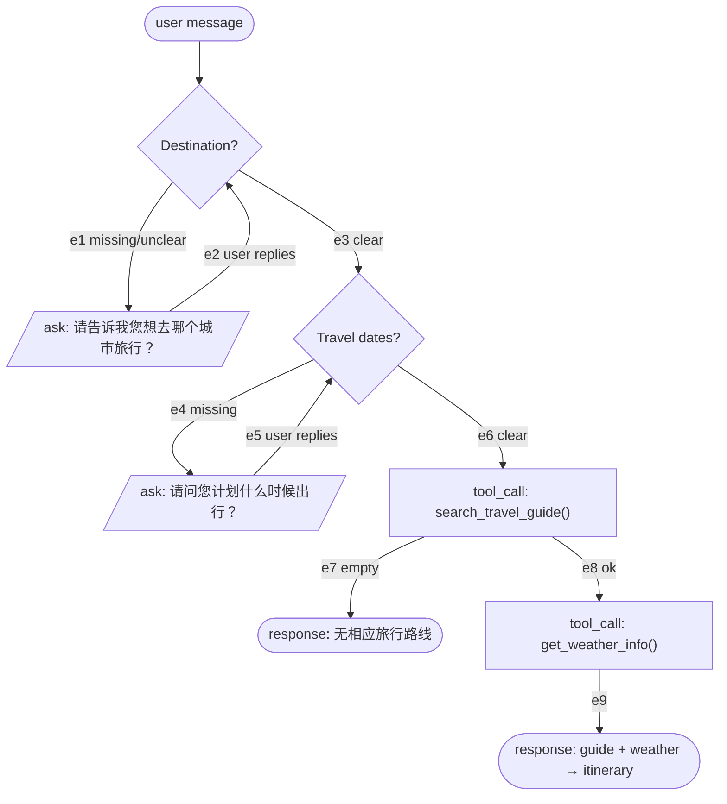
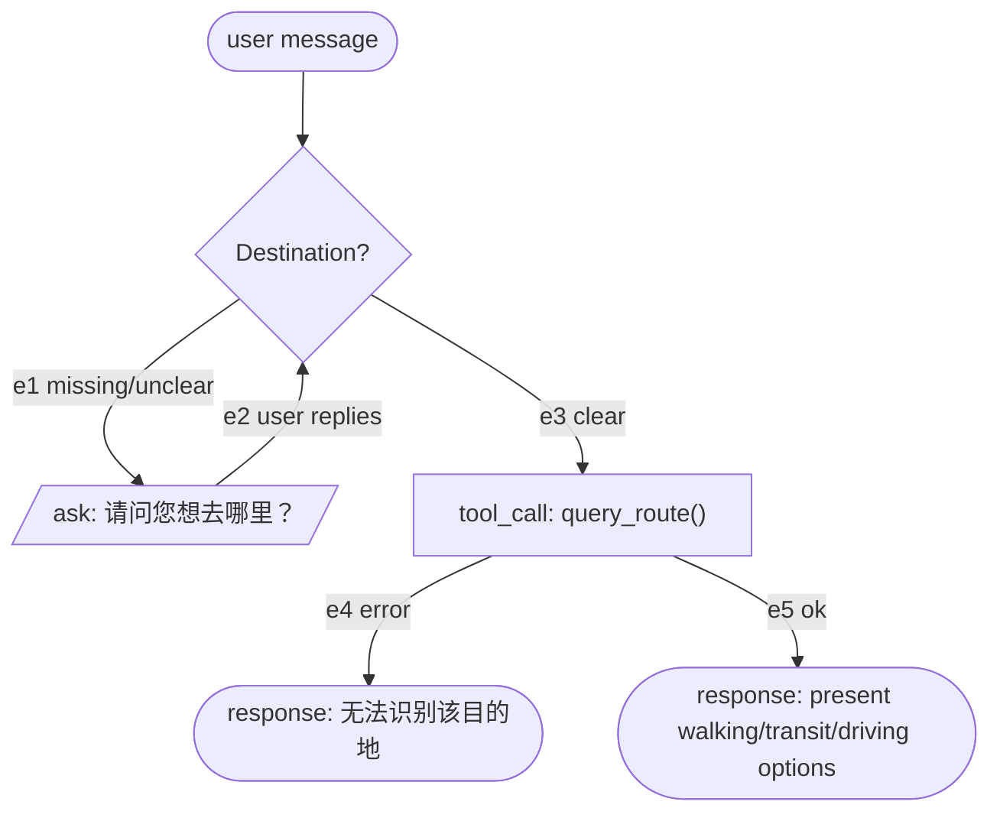
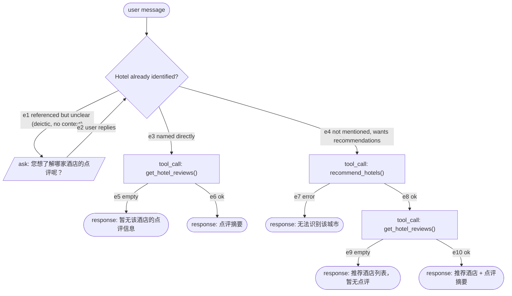
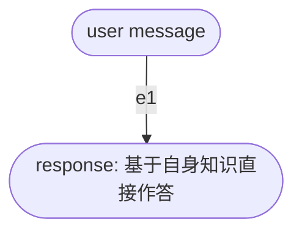
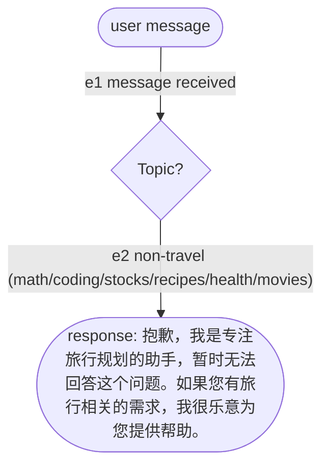

# 🏔️ CN City Travel Assistant

This Receipe trains a **Qwen-based LLM (0.6B)** to be a travel assistant that can intelligently call tools/functions to help users with:

---

## 1. Business Logic

### 1.1 Core Workflows (5 types):

1. **Travel Planning** - Recommends destinations, creates itineraries, searches travel guides and weather
2. **Route Navigation** - Provides directions between locations using map APIs
3. **Hotel Services** - Recommends hotels and retrieves reviews
4. **Travel Chitchat** - Answers general travel questions
5. **Rejection** - Politely declines non-travel related queries

### 1.2 Knowledge base

|                 |                                                                                              |
| --------------- | -------------------------------------------------------------------------------------------- |
| Guides          | 725                                                                                          |
| Coverage        | 34 / 34 province-level divisions                                                             |
| Corpus          | `apps/cn_travel/knowledge_base/travel_guides/` — `{城市编码}_{城市名}_travel_guide.txt` |
| Vector store    | `knowledge_base/milvus.db`, 7.3 MB (Milvus Lite single-file format)                        |
| Embedding model | `embeddinggemma-300m`, local, 768 dimensions                                               |

Each guide covers the city overview, transport, accommodation, a day-by-day
itinerary, food, shopping, practical tips and a budget estimate.

## 2. Quick Start

#### 1. Environment Setup

```bash
# Dependencies and the Python version are pinned in pyproject.toml + uv.lock
uv sync
```

#### 2. Run Travel Assistant

```bash
make chat
```

#### 3. Run LoRA Training (Recommended)

```bash
bash run_train_last_assistant.sh
```

or

```bash
python train_qwen_functioncall_sft.py \
  --train_file merged_train_final_multiturn_v2.json \
  --model_name_or_path qwen3-0_6b \
  --output_dir output_model \
  --max_seq_length 4096 \
  --learning_rate 2e-4 \
  --num_train_epochs 3 \
  --qlora \
  --bf16
```

#### Test RAG API

```bash
cd rag-system
python test_api.py
```

#### Test Function Calling

```bash
python test_funcall.py
```

---

## 3. Design Routes

### 3.1 Agent behavior

#### **System Prompt Overview**

Every training conversation begins with a **system message** that contains:

- User information (name, city, departure date, coordinates)
- Detailed instructions for 5 workflows
- Tool calling rules and sequences
- Follow-up question guidelines
- Error handling procedures

The system prompt is embedded in the training data to teach the model:

1. **When** to call which tools
2. **How** to handle missing information
3. **What** to ask in follow-up questions
4. **Conditional logic** for tool calling

The exact system message is frozen by Step 2 and rendered by Step 3. Its user
context must contain the frozen user name, logical current date, current city
display name, weather-service city ID, departure window and start coordinates.
The workflow policy portion must be identical across one sealed Step 3 run.

#### **Workflow Details**

##### **Workflow 1: 旅行规划 (Travel Planning)**

**Samples**: 450 (400 no follow-up + 50 with follow-up)
**Tools Used**: `search_travel_guide` → `get_weather_info` (conditional)

**Trigger Conditions**:

- User wants to plan a trip
- Asks for travel guides or destination recommendations
- Requests itinerary creation

**Process Flow**:



**Routes** — a route is the sequence of edges traversed; this is the blueprint tag

Eight routes: {no ask, ask city, ask dates, ask both} × {guide ok, guide empty}.
The graph has cycles, so in principle a check can be re-entered more than once
(`随便` after being asked for a city); the blueprint bounds each loop to one
iteration.

| Tag      | Edges                          | Turns | Tool calls                                      | Example question (illustration)                |
| -------- | ------------------------------ | ----- | ----------------------------------------------- | ---------------------------------------------- |
| `W1-A` | e3, e6, e8, e9                 | 1     | `search_travel_guide` → `get_weather_info` | 我想去北京旅游，帮我制定旅行计划               |
| `W1-B` | e3, e6, e7                     | 1     | `search_travel_guide`                         | 我想去平壤旅游，帮我制定旅行计划               |
| `W1-C` | e1, e2, e3, e6, e8, e9         | 2     | `search_travel_guide` → `get_weather_info` | 我想出去旅游，有什么推荐的地方吗？ → 想去温州 |
| `W1-D` | e1, e2, e3, e6, e7             | 2     | `search_travel_guide`                         | 帮我规划一下行程 → 想去平壤                   |
| `W1-E` | e3, e4, e5, e6, e8, e9         | 2     | `search_travel_guide` → `get_weather_info` | 我想去北京旅游 → 下周三出发                   |
| `W1-F` | e3, e4, e5, e6, e7             | 2     | `search_travel_guide`                         | 我想去平壤旅游 → 下周三出发                   |
| `W1-G` | e1, e2, e3, e4, e5, e6, e8, e9 | 3     | `search_travel_guide` → `get_weather_info` | 帮我规划一下行程 → 想去北京 → 下周三出发     |
| `W1-H` | e1, e2, e3, e4, e5, e6, e7     | 3     | `search_travel_guide`                         | 帮我规划一下行程 → 想去平壤 → 下周三出发     |

---

##### **Workflow 2: 问路/地图导航 (Route Navigation)**
**Samples**: 120 (100 no follow-up + 20 with follow-up)  
**Tools Used**: `query_route`

**Trigger Conditions**:
- User asks how to get from one place to another
- Asks for directions, navigation, or the route to a destination

**Process Flow**:



**Routes** — a route is the sequence of edges traversed; this is the blueprint tag

Four routes: {no ask, ask destination} × {route ok, destination unresolvable}.
`query_route` returns `error` when it cannot resolve the destination, and that is
the reachable failure — a resolvable point is inside China, and driving connects
any two of those, so `empty` never occurs in practice.

| Tag | Edges | Turns | Tool calls | Example question (illustration) |
|---|---|---|---|---|
| `W2-A` | e3, e4 | 1 | `query_route` | 从这里到曾母暗沙怎么走？ |
| `W2-B` | e3, e5 | 1 | `query_route` | 我在国家博物馆，怎么走到天安门？ |
| `W2-C` | e1, e2, e3, e4 | 2 | `query_route` | "我该怎么走？"（追问后回复："曾母暗沙"） |
| `W2-D` | e1, e2, e3, e5 | 2 | `query_route` | "帮我导航一下"（追问后回复："天安门"） |

**Key Features**:
- No follow-up needed if landmarks mentioned (火车站, 医院, 学校, etc.)
- Direct tool call for clear destinations
- Default start point from user coordinates

**Example Questions**:
- "从北京到上海怎么走？"
- "去火车站怎么走？"
- "如何到达故宫？"

---

##### **Workflow 3: 酒店查询 (Hotel Search)**
**Samples**: 240 (200 no follow-up + 40 with follow-up)  
**Tools Used**: `get_hotel_reviews` (direct) | `recommend_hotels` → `get_hotel_reviews` (chained)

**Trigger Conditions**:
- User wants hotel recommendations for a city
- User asks about a specific hotel's reputation or reviews
- User wants hotel suggestions along with what other guests said about them

**Process Flow**:



**Routes** — a route is the sequence of edges traversed; this is the blueprint tag

Ten routes: {no ask, ask} × {hotel named: reviews ok, reviews empty} ∪ {no ask, ask} × {recommend error, recommend ok + reviews empty, recommend ok + reviews ok} — i.e. {no ask, ask} × 5 terminal outcomes.

| Tag | Edges | Turns | Tool calls | Example question (illustration) |
|---|---|---|---|---|
| `W3-A` | e4→e8→e9 | 1 | `recommend_hotels` → `get_hotel_reviews` | 推荐几家性价比高的酒店 |
| `W3-B` | e4→e8→e10 | 1 | `recommend_hotels` → `get_hotel_reviews` | 帮我推荐几家北京798附近的酒店，顺便看看大家的评价 |
| `W3-C` | e3→e5 | 1 | `get_hotel_reviews` | 如家酒店天安门店的点评怎么样 |
| `W3-D` | e3→e6 | 1 | `get_hotel_reviews` | 北京饭店的点评怎么样，好不好 |
| `W3-E` | e4→e7 | 1 | `recommend_hotels` | 推荐几家外滩看夜景的五星级酒店 |
| `W3-F` | e1→e2→e4→e8→e9 | 2 | `recommend_hotels` → `get_hotel_reviews` | "这家酒店口碑怎么样？" → 追问 → "算了，直接帮我推荐几家附近的酒店吧" |
| `W3-G` | e1→e2→e4→e8→e10 | 2 | `recommend_hotels` → `get_hotel_reviews` | "这个酒店好不好？" → 追问 → "算了，帮我推荐几家酒店，最好带点评的" |
| `W3-H` | e1→e2→e3→e5 | 2 | `get_hotel_reviews` | "这家酒店评价怎么样？" → 追问 → "亚朵酒店望京店" |
| `W3-I` | e1→e2→e3→e6 | 2 | `get_hotel_reviews` | "这个酒店好不好？" → 追问 → "北京饭店" |
| `W3-J` | e1→e2→e4→e7 | 2 | `recommend_hotels` | "这家酒店怎么样？" → 追问 → "不用了，帮我推荐几家崇礼滑雪场附近的酒店" |

**Critical Rule**: **NEVER** return hotel recommendations without reviews. Must call both tools in sequence — `e8` always leads to `get_hotel_reviews()`. This governs the call, not the result: `e9` (reviews empty) still counts as having called it.

**Example Questions**:
- "推荐一些北京300元的酒店"
- "上海有什么好的酒店推荐？"
- "北京酒店哪家比较好？"

---

##### **Workflow 4: 旅行相关闲聊 (Travel Chitchat)**
**Samples**: 100  
**Tools Used**: none — answers from the agent's own knowledge

**Trigger Conditions**:
- User greets the agent (打招呼、寒暄)
- User asks a general travel question that names no specific city, date, hotel, or route — nothing a corpus/API lookup is needed for
- User makes small talk about travel in general, or asks about the agent itself

**Process Flow**:



**Routes** — a route is the sequence of edges traversed; this is the blueprint tag

Zero branch points (no slots, no tool call): 1 route.

| Tag | Edges | Turns | Tool calls | Example question (illustration) |
|---|---|---|---|---|
| `W4-A` | e1 | 1 | — | 你好，出国旅行一般要提前多久办签证？ |

**Example Questions**:
- "你好，我是第一次使用旅行助手"
- "旅行的时候需要注意什么安全问题？"
- "出国旅行需要准备什么？"
- "旅行保险重要吗？"
- "什么季节旅行最好？"

---

##### **Workflow 5: 拒答 (Rejection)**
**Samples**: 100  
**Tools Used**: none

**Trigger Conditions**:
- User's message has no travel intent at all (math, coding, stocks, recipes, health, movies, etc.)
- Query cannot be served by any travel tool because it names no travel action

**Process Flow**:



**Routes** — a route is the sequence of edges traversed; this is the blueprint tag

One route: zero branch points — every non-travel topic collapses onto the same single edge because none of them differs in turn count or tool calls (a plain decline, no tool, one turn), so the topic category is content, not shape.

| Tag | Edges | Turns | Tool calls | Example question (illustration) |
|---|---|---|---|---|
| `W5-A` | e1→e2 | 1 | — | 1+1等于几？ |

**Example Questions**:
- "帮我算一下1+1等于几？"
- "你能帮我写一段Python代码吗？"
- "今天股市怎么样？"
- "如何做红烧肉？"
- "推荐几部电影"


### 3.2 Tool Design

The travel assistant has access to 5 tools:

1. **`search_travel_guide`** - Searches travel guides via RAG
2. **`get_weather_info`** - Gets weather information 
3. **`query_route`** - Gets navigation/route information
4. **`recommend_hotels`** - Recommends hotels based on requirements 
5. **`get_hotel_reviews`** - Gets hotel reviews by name 

#### How each tool works

A tool is a function with a fixed input/output shape. Which backend sits behind
it is an implementation detail and may be swapped, as long as the returned dict
satisfies the return semantics in Section 4.1. Three rules:

- Always return a dict carrying `status` (`ok` / `empty` / `error`) and `source`.
- `empty` is not `error` — "the lookup succeeded but found nothing" versus "the
  lookup failed". Conflating them makes the model report an outage as "there is
  no guide for this city".
- No tool calls another tool. Each resolves what it needs internally.

| Tool | Implementation | Backend | How it works |
|---|---|---|---|
| `search_travel_guide` | `tools/get_guide.py` | local RAG service `:8010` | POST `/search`; a hit whose city does not match the query is discarded |
| `get_weather_info` | `tools/get_weather.py::get_weather_by_date` | AMap district → Open-Meteo | resolve the place name to coordinates, then fetch the daily forecast; past dates use the archive endpoint |
| `query_route` | `tools/get_route.py::query_routes` | AMap POI + directions | resolve the destination nearest to the user's coordinates, then compute walking / transit / driving |
| `recommend_hotels` | `tools/get_hotel.py::get_hotel_recommendations` | AMap POI `types=100000` | search hotels by city adcode; `requirements` biases the tier keyword only |
| `get_hotel_reviews` | `tools/get_hotel.py` | web search + extraction | search real review pages, extract rating / price / review text; `null` when not found |

---


#### How each tool works

A tool is a function with a fixed input/output shape. Which backend sits behind
it is an implementation detail and may be swapped, as long as the returned dict
satisfies the return semantics in Section 4.1. Three rules:

- Always return a dict carrying `status` (`ok` / `empty` / `error`) and `source`.
- `empty` is not `error` — "the lookup succeeded but found nothing" versus "the
  lookup failed". Conflating them makes the model report an outage as "there is
  no guide for this city".
- No tool calls another tool. Each resolves what it needs internally.

| Tool                    | Implementation                                    | Backend                     | How it works                                                                                              |
| ----------------------- | ------------------------------------------------- | --------------------------- | --------------------------------------------------------------------------------------------------------- |
| `search_travel_guide` | `tools/get_guide.py`                            | local RAG service`:8010`  | POST`/search`; a hit whose city does not match the query is discarded                                   |
| `get_weather_info`    | `tools/get_weather.py::get_weather_by_date`     | AMap district → Open-Meteo | resolve the place name to coordinates, then fetch the daily forecast; past dates use the archive endpoint |
| `query_route`         | `tools/get_route.py::query_routes`              | AMap POI + directions       | resolve the destination nearest to the user's coordinates, then compute walking / transit / driving       |
| `recommend_hotels`    | `tools/get_hotel.py::get_hotel_recommendations` | AMap POI`types=100000`    | search hotels by city adcode;`requirements` biases the tier keyword only                                |
| `get_hotel_reviews`   | `tools/get_hotel.py`                            | web search + extraction     | search real review pages, extract rating / price / review text;`null` when not found                    |

**Fail-closed requirements**

A tool that cannot determine the answer must return `error` or `empty`, never an
approximation:

1. If a place name cannot be resolved, return `error`. Never substitute a
   default coordinate.
2. A retrieved guide's city must match the query, otherwise discard it.
3. Generic facilities (火车站 / 医院 / 学校) resolve to the nearest match from the
   user's coordinates, not a nationwide search.

**Price**: AMap does not expose hotel prices. `recommend_hotels` gets `price_cny`
from `backends/hotel_price.py`; when unavailable it is `None`, never estimated.

#### Retrieval path

```
User Query
    ↓
travel_assistant_funcall_fixed.py
    ↓
rag_api.py (Flask API on port 8010)
    ↓
Milvus Vector Database (apps/cn_travel/knowledge_base/milvus.db)
    ↓
Travel Guide Text (725 cities)
```

- **Engine**: Milvus Lite (SQLite-based)
- **Index**: AUTOINDEX (Knowhere engine)
- **Embedding Model**: embeddinggemma-300m, local (768 dimensions)
- **Metric**: Inner Product (IP) / Cosine Similarity
- **Size**: 7.3 MB with 725 travel guides

#### **Tool Usage Summary**

| Workflow                   | Tools                                           | Conditional Logic                 | Follow-ups               |
| -------------------------- | ----------------------------------------------- | --------------------------------- | ------------------------ |
| **Travel Planning**  | `search_travel_guide` → `get_weather_info` | Weather only if guide has results | Destination, dates       |
| **Route Navigation** | `query_route`                                 | None                              | Destination (if unclear) |
| **Hotel Search**     | `recommend_hotels` → `get_hotel_reviews`   | Reviews only if hotels found      | Hotel identity; city when abandoning an unresolved reference |
| **Travel Chitchat**  | None                                            | None                              | None                     |
| **Rejection**        | None                                            | None                              | None                     |

#### **Step 1 Storyboard Distribution**

- Workflow 1: 450 rows
- Workflow 2: 120 rows
- Workflow 3: 240 rows
- Workflow 4: 100 rows
- Workflow 5: 100 rows
- **Total**: 1,010 storyboard rows

Candidate, retry, tool-call, split and enhancement counts are process outputs.
The selected Step 2 and Step 3 deliverables are not variable: each must contain
exactly 1,010 valid records with the fixed distribution in Section 4.1. Failed or
deferred candidates remain outside the selected set and never reduce its size.

## 4. Data Pipeline

The current pipeline has six numbered data stages. Step 1 remains the immutable
structural storyboard. Step 2 materializes each storyboard row into a grounded,
validated scenario package. Step 3 turns that package into natural conversation
text without rerunning tools. Steps 4–6 split, merge and enhance accepted
conversations while preserving their labels.

This README is the sole governing design-intent document for the CN Travel
pipeline. Other files may describe implementation details, but they cannot add,
remove or override an acceptance requirement stated here.

### 4.1 Normative Step 2 and Step 3 selected-output contract

This section defines the exact deliverable. Candidate files, retries and failed
attempts may exceed 1,010, but they are process records rather than selected
dataset rows.

#### Fixed selected distribution

Both Step 2 and Step 3 must contain exactly this selected distribution:

| Route | Workflow | Turns | Terminal `expect` | Selected rows |
|---|---:|---:|---|---:|
| `W1-A` | 1 | 1 | `ok` | 320 |
| `W1-B` | 1 | 1 | `empty` | 80 |
| `W1-C` | 1 | 2 | `ok` | 14 |
| `W1-D` | 1 | 2 | `empty` | 4 |
| `W1-E` | 1 | 2 | `ok` | 13 |
| `W1-F` | 1 | 2 | `empty` | 3 |
| `W1-G` | 1 | 3 | `ok` | 13 |
| `W1-H` | 1 | 3 | `empty` | 3 |
| `W2-A` | 2 | 1 | `error` | 20 |
| `W2-B` | 2 | 1 | `ok` | 80 |
| `W2-C` | 2 | 2 | `error` | 4 |
| `W2-D` | 2 | 2 | `ok` | 16 |
| `W3-A` | 3 | 1 | `empty` | 14 |
| `W3-B` | 3 | 1 | `ok` | 80 |
| `W3-C` | 3 | 1 | `empty` | 13 |
| `W3-D` | 3 | 1 | `ok` | 80 |
| `W3-E` | 3 | 1 | `error` | 13 |
| `W3-F` | 3 | 2 | `empty` | 3 |
| `W3-G` | 3 | 2 | `ok` | 16 |
| `W3-H` | 3 | 2 | `empty` | 3 |
| `W3-I` | 3 | 2 | `ok` | 16 |
| `W3-J` | 3 | 2 | `error` | 2 |
| `W4-A` | 4 | 1 | `ok` | 100 |
| `W5-A` | 5 | 1 | `ok` | 100 |
| **Total** |  |  |  | **1,010** |

Aggregate cross-checks are mandatory:

| Dimension | Required counts |
|---|---|
| Workflow | W1 450; W2 120; W3 240; W4 100; W5 100 |
| User turns | one-turn 900; two-turn 94; three-turn 16 |
| Terminal outcome | `ok` 848; `empty` 123; `error` 39 |

#### Step 1 completion, lineage, and future scale

Step 1 is complete only when every declared storyboard row is internally valid
and can produce one valid Step 2 materialization. For this release, all 1,010
original indices must succeed. A terminally unmaterializable row means Step 1 is
incomplete; it cannot be dropped, substituted, relabeled, or compensated for by
sampling another row. Step 2 may make multiple attempts for that same index,
but only one valid candidate for the original row may enter the selected set.

The immutable lineage key is the Step 1 index. The immutable stratification
label carried with that key is the complete `metadata` object, including at
least `workflow`, `route`, `turns`, `expect`, `omit`, and `slots`. Downstream
splitting uses these explicit labels, never generated prose or a reassigned
index. The minimum joint stratum key is
`(workflow, route, turns, expect, omit)`; any additional balance dimension must
be declared in the Step 1 quota map before generation.

A future scale increase begins by revising the governing total and quota map,
then creating the additional Step 1 storyboard rows with new unique indices and
their intended strata. Existing indices and labels remain stable. Steps 2 and 3
materialize those rows one-to-one; downstream over-generation, duplication, or
resampling cannot be used to change the selected distribution.

The selected filenames are exactly `0000.json` through `1009.json`, with no
gap or extra numeric file. The filename stem is the immutable Step 1 storyboard
index and must equal `metadata.idx` and `provenance.source_storyboard_idx` at
every later step. `candidate_id` identifies an attempt for that same storyboard
index and is separate from the index. If an attempt fails, additional candidates
may be generated only for the same Step 1 row until one valid candidate is
selected; a candidate from another source index cannot replace it. Every
selected `candidate_id` is unique. Repeated blueprint labels are legitimate;
reusing one candidate or selecting byte-identical records/conversations is not.

#### Step 2 selected-record schema

Every selected Step 2 numeric file is a UTF-8 JSON object with exactly these
top-level fields:

```text
schema_version, metadata, context, resolved,
visible_tool_trace, selection_trace, provenance
```

Required model:

```text
MaterializedRecord
  schema_version: "cn_travel.materialized.v2"
  metadata: StoryboardLabel
  context: FrozenContext
  resolved: ResolvedScenario
  visible_tool_trace: list[ToolTrace]
  selection_trace: list[ToolTrace]
  provenance: Provenance

StoryboardLabel
  idx: source storyboard index in [0, 1009]
  workflow: int in [1, 5]
  route: one of the 24 route tags above
  edges: list[str]
  turns: int in [1, 3]
  expect: "ok" | "empty" | "error"
  slots: object
  omit: list[str]

FrozenContext
  user_name: non-empty string
  today: YYYY-MM-DD
  current_city:
    name: non-empty canonical administrative name
    adcode: exactly six digits
    weather_id: `101` followed by six digits
  start_coordinates: `longitude,latitude` within valid numeric ranges
  departure_window: {start: YYYY-MM-DD, end: YYYY-MM-DD}

ResolvedScenario
  canonical_slots: route-complete object
  turn_plan: list of length metadata.turns
  assistant_asks: list of length metadata.turns - 1
  response_policy: object containing price knowledge, weather use and allowed capabilities

ToolTrace
  execution_id: `sha256:` followed by 64 lowercase hexadecimal digits
  name: one of the five canonical tool names
  arguments: object
  result: object containing non-empty source and status `ok` | `empty` | `error`
  ordinal: required and consecutive for visible traces; optional for selection traces

Provenance
  run_id: non-empty string
  seed: integer
  fingerprint: 64 lowercase hexadecimal digits
  source_storyboard_idx: int equal to metadata.idx
  candidate_id: globally unique non-empty string
  attempt: positive integer
  created_at: timezone-bearing timestamp
```

`metadata.idx` and `provenance.source_storyboard_idx` must be equal. All eight
metadata fields are the immutable source storyboard label and must not be
changed to fit an observed tool result. The selected filename stem is the
same index. The manifest maps every index to exactly one unique `candidate_id`.

#### Frozen profile and weather-city identity

Profiles must vary across the selected set. Every profile freezes one internally
consistent canonical tuple: administrative city name, AMap adcode, coordinates,
and the corresponding client weather-service ID in the `101...` namespace.

`当前城市ID` is never an AMap adcode and never a generic Beijing fallback. A
non-Beijing profile must not carry `101010100`. Each `(adcode, weather_id)` pair
must resolve to the same administrative entity, including province/prefecture
for ambiguous same-name cities. The selected artifacts and manifest must carry
enough immutable mapping identity and hashes for an offline audit to prove that
coupling. An unresolved or ambiguous mapping is not selectable.

The same frozen tuple is rendered in Step 3. The system message may remove only
the terminal `市` from the current-city display name; no other unrecorded alias,
abbreviation or administrative-level change is allowed.

#### Route and trace invariants

| Routes | Required visible trace |
|---|---|
| W1-A/C/E/G | `search_travel_guide: ok` then `get_weather_info: ok` |
| W1-B/D/F/H | `search_travel_guide: empty`; no weather call |
| W2-A/C | `query_route: error` |
| W2-B/D | `query_route: ok` |
| W3-A/F | `recommend_hotels: ok` then `get_hotel_reviews: empty` |
| W3-B/G | `recommend_hotels: ok` then `get_hotel_reviews: ok` |
| W3-C/H | `get_hotel_reviews: empty` |
| W3-D/I | `get_hotel_reviews: ok` |
| W3-E/J | `recommend_hotels: error`; no review call |
| W4-A/W5-A | no visible or selection tool trace |

Each visible dependency is a separate sequential assistant/tool pair in Step 3.
Every selected request/result pair is frozen in Step 2; Step 3 must reproduce it
value-for-value and must perform no live lookup.

For W2, a local request without an explicit origin uses the frozen profile
coordinates as `start_location` and the frozen profile city as `city`. An
explicit intercity request preserves its stated origin and destination and uses
the destination's canonical administrative city as `city`. On an intercity
route that omits the destination, turn 1 reveals the origin while concealing the
destination, and the final user turn reveals the destination. The frozen system
workflow policy must state this same local/intercity rule; it must not instruct
the model to use the profile city for every intercity call.

For every trace, arguments and results must refer to the exact same canonical
entity. `ok` requires substantive result content: a guide hit for W1, route
options for W2, a non-empty hotel list for recommendations, a non-empty review
list for hotel reviews, and the full requested day window for weather. `empty`
requires empty result content; `error` represents failure or an unresolvable
request. These statuses are never interchanged.

For chained W3 routes, the reviewed hotel must be one of the exact hotels in the
captured recommendation result. A direct-review route may use selection evidence
to identify a real hotel, but that selection trace is not exposed in Step 3.
Unknown hotel price remains null and cannot support a budget conclusion.

W1 weather dates are inclusive. The canonical end date equals
`start_date + num_days - 1`, must not exceed the frozen forecast horizon, and
the weather result must contain exactly that date range.

#### Step 2 selected-set manifest

The Step 2 manifest is a UTF-8 JSON object that must prove:

- schema version and state `complete`;
- required and selected counts of exactly 1,010;
- the exact 24-route distribution and aggregate cross-checks above;
- one hash for every selected numeric record;
- an aggregate selected-record digest;
- the run fingerprint and source/configuration hashes;
- immutable profile/weather-ID mapping identity;
- an explicit `idx -> candidate_id` mapping for every selected position, with
  unique candidate IDs and `idx = source_storyboard_idx`;
- zero selected deferred or failed records.

Every selected record's provenance fingerprint must equal the manifest
fingerprint. A manifest is invalid if its declared hashes do not reproduce the
submitted bytes.

#### Step 3 selected-record schema and semantics

Every Step 3 numeric file is a UTF-8 JSON object with exactly `conversation` and
`metadata`. Its filename stem, `metadata.idx`, and source storyboard index are
equal to the corresponding selected Step 2 index, and its metadata is
value-identical to that Step 2 metadata.

The conversation grammar is:

```text
system,
(user, fixed assistant clarification) repeated for every omitted slot,
final user turn,
(assistant singleton tool call, matching tool result) for each visible Step 2 trace,
plain final assistant
```

There is exactly one system message and it is first. User-message count equals
`metadata.turns`; clarification count equals `turns - 1`; the final assistant is
non-empty and has no tool call. Tool-call IDs are globally unique, and every tool
result immediately follows and references its call.

Every user turn must express its route intent, reveal all fields required by its
turn plan, and conceal all fields marked concealed. A revealed W1 date must be
uniquely resolvable to the frozen `start_date`; vague, unset or contradictory
date language is invalid. Required cities, destinations and hotel names remain
the exact canonical entity unless an allowed alias is frozen in Step 2.

The final assistant answer must be grounded in the visible trace and must not
contradict the user, profile or frozen evidence. In particular:

- W1 reports the captured itinerary/weather and may make only evidence-grounded
  safety adjustments; it does not invent closures or unsupported certainty.
  For every requested forecast day, the answer must make that date individually
  identifiable and state its captured weather condition plus minimum and
  maximum temperature. Days may be grouped only when the grouping still assigns
  those exact three values unambiguously to every included date.
- W2 reports only route modes, durations, distances or prices present in the
  captured result and preserves navigation intent.
- W3 preserves the exact selected hotel, discloses empty/error outcomes, and
  makes no unsupported price, availability, booking, cancellation or calling claim.
- W4 answers a general travel question without tools.
- W5 declines the non-travel request without answering it and without tools.

#### Step 3 selected-set manifest

The Step 3 manifest is required and must prove:

- schema version and state `complete`;
- required and written counts of exactly 1,010;
- exact route and aggregate distributions;
- the accepted Step 2 fingerprint and exact Step 2 manifest hash;
- Step 3 generator and teacher-model identity;
- one hash for every selected conversation;
- an aggregate selected-conversation digest;
- zero selected failures.

#### Formal submission-audit report

Every Step 2/Step 3 submission receives a Markdown report under `docs/`. The
report states the governing-document version/hash, immutable submission snapshot
digests, exhaustive file counts, each requirement's pass/fail result, exact
affected indices for every reject class, distribution tables, and one formal
verdict: `ACCEPT`, `REJECT`, or `INCOMPLETE`. It evaluates submitted artifacts,
not the worker's implementation choices. No approval or exception exists only
in chat.

### 4.2 Design-intent diff history

Each row is independently reversible. Reversion means applying the stated old
text/meaning and removing only the requirement introduced by that row. When two
rows conflict, the later change ID is authoritative; the earlier row remains as
history.

| Change ID | Date | Prior intent | Current approved intent | Deterministic revert |
|---|---|---|---|---|
| `CNTRAVEL-DI-001` | 2026-08-22 | Realized Step 3–6 counts could shrink when Step 2 candidates were deferred or failed. | Candidate counts may vary, but selected Step 2 and Step 3 outputs are exactly 1,010 valid rows with the fixed distribution. | Restore the former variable-realized-count paragraph and remove exact selected-count requirements. |
| `CNTRAVEL-DI-002` | 2026-08-22 | README delegated normative Step 2 details and result validation to other project documents. | This README alone governs acceptance; other files are non-governing implementation material. | Restore the external normative references and remove the sole-source declaration. |
| `CNTRAVEL-DI-003` | 2026-08-22 | Current profile variation and `当前城市ID` semantics were unspecified. | Every profile carries an entity-matched `101...` weather ID; Beijing fallback and AMap-adcode substitution are forbidden. | Remove the frozen profile/weather-ID subsection and its associated schema/manifest checks. |
| `CNTRAVEL-DI-004` | 2026-08-22 | Active route text inconsistently used `query_routes`, `get_hotel_recommendations`, and “recommend empty.” | Canonical schema names are `query_route` and `recommend_hotels`; W3 recommendation failure is `error`. | Restore the former active-route terms without changing historical examples. |
| `CNTRAVEL-DI-005` | 2026-08-22 | Exact route quotas, selected-record schemas, manifest seals and formal audit shape were not fully specified. | Section 4.1 supplies the closed selected-output contract, fixed 24-route quotas, seals and formal report requirements. | Remove Section 4.1 except the cardinality rule retained by `CNTRAVEL-DI-001`. |
| `CNTRAVEL-DI-006` | 2026-08-22 | Selected filename, source storyboard index and candidate identity were treated as one index. | `final_idx`, `source_storyboard_idx`/`metadata.idx`, and `candidate_id` are separate; the manifest maps them and selected candidate IDs are unique. | Require filename stem, metadata index and source index to be equal and remove the final-to-source mapping requirement. |
| `CNTRAVEL-DI-007` | 2026-08-22 | W2 required a `city` argument but did not distinguish local from explicit intercity requests. | Local requests use the frozen profile city and coordinates; explicit intercity requests preserve the stated origin/destination and use the destination's canonical administrative city. | Remove the W2 local/intercity paragraph and its system-policy consistency requirement. |
| `CNTRAVEL-DI-008` | 2026-08-22 | Replacement provenance had no defined record-level marker. | A selected row whose source index differs from `final_idx` carries `replaces_storyboard_idx = final_idx`; non-replacements omit it. | Remove `replaces_storyboard_idx` from the provenance model and the accompanying presence/equality rule. |
| `CNTRAVEL-DI-009` | 2026-08-22 | `CNTRAVEL-DI-006` and `CNTRAVEL-DI-008` allowed a final position to use a candidate from another source storyboard index. | Restore one-to-one lineage: filename stem = Step 1 idx = Step 2/3 metadata.idx = source storyboard index. Additional candidates are attempts for that same source row only. This supersedes `CNTRAVEL-DI-006` and `CNTRAVEL-DI-008`. | Restore the separate-final-index wording and replacement marker introduced by `CNTRAVEL-DI-006` and `CNTRAVEL-DI-008`, and remove this equality rule. |
| `CNTRAVEL-DI-010` | 2026-08-22 | Step 1 completion and future scale control were implicit, permitting failed rows to be treated as downstream sampling shortages. | Every declared Step 1 index must be materializable one-to-one; a terminal failure makes Step 1 incomplete. Future scale and distributions are changed only by revising the Step 1 total/quota map and adding uniquely indexed storyboard rows. | Remove the Step 1 completion, lineage, and future-scale subsection and again permit downstream selection to compensate for failed source rows. |
| `CNTRAVEL-DI-011` | 2026-08-22 | W1 required the final plan to explain each day's weather, but the selected-output test did not define how daily coverage is proved. | Every requested date must be individually identifiable with its captured condition and minimum/maximum temperature; grouping is allowed only when those values remain unambiguous per date. | Remove the per-day W1 sentence and return to the broader captured-itinerary/weather wording. |

### Historical 2025 Pipeline — Deprecated

The material below documents the pre-storyboard pipeline for historical comparison.
It is not the current numbered or runnable pipeline, and its old 80/20 split,
script names, counts and artifact paths must not be used to implement the current
six-stage design.

#### **Historical Stage A: Raw Data Generation** (`generate_dataset.py`)

- **Input**: None (generates from scratch)
- **Output**: `travel_assistant_dataset_20250914_112354.json` (1,010 samples, 290KB)
- **Process**:
  - Generates 100 Chinese cities with coordinates
  - Creates 40 Chinese names for users
  - Defines 5 workflow types with question templates
  - **Workflow 1**: Travel planning (450 samples - 400 no follow-up, 50 with follow-up)
  - **Workflow 2**: Route navigation (120 samples - 100 no follow-up, 20 with follow-up)
  - **Workflow 3**: Hotel search (240 samples - 200 no follow-up, 40 with follow-up)
  - **Workflow 4**: Travel chitchat (100 samples)
  - **Workflow 5**: Rejection (100 samples)

**Example Input/Output:**

```python
# generate_dataset.py generates:
{
  "用户名字": "张伟",
  "用户所处城市": "101010100",
  "出发日期": "2025-09-15",
  "起点坐标": "116.481028,39.989643",
  "工作流": 1,
  "用户问题": "我想去上海旅游，帮我制定旅行计划",
  "是否追问": "否",
  "追问回答": null
}
```

#### **Historical Stage B: Dataset Splitting** (`split_dataset.py`)

- **Input**: `travel_assistant_dataset_20250914_112354.json` (1,010 samples)
- **Output**:
  - `travel_assistant_train_dataset.json` (808 samples)
  - `travel_assistant_test_dataset.json` (202 samples)
- **Process**: 80/20 train/test split, balanced across workflow types

#### **Historical Stage C: Conversation Conversion** (`convert_dataset_final_fixed.py`)

- **Input**:
  - `travel_assistant_train_dataset.json` (808 samples)
  - `travel_assistant_test_dataset.json` (202 samples)
- **Output**:
  - `converted_train_final/` (41 batch files)
  - `converted_test_final/` (11 batch files)
- **Process**: Converts both train and test datasets to OpenAI function calling format with tool calls
- **Why batching**:
  - **Concurrent processing** (I/O bound -> API calls): Uses ThreadPoolExecutor with 8 threads, process in chunks of ~101 samples per thread
  - **OOM prevention**: save every 20 samples as one batch.json file to disk to avoid memory overflow
  - **Fault tolerance**: If crash occurs, only lose current batch, not entire conversion

**Example Input/Output:**

```python
# Input (from split_dataset.py):
{
  "用户名字": "张伟",
  "用户所处城市": "101010100", 
  "出发日期": "2025-09-15",
  "起点坐标": "116.481028,39.989643",
  "工作流": 1,
  "用户问题": "我想去上海旅游，帮我制定旅行计划",
  "是否追问": "否",
  "追问回答": null
}

# Output (converted to conversation format - REAL TRAINING EXAMPLE):
{
  "conversation": [
    {
      "role": "system",
      "content": "## 用户信息\n- 用户名: 许飞\n- 当前城市ID: 101220601\n- 出发日期: 2025-09-16\n- 起点坐标: 116.794664,33.971707\n\n[详细工作流程说明]"
    },
    {
      "role": "user", 
      "content": "我要去嘉兴度假，求推荐"
    },
    {
      "role": "assistant",
      "content": "",
      "tool_calls": [
        {
          "id": "call_1",
          "type": "function",
          "function": {
            "name": "search_travel_guide",
            "arguments": "{\"location\": \"嘉兴\", \"search_mode\": \"hybrid\"}"
          }
        },
        {
          "id": "call_2",
          "type": "function",
          "function": {
            "name": "get_weather_info",
            "arguments": "{\"location\": \"嘉兴\", \"num_days\": 5, \"start_date\": \"2025-09-16\"}"
          }
        }
      ]
    },
    {
      "role": "tool",
      "content": "# 嘉兴市旅游攻略\n城市编码: 330400\n生成时间: 2025-09-12 10:11:18\n\n# 嘉兴市5日游攻略\n## 🏙️ 城市简介\n嘉兴市位于浙江省北部...",
      "tool_call_id": "call_1"
    },
    {
      "role": "tool",
      "content": "天气信息(嘉兴 - 2025-09-16起5天):\n第1天 (2025-09-16): 晴，26℃ ~ 35℃\n第2天 (2025-09-17): 小雨，23℃ ~ 29℃\n第3天 (2025-09-18): 阴，20℃ ~ 24℃...",
      "tool_call_id": "call_2"
    },
    {
      "role": "assistant",
      "content": "# 嘉兴5日度假旅行计划\n\n## 📅 出行日期\n2025年9月16日 - 2025年9月20日\n\n## ☀️ 天气概况\n- 第1天：晴天，26℃~35℃，天气炎热\n- 第2天：小雨，23℃~29℃，较凉爽，注意防雨\n..."
    }
  ]
}
```

#### **Historical Stage D: Batch Merging** (`merge_json_files.py`)

- **Input**:
  - `converted_train_final/` (41 batch files)
  - `converted_test_final/` (11 batch files)
- **Output**:
  - `merged_train_final.json` (808 samples)
  - `merged_test_final.json` (200 samples)
- **Process**: Merges all batch files into single JSON files

**Example Input/Output:**

```python
# Input (batch files):
converted_train_final/
├── converted_batch_001.json  # [conversation1, conversation2, ...]
├── converted_batch_002.json  # [conversation3, conversation4, ...]
└── ...

# Output (merged file):
[
  {
    "conversation": [
      {"role": "system", "content": "..."},
      {"role": "user", "content": "..."},
      {"role": "assistant", "content": "", "tool_calls": [...]},
      {"role": "tool", "content": "...", "tool_call_id": "..."},
      {"role": "assistant", "content": "..."}
    ]
  },
  {
    "conversation": [...]
  },
  // ... 808 total conversations
]
```

#### **Historical Stage E: Multi-turn Enhancement** (`conversation_splitter.py`)

- **Input**: `merged_train_final.json` (808 samples)
- **Output**: `merged_train_final_multiturn_v2.json` (2,207 samples, 19.8MB)
- **Process**:

##### **Code Logic:**

```python
# 1. Check if conversation has tool messages
has_tool_messages = any(message.get('role') == 'tool' for message in conversation)
if not has_tool_messages:
    result.append(conversation_data)  # Keep as-is, no splitting
    continue

# 2. Find all assistant positions
assistant_indices = []
for i, message in enumerate(conversation):
    if message.get('role') == 'assistant':
        assistant_indices.append(i)

# 3. Create split conversations
for assistant_idx, end_pos in enumerate(assistant_indices):
    split_conversation = {'conversation': conversation[:end_pos + 1]}
    result.append(split_conversation)
  
    # 4. Duplicate last assistant response 2x
    if assistant_idx == len(assistant_indices) - 1:
        result.append(copy.deepcopy(split_conversation))  # Copy 1
        result.append(copy.deepcopy(split_conversation))  # Copy 2
```

##### **Processing Examples:**

**No-Tool Conversations:**

- **Condition**: No `role: "tool"` messages in conversation
- **Action**: Keep as-is (no splitting)
- **Result**: 1 sample

**Single-Turn Tool Calls:**

- **Condition**: Has `role: "tool"` messages, 2 assistant positions `[2, 4]`
- **Splits into**: 3 samples
  - Sample 1: `system → user → assistant (with tool calls) → tool → assistant (response)`
  - Sample 2: `system → user → assistant (with tool calls) → tool → assistant (response)` [COPY]
  - Sample 3: `system → user → assistant (with tool calls) → tool → assistant (response)` [COPY]

**Multi-Turn Tool Calls:**

- **Condition**: Has `role: "tool"` messages, 3 assistant positions `[2, 4, 6]`
- **Splits into**: 4 samples

  - Sample 1: `system → user → assistant₁ → tool → assistant₂`
  - Sample 2: `system → user → assistant₁ → tool → assistant₂ → tool → assistant₃` [ORIGINAL]
  - Sample 3: `system → user → assistant₁ → tool → assistant₂ → tool → assistant₃` [COPY]
  - Sample 4: `system → user → assistant₁ → tool → assistant₂ → tool → assistant₃` [COPY]
- **Result**: 808 → 2,207 samples (2.73x expansion)

**Example Input/Output:**

```python
# Input (single conversation):
{
  "conversation": [
    {"role": "system", "content": "..."},
    {"role": "user", "content": "我想去上海旅游"},
    {"role": "assistant", "content": "", "tool_calls": [...]},
    {"role": "tool", "content": "...", "tool_call_id": "..."},
    {"role": "assistant", "content": "根据攻略推荐..."},
    {"role": "user", "content": "帮我订酒店"},
    {"role": "assistant", "content": "", "tool_calls": [...]},
    {"role": "tool", "content": "...", "tool_call_id": "..."},
    {"role": "assistant", "content": "为您推荐以下酒店..."}
  ]
}

# Output (3 split conversations):
[
  {
    "conversation": [
      {"role": "system", "content": "..."},
      {"role": "user", "content": "我想去上海旅游"},
      {"role": "assistant", "content": "", "tool_calls": [...]},
      {"role": "tool", "content": "...", "tool_call_id": "..."},
      {"role": "assistant", "content": "根据攻略推荐..."}
    ]
  },
  {
    "conversation": [
      {"role": "system", "content": "..."},
      {"role": "user", "content": "我想去上海旅游"},
      {"role": "assistant", "content": "", "tool_calls": [...]},
      {"role": "tool", "content": "...", "tool_call_id": "..."},
      {"role": "assistant", "content": "根据攻略推荐..."},
      {"role": "user", "content": "帮我订酒店"},
      {"role": "assistant", "content": "", "tool_calls": [...]},
      {"role": "tool", "content": "...", "tool_call_id": "..."},
      {"role": "assistant", "content": "为您推荐以下酒店..."}
    ]
  },
  {
    "conversation": [
      {"role": "system", "content": "..."},
      {"role": "user", "content": "我想去上海旅游"},
      {"role": "assistant", "content": "", "tool_calls": [...]},
      {"role": "tool", "content": "...", "tool_call_id": "..."},
      {"role": "assistant", "content": "根据攻略推荐..."},
      {"role": "user", "content": "帮我订酒店"},
      {"role": "assistant", "content": "", "tool_calls": [...]},
      {"role": "tool", "content": "...", "tool_call_id": "..."},
      {"role": "assistant", "content": "为您推荐以下酒店..."}
    ]
  }
]
```

#### **Historical Model Training** (`train_qwen_functioncall_sft.py`)

- **Input**: `merged_train_final_multiturn_v2.json` (2,207 samples)
- **Output**: `qwen3-0_6b_lora_v2_last_assistant/` (Trained Model)
- **Process**: LoRA fine-tuning with last-assistant masking

### Current Pipeline Summary

```
step 1: business logic -> storyboard
        apps/cn_travel/data/scripts/business-logic-to-routes.md  scenarios -> slots -> flowchart
        apps/cn_travel/data/scripts/routes.py                    flowchart -> route table
        apps/cn_travel/data/scripts/1_storyboard.py              route table -> structural rows
        output: apps/cn_travel/data/1_storyboard.json

step 2: storyboard -> grounded scenario materialization
        non-governing implementation note: apps/cn_travel/data/STEP2_MATERIALIZATION_SPEC.md
        target script: apps/cn_travel/data/scripts/2_materialize.py
        output: apps/cn_travel/data/2_materialized/{idx:04d}.json + sealed manifest
        resolves canonical context, dates, turn intents, entities and response policy
        executes and validates each selected tool request once, then freezes its result
        preserves the complete step-1 row as immutable metadata

step 3: grounded scenario -> conversation
        target script: apps/cn_travel/data/scripts/3_conversation.py
        output: apps/cn_travel/data/3_conversations/{idx:04d}.json
        writes natural user/final prose around the frozen step-2 plan and tool trace
        performs no live tool calls
        every sample carries the unchanged step-1 metadata as its label

step 4: grouped stratified split 9:1
        src/miniagent/engine/pipeline/split.py           9 train + validation
                                                         1 held-out leaderboard eval
        stratifies by label and keeps equivalent retrieval/tool evidence in one side

step 5: merge the batch files into one json
        src/miniagent/engine/pipeline/merge.py           json.dump, one array

step 6: multi-turn enhancement
        src/miniagent/engine/pipeline/expand.py
        applies to the training side; held-out leaderboard conversations remain untouched
        every derived sample preserves the source metadata label
```

Model training begins only after Step 6 and is not itself a data-generation step.
Step 3 must verify the sealed Step 2 manifest and refuse partial, stale or
hash-mismatched materialized inputs. Steps 4–6 must preserve metadata without
relabeling samples.

The training data follows the OpenAI function calling format:

```json
{
  "conversation": [
    {"role": "system", "content": "..."},
    {"role": "user", "content": "用户问题"},
    {"role": "assistant", "content": "", "tool_calls": [...]},
    {"role": "tool", "content": "...", "tool_call_id": "..."},
    {"role": "assistant", "content": "最终回复"}
  ],
  "metadata": {
    "idx": 0,
    "workflow": 1,
    "route": "W1-A",
    "edges": ["e3", "e6", "e8", "e9"],
    "turns": 1,
    "expect": "ok",
    "slots": {"city": "北京", "in_corpus": true},
    "omit": []
  }
}
```

---

## 5. Evaluation

### 5.1 Toolset Evaluation

Each of the five tools exercised across its `ok` / `empty` / `error` paths, with
every return value validated against Section 4.1. **12/12 pass.**

| Tool                    | Case                     | Expected | Actual                           |
| ----------------------- | ------------------------ | -------- | -------------------------------- |
| `search_travel_guide` | 嘉兴 (in corpus)         | ok       | ✅ returns 嘉兴's guide          |
|                         | 平壤 (out of corpus)     | empty    | ✅ 0 results, no substitute city |
|                         | empty location           | error    | ✅                               |
| `get_weather_info`    | 嘉兴, 3 days             | ok       | ✅                               |
|                         | unresolvable place       | error    | ✅ no fallback coordinate        |
| `query_route`         | 望京 → 北京天坛公园     | ok       | ✅ driving 17.4 km               |
|                         | 望京 → 火车站 (generic) | ok       | ✅ nearest match                 |
|                         | 望京 → unresolvable     | error    | ✅                               |
| `recommend_hotels`    | 嘉兴, budget tier        | ok       | ✅ real AMap POIs                |
|                         | unresolvable city        | error    | ✅ distinct from empty           |
| `get_hotel_reviews`   | 北京国贸大酒店           | ok       | ✅ 3 real reviews, rating 4.65   |
|                         | empty hotel_name         | error    | ✅                               |

Unit tests: `make test-offline`.

### 5.2 Agent Evaluation

todo: goldenset stratify 9:1 heldout testset
todo: leaderboard table including:
      basedline: claude sonnet5 medium, codex 5.6 terra medium, vanila qwen 3.5 0.8b
      test agent: trained lora llm

---

## Appendix: Project Structure

```
apps/cn_travel/
├── config.yaml                     app declaration: LLM / embeddings / tool list
├── agent.py                        assembles the business content, hands it to miniagent.engine.agent
├── business_logic/                 client-supplied; engineering does not change it
│   ├── system_prompt.md            full policy for the 5 workflows
│   ├── user_info.md                user-info template injected into the system prompt
│   ├── tool_schemas.json           tool schemas (this is what the model sees)
│   └── contracts.py                what each of the 5 tools returns
├── tools/                          the 5 tools
│   ├── get_guide.py                search_travel_guide
│   ├── get_weather.py              get_weather_info ← get_weather_by_date
│   ├── get_route.py                query_route      ← query_routes
│   └── get_hotel.py                recommend_hotels ← get_hotel_recommendations
│                                   get_hotel_reviews
├── backends/                       infrastructure; the model never sees these
│   ├── amap.py                     AMap client (districts / POI / directions)
│   ├── hotel_price.py              hotel price (headless browser against Booking)
│   └── llm_tool.py
├── knowledge_base/                 corpus; not tracked
│   ├── travel_guides/              725 city guides
│   ├── milvus.db                   vector store, 7.3 MB
│   ├── .embedding_model.json       fingerprint of the model that built the index
│   └── city_code_mapping.json      city codes (an input to the importer; tracked)
├── data/                           app-specific data pipeline
│   ├── README.md                   generated-artifact inventory and rebuild notes
│   ├── STEP2_MATERIALIZATION_SPEC.md
│   │                               non-governing implementation note for Step 2
│   ├── 1_storyboard.json           Step 1 structural labels; generated, not tracked
│   ├── 2_materialized/             Step 2 grounded scenarios; target output, not tracked
│   ├── 3_conversations/            Step 3 conversations; target output, not tracked
│   └── scripts/
│       ├── business-logic-to-routes.md
│       ├── routes.py
│       ├── 1_storyboard.py
│       ├── 2_materialize.py        target implementation
│       └── 3_conversation.py       target name after pipeline renumbering
└── models/                         training output; weights not tracked
    ├── lora_v1/{train.py, run.sh, adapter/}
    └── lora_v2/{train.py, run.sh, adapter/}
```

The generic half lives in `src/miniagent/` — agent loop, pipeline, RAG service,
contracts. This app supplies only the business content; see the
[MiniAgent recipe](../README.MD).
