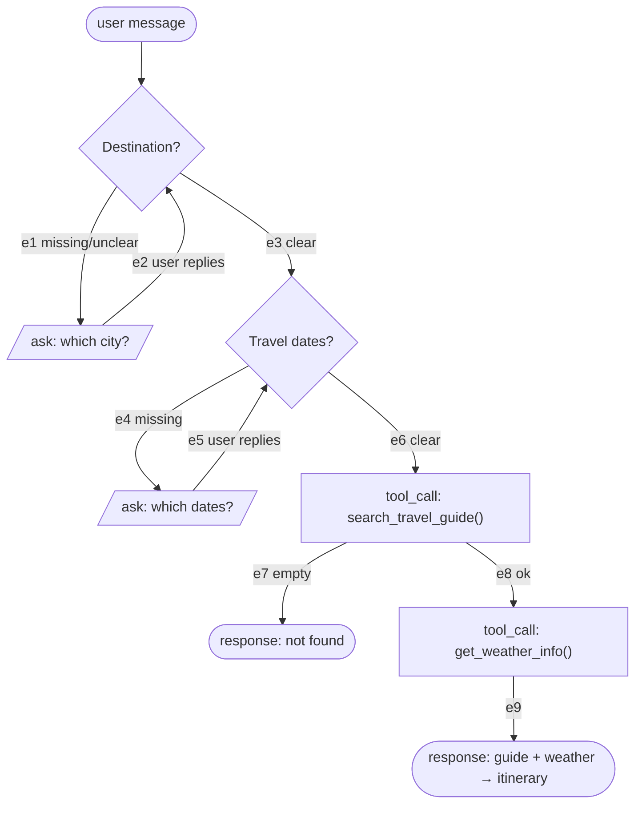

# Business logic → routes

Two parts. You do part 1. A script does part 2.

| | Who | Output |
|---|---|---|
| 1 | You | multiple-choice scenarios → flow chart |
| 2 | `routes.py` | route table |

Do not enumerate routes by hand. That is part 2's job, and hand-counting is
exactly where combinations go missing.

---

## Part 1 — Four steps, in order

### 1. Read the client request

The client request and business logic are the inputs. A request may be as short as:

> "Hotel Services — recommends hotels and retrieves reviews"

No tool list is given. No signatures are given. You design those yourself in
step 2. Do not wait for them and do not ask for them.

### 2. Decompose into QA scenarios, and write the dummy tools

Write out what actually happens in the conversation — the user's words, not an
abstraction:

- what the user will ask, phrased the way they would phrase it
- what the agent needs in order to answer
- what it must ask back when the request is underspecified
- how many turns that takes

```
"推荐一些北京300元的酒店"     → have city + budget, answer directly, 1 turn
"帮我找个酒店"                → city missing, ask, then answer, 2 turns
"附近有什么酒店"              → deictic, use current city, 1 turn
"XX酒店怎么样"                → hotel named, reviews only
```

Now name the tools those scenarios need, and **write the dummy function for
each** — name, parameters, and what it returns:

```python
def recommend_hotels(location, requirements, limit): ...   # -> [hotel]
def get_hotel_reviews(hotel_name): ...                     # -> [review]
```

The signature is a design decision, and it is the one that fixes the slots, so
make it deliberately:

- **A parameter is something the agent must have before calling.** If it can be
  filled from context rather than asked for, say so in a comment — it is a
  parameter, but not a slot.
- **Do not add a parameter per noun in the sentence.** Budget belongs inside
  `requirements`; it is a filter on the call, not a precondition for it.
- **One tool per action, not per phrase.** Clauses with no action behind them
  ("creates itineraries") are the agent's own synthesis in the final response —
  no tool, no node.

### 3. Design the QA slots — three at most

A **slot** is a thing the conversation may be missing that the agent has to ask
for. Abstract them from the scenarios in step 2: whatever the user omitted and
the agent had to ask back.

Two sources, both needed:

- **the signatures you wrote in step 2** — a parameter the agent cannot fill
  from context is a slot. `recommend_hotels` cannot run without `location`, and
  the sentence never mentions it. A parameter that *is* fillable from context is
  not a slot: a start point taken from the user's coordinates is required by the
  function and never asked for.
- **the scenarios** — something the agent should ask about even though the tool
  would technically run without it. Budget is not a parameter (it rides inside
  `requirements`), but "推荐300元左右的" is a real ask, so budget can be a slot.

Do not read slots off the sentence's nouns. A sentence advertises the selling
point, not the precondition; "matching your budget and preferences" names two
optional filters and omits the one mandatory input.

**Three slots maximum.** Every slot multiplies the route table — each one adds
an ask/skip choice on top of every existing combination. Three slots with one
two-way tool outcome is already 16 routes, and each route needs its own training
data. If a fourth seems necessary, either it is not really askable, or the
capability is two capabilities and should be split.

For each slot record: what to ask, and how many times it may be asked (default
once).

### 4. Draw the flowchart from the slots

One decision node per slot, in ask order, then the tool chain. Mermaid
`flowchart TD` — node shape carries meaning, the script reads it:

| Shape | Means |
|---|---|
| `([...])` | start, and each terminal response |
| `{...}` | decision — one slot, or one tool result |
| `[/.../]` | ask — the agent speaks and waits |
| `[...]` | tool_call — real function name, `name()`, no arguments |

Label every route-defining edge `e1`, `e2`, … including loop-backs, with the
option on the edge, not in the node. The structural arrow from `START` into the
first decision remains outside the route sequence; the parser reports it
separately and omits it from route output.



Rules the example is too small to show:

- **A decision may have more than two options.** "Which city?" has at least
  three: given / missing / deictic ("附近的酒店" → use the current city). Do not
  default to binary because the example is binary.
- **But options that do not change turns or tool calls belong on one edge.**
  "City named outright" and "city inferred from 附近" both proceed straight to
  the same tool with no ask — that is one edge, not two. Splitting them produces
  duplicate routes that differ only in wording, which is content, not shape.
  Two edges between the same pair of nodes is always this mistake; the script
  refuses to run rather than silently collapse them.
- **One slot gets one ask loop.** If a slot has several not-yet-usable options
  (missing, ambiguous), they share a single ask node and a single loop-back.
  Giving each its own loop-back lets the enumerator walk both in sequence and
  invent impossible routes — asked-because-ambiguous followed by
  asked-because-missing, for the same slot, in the same conversation.
- **Empty mid-chain suppresses; empty at the end does not.** A tool whose empty
  result leaves the next tool nothing to work on ends the turn — a suppression
  branch. The last tool has nothing to suppress, so its empty result is a second
  terminal response: same tool calls, different reply.
- A loop-back is an edge, not a new node.
- `empty` is its own edge, separate from `error`. Empty is a normal outcome.
- A node with no outgoing edge is a terminal — draw it `([...])` to say you meant
  it. The script warns when those disagree, which catches a forgotten edge.

## Part 2 — Run the function

```bash
python data/scripts/routes.py "README_CN TRAVEL.md" --tag W1
```

`--tag` names the workflow, and becomes the prefix of every route tag — use the
workflow's own identifier (`W1`, `W2`), not an abbreviation of the capability.

It reads the first mermaid block, walks every start→terminal path using each
edge at most once (that is the "ask once" bound), and prints the table:

| Tag | Edges | Turns | Tool calls |
|---|---|---|---|
| W1-A | e3→e6→e8→e9 | 1 | search_travel_guide(), get_weather_info() |
| W1-B | e3→e6→e7 | 1 | search_travel_guide() |
| … | | | |

Paste it under the chart. It also reports on stderr any edge that appears in no
route — a dead edge, or a chart you drew wrong.

**If the route count surprises you, the chart is wrong — fix the chart, not the
table.** The table is never edited by hand.

---

## After the routes exist

A blueprint row is a route tag plus a question that lands on that route. The
questions come from step 2 — assign each to the route it reaches, and write more
for any tag the scenarios never covered. A tag with no question is an untrained
route; that is what the chart is for, since step 2 alone never surfaces it.

The question in a route table is an illustration of the route, not a data row.

Generation may vary only content:

| Fixed by the tag | Free to vary |
|---|---|
| which tools are called, in what order | wording of the agent's question |
| number of user turns | the final prose |
| whether a tool is called at all | which city / date / name appears |

Replay each generated sample and compare its actual edge sequence to its tag.
**A mismatch is a failed generation — retry or drop it. Never keep it as a
label.** A tag with zero rows is an untrained route.

One branch is decided by grounded tool evidence (guide ok vs empty). Select
inputs whose materialized evidence produces each required outcome.

## Refuse to proceed if

- The request names no action at all — there is nothing to call and nothing to
  branch on.
- A branch's options cannot be listed — it is not a decision yet.
- A required slot is disputed — that is the client's call, not yours.
- You are asked for a route table without a chart. Draw the chart first.
