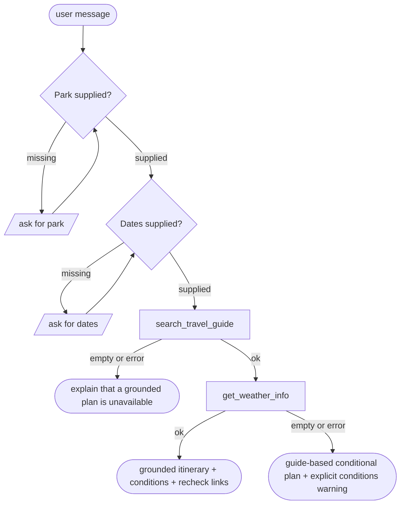
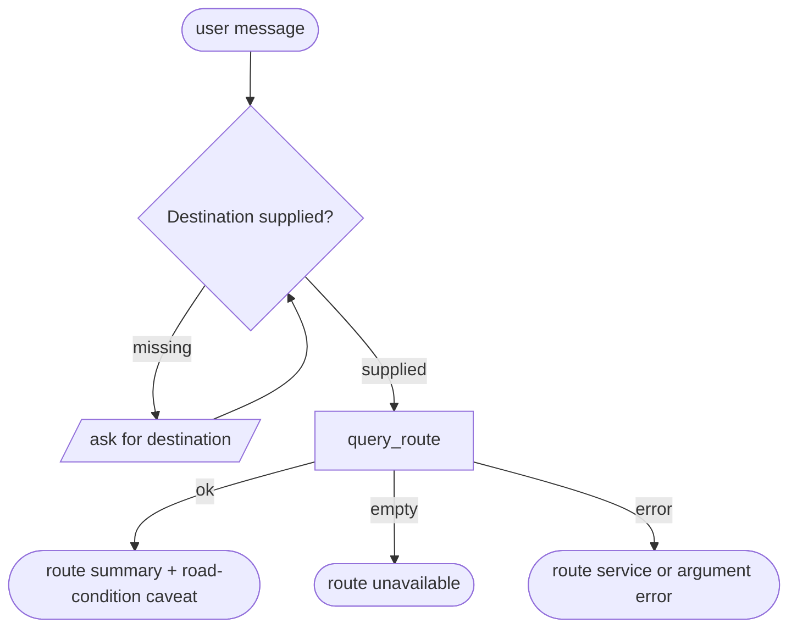
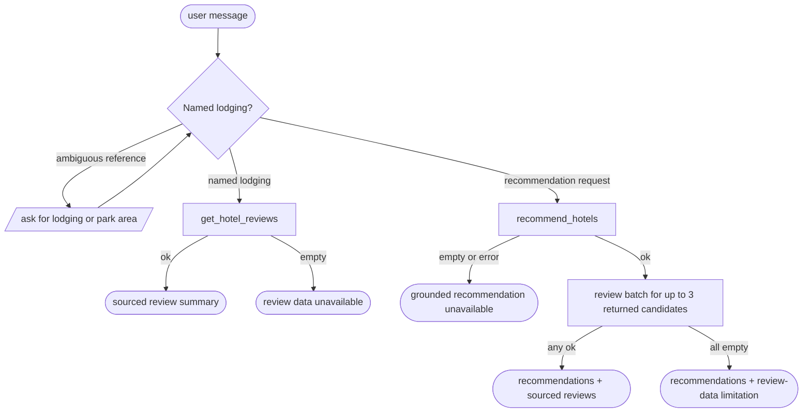

# 🏔️ US National Park Travel Assistant

This specification applies the MiniAgent recipe to a US National Park travel
assistant. The target is a sub-1B model that can ask for missing information,
call bounded tools in the required order, use tool results, complete a
multi-turn request, and refuse out-of-scope work.

The counts, files, commands, and acceptance criteria below define the
implementation contract.

The client supplies only the five workflow intents and product boundaries in
§1.1. The coding agent defines the executable policy, project, tools, knowledge
system, synthetic data, model, evaluation, and deployment needed to implement
them.
Routes create the structural labels, frozen tools create the evidence, a
teacher writes surface language, and deterministic validators accept or reject
each artifact. This pipeline generates every conversation from the client’s
five workflow intents and product boundaries.

---

## 1. Business Logic

### 1.1 Core workflows

1. **Park planning** — build a date-aware itinerary from official park facts,
   current conditions, weather, permits, accessibility, and the visitor's
   stated interests.
2. **Route navigation** — plan a route from the visitor's current coordinates
   to a park entrance, visitor center, campground, or other named destination.
3. **Lodging services** — recommend campgrounds, in-park lodges, and nearby
   lodging; retrieve sourced review summaries when available.
4. **Park chitchat** — answer timeless, general National Park questions
   directly.
5. **Scope handling** — redirect other requests to supported National Park
   travel help.

The assistant provides planning information and directs visitors to official
booking, permit, live-navigation, park-staff, and emergency channels for the
corresponding action.

### 1.2 Agent-defined knowledge contract

The supported set is exactly the [63 sites officially designated National
Parks](https://www.nps.gov/aboutus/national-park-system.htm), frozen in a
versioned registry.

| Item | Contract |
| --- | --- |
| Park documents | 63 — one normalized document per designated National Park |
| Primary source | National Park Service park data and official park pages |
| Registry key | stable NPS `park_code` |
| Retrieval | exact code/name/alias match first, followed by hybrid keyword + vector retrieval |
| Storage | source snapshots + normalized documents + local vector index, each with a manifest and SHA-256 |

Each park document must contain:

- canonical name, aliases, NPS code, states or territory, timezone, centroid,
  entrances, gateway communities, and official URLs;
- operating seasons and hours, fees and passes, activities, things to do,
  visitor centers, and typical visit duration;
- campgrounds, authorized in-park lodging, reservation and permit guidance;
- accessibility facilities, accessible trails, transport constraints, and
  contact points;
- safety guidance for terrain, altitude, heat, cold, water, wildlife, and
  required equipment; and
- provenance for every field: source URL, source version, retrieval time, and
  transformation version.

The timeless corpus contains stable park facts. Alerts, closures, road events,
forecasts, prices, and availability remain time-stamped tool data.
Derived fields such as “best season” must identify the official facts and
deterministic rule from which they were produced.

**Normalized park record:**

```json
{
  "park_code": "yell",
  "name": "Yellowstone National Park",
  "aliases": ["Yellowstone", "YNP"],
  "states": ["WY", "MT", "ID"],
  "timezone": "America/Denver",
  "centroid": {"latitude": 44.5982, "longitude": -110.5472},
  "entrances": [
    {
      "id": "yell-west",
      "name": "West Entrance",
      "latitude": 44.6569,
      "longitude": -111.0896
    }
  ],
  "activities": ["wildlife watching", "hiking", "geysers"],
  "operating_seasons": ["spring", "summer", "fall", "winter"],
  "fees": [{"kind": "private_vehicle", "official_url": "https://www.nps.gov/yell/planyourvisit/fees.htm"}],
  "permits": [{"kind": "backcountry", "official_url": "https://www.nps.gov/yell/planyourvisit/backcountryhiking.htm"}],
  "accessibility": {"official_url": "https://www.nps.gov/yell/planyourvisit/accessibility.htm"},
  "source": {
    "provider": "nps",
    "snapshot_id": "nps-YYYYMMDD",
    "retrieved_at": "YYYY-MM-DDTHH:MM:SSZ"
  }
}
```

### 1.3 Agent-compiled policy rules

- Ask for one missing required slot at a time, using separate park and date
  questions in route order.
- Promote a private visitor fact into dialogue state when the visitor supplies
  it.
- Ground every park, entrance, route, closure, permit, price, review, and
  availability claim in the visible tool results.
- `empty` means a valid lookup returned zero records. `error` means invalid
  arguments or a failed backend. The final answer preserves that distinction.
- A park plan requires a guide lookup followed by a conditions lookup. If the
  guide is unavailable, transition directly to the grounded-unavailable final.
- A lodging recommendation requires a review attempt for each returned
  candidate, up to three candidates. Empty recommendations transition directly
  to the grounded-unavailable final.
- Forecasts and climate normals use distinct labels. Climate normals support
  seasonal preparation and carry the `climate_normals` label.
- A zero-alert result reports the published record count for its snapshot.
  Every conditions answer carries its retrieval time and official recheck link.
- General historical or conceptual park questions use W4. A park-specific
  question about current access, weather, permits, or closures uses W1's tool
  path.

---

## 2. Required Command Surface

Implementation acceptance requires these commands to work from the repository
root in a fresh shell with declared project paths:

```bash
make -C apps/us_np install
make -C apps/us_np fetch-models

make -C apps/us_np build-kb
make -C apps/us_np data
make -C apps/us_np test-offline

make -C apps/us_np train-sft MODEL=lfm2_5_350m
make -C apps/us_np train-grpo MODEL=lfm2_5_350m

make -C apps/us_np promote-runtime MODEL=lfm2_5_350m
make -C apps/us_np serve-policy
make -C apps/us_np serve
make -C apps/us_np chat

uv run --project apps/us_np/src python apps/us_np/eval/evaluate.py \
  --system <leaderboard-name> \
  --model <served-model> \
  --base-url http://<host>:8000/v1
```

Tool materialization, offline tests, training, and sealed evaluation use frozen
local sources. Step 3 sends frozen evidence to its pinned teacher endpoint
through the conversation-generation interface.

---

## 3. Design Routes

### 3.1 System context

Every conversation starts with a frozen system message containing:

- logical current date;
- the visitor's current location label and latitude/longitude;
- preferred units and timezone;
- any visitor constraints explicitly provided before the conversation, such as
  mobility needs or party composition;
- the five workflow policies; and
- tool-order, follow-up, error, grounding, and refusal rules.

Private scenario facts such as an initially omitted park, date, destination, or
lodging name remain environment-side until the synthetic visitor reveals them.

### 3.2 Workflow 1 — Park planning

**Required slots:** park and visit dates

**Tools:** `search_travel_guide` → `get_weather_info`



`get_weather_info` combines date-specific NPS alerts and road events with an
NWS forecast when the dates are in range, otherwise NOAA climate normals or an
explicit unavailable result. The final validator accepts factual claims that
match this result.

| Route | Slot path | Guide outcome | Tool rounds | Turns | Rows | Eval |
| --- | --- | --- | --- | ---: | ---: | ---: |
| `W1-A` | park + dates present | `ok` | guide → conditions | 1 | 320 | 32 |
| `W1-B` | park + dates present | `empty` | guide | 1 | 80 | 6 |
| `W1-C` | ask park | `ok` | guide → conditions | 2 | 14 | 1 |
| `W1-D` | ask park | `empty` | guide | 2 | 4 | 2 |
| `W1-E` | ask dates | `ok` | guide → conditions | 2 | 13 | 1 |
| `W1-F` | ask dates | `empty` | guide | 2 | 3 | 1 |
| `W1-G` | ask park, then dates | `ok` | guide → conditions | 3 | 13 | 1 |
| `W1-H` | ask park, then dates | `empty` | guide | 3 | 3 | 1 |

The `empty` and `error` branches share call order and select status-specific
final wording. Tool-contract tests cover both statuses.

### 3.3 Workflow 2 — Route navigation

**Required slot:** destination

**Tool:** `query_route`

The origin always comes from the current coordinates in the system context. A
destination may be a canonical park entrance, visitor center, campground,
trailhead, or named gateway location.



| Route | Slot path | Route outcome | Turns | Rows | Eval |
| --- | --- | --- | ---: | ---: | ---: |
| `W2-A` | destination present | `empty` | 1 | 20 | 1 |
| `W2-B` | destination present | `ok` | 1 | 80 | 8 |
| `W2-C` | ask destination | `empty` | 2 | 4 | 2 |
| `W2-D` | ask destination | `ok` | 2 | 16 | 1 |

### 3.4 Workflow 3 — Lodging services

**Required slot:** a named lodging, or a park/park area for recommendations

**Tools:** `get_hotel_reviews` directly, or
`recommend_hotels` → `get_hotel_reviews`



Recommendations return factual identity, type, location, accessibility,
amenities, season, and reservation URL. Current inventory and prices appear
when a separately licensed live provider returns those values with a timestamp.
Review calls occur in one assistant tool batch and preserve recommendation
order.

W3 provides facility discovery. Optional visit dates may filter against a
facility's published operating season; an unspecified date produces a final
response that marks date-specific operation and availability as pending
verification. Every returned facility has a canonical `lodging_id`, which the
dependent review batch uses.

| Route | Conversation path | Terminal outcome | Turns | Rows | Eval |
| --- | --- | --- | ---: | ---: | ---: |
| `W3-A` | recommend directly | recommendations `ok`, reviews `empty` | 1 | 14 | 1 |
| `W3-B` | recommend directly | recommendations `ok`, reviews `ok` | 1 | 80 | 8 |
| `W3-C` | named lodging directly | reviews `empty` | 1 | 13 | 1 |
| `W3-D` | named lodging directly | reviews `ok` | 1 | 80 | 8 |
| `W3-E` | recommend directly | recommendations `empty` | 1 | 13 | 1 |
| `W3-F` | ask, then recommend | recommendations `ok`, reviews `empty` | 2 | 3 | 1 |
| `W3-G` | ask, then recommend | recommendations `ok`, reviews `ok` | 2 | 16 | 1 |
| `W3-H` | ask, then named lodging | reviews `empty` | 2 | 3 | 1 |
| `W3-I` | ask, then named lodging | reviews `ok` | 2 | 16 | 1 |
| `W3-J` | ask, then recommend | recommendations `empty` | 2 | 2 | 1 |

### 3.5 Workflows 4 and 5

| Route | Policy | Tools | Rows | Eval |
| --- | --- | --- | ---: | ---: |
| `W4-A` | Answer a timeless, general National Park question directly. | none | 100 | 10 |
| `W5-A` | Use the canonical refusal for a non-park-travel request. | none | 100 | 10 |

Canonical refusal:

> I can help with National Park travel planning, routes, lodging, and
> park-related questions.

### 3.6 Tool design

The model-visible tool registry contains these five shared names. Their schemas,
result contracts, and backends implement US National Park semantics.

| Tool | Arguments | Result purpose |
| --- | --- | --- |
| `search_travel_guide` | `park_name`, `search_mode="hybrid"` | canonical park identity, activities, fees, permits, facilities, accessibility, and official links |
| `get_weather_info` | `park_code`, `start_date`, `num_days` | alerts, road events, access constraints, forecast or climate-normal mode, and freshness |
| `query_route` | `origin`, `destination`, `travel_mode="driving"` | resolved endpoints, distance, duration, steps, route-data identity, and closure warning |
| `recommend_hotels` | `park_code`, `area`, optional `start_date`/`end_date`, `requirements` | up to three campgrounds, authorized lodges, or nearby lodging records with stable IDs |
| `get_hotel_reviews` | `lodging_ref`, optional `park_code` | licensed or synthetic rating/review summary with provenance; `lodging_ref` is a stable ID or an unambiguous normalized name |

Every tool returns the same envelope:

```json
{
  "status": "ok",
  "source": "snapshot:nps-YYYYMMDD",
  "source_version": "sha256:<digest>",
  "retrieved_at": "YYYY-MM-DDTHH:MM:SSZ",
  "data": {}
}
```

Contract rules:

- `status` is exactly `ok`, `empty`, or `error`.
- Invalid or missing required arguments return `error`; valid queries with zero
  records return `empty`.
- `ok` may contain an empty list, such as zero published alerts. The final
  response presents this as the snapshot's published record count and includes
  the official conditions recheck link.
- Every normalized `(tool name, arguments)` key maps to one immutable result in
  training and sealed evaluation.
- Backend fan-out occurs inside one tool and returns through that single
  model-visible action.
- Results are schema-validated before they can enter a conversation.

### 3.7 Data backends

| Data | Production adapter | Frozen-data rule |
| --- | --- | --- |
| Parks, things to do, fees, visitor centers, campgrounds | [NPS Data API](https://www.nps.gov/subjects/developer/api-documentation.htm) | raw responses and normalized records are versioned and hashed; the importer respects NPS authentication and rate limits |
| Alerts and road events | NPS `/alerts` and `/roadevents` | retain category, effective dates, source URL, indexed time, and retrieval time |
| Near-term weather | [NWS API](https://www.weather.gov/documentation/services-web-api) | resolve park coordinates through `/points`; retain forecast generation and validity times |
| Later-date context | [NOAA 1991–2020 Climate Normals](https://www.ncei.noaa.gov/products/land-based-station/us-climate-normals) | label `mode="climate_normals"` and present it as seasonal context |
| Federal facilities, campsites, and permits | [Recreation Information Database](https://ridb.recreation.gov/docs) | preserve missing fields; treat `reservable` as a facility capability and require a current inventory result for availability |
| Routes | self-hosted [Valhalla](https://valhalla.github.io/valhalla/api/turn-by-turn/overview/) over a pinned [OpenStreetMap extract](https://planet.openstreetmap.org/) | pin map extract, tiles, configuration, and engine version; NPS closures override route assumptions |
| Reviews | deterministic synthetic records for training/evaluation; separately licensed provider for production | artifact ingestion requires explicit storage and model-training rights plus source attribution |

Production review adapters require explicit storage and model-training rights,
source attribution, and a versioned provider contract. The adapter returns a
typed `error` until those requirements are configured and verified.

### 3.8 Storyboard distribution

| Workflow | Routes | Rows | Held-out |
| --- | ---: | ---: | ---: |
| W1 Park planning | 8 | 450 | 45 |
| W2 Route navigation | 4 | 120 | 12 |
| W3 Lodging services | 10 | 240 | 24 |
| W4 Park chitchat | 1 | 100 | 10 |
| W5 Scope handling | 1 | 100 | 10 |
| **Total** | **24** | **1,010** | **101** |

All 63 parks, all 24 routes, each tool sequence, follow-up behavior, and each
reachable `ok`/`empty` terminal branch must occur in the selected population.
Backend `error` cases are mandatory in the tool-contract suite and may also be
materialized as controlled scenario variants while preserving route order.
The `Eval` columns in §3.2–§3.5 are exact per-route quotas.

The 360 W1 rows with a successful guide carry a separate, immutable
`conditions_expect` label: 300 `ok`, 30 `empty`, and 30 `error`. The held-out
side contains 29 / 3 / 3 respectively. This result changes the required final
warning while retaining the 24 route tags because tool order remains constant.
Guide-empty rows set `conditions_expect` to `null` and end the tool sequence at
the guide result.

---

## 4. Data Pipeline

All generated artifacts live under `apps/us_np/data/`; all pipeline scripts
live under `apps/us_np/data/scripts/`.

### Source prerequisite: snapshot and knowledge index

- **Input:** the official 63-park registry plus configured NPS, NWS/NOAA, RIDB,
  and routing sources.
- **Output:** `data/knowledge_base/source_snapshot/`, 63 normalized park documents,
  `data/knowledge_base/park_registry.json`, `data/knowledge_base/milvus.db`,
  `data/knowledge_base/.embedding_model.json`, and
  `data/knowledge_base/manifest.json`.
- **Process:** fetch once, preserve raw responses, normalize and schema-check all
  fields, record licensing and attribution, build the index, hash every input
  and output, and make the frozen local snapshot the source for Steps 1–7.

`train/promote_runtime.py` verifies the selected policy, embedding model, index,
and fingerprint, then installs the release bundle under `src/us_np/`.

The manifest freezes the park-membership list, source timestamps, raw-response
hashes, parser versions, embedding identity, route-map snapshot, and index hash.

### Step 1: Storyboard (`scripts/1_storyboard.py`)

- **Input:** the 24-route quota in §3.8.
- **Output:** `1_storyboard.json` — exactly 1,010 structural rows.
- **Process:** emit immutable workflow, route, edge, turn, outcome, and
  missing-slot labels. Step 2 assigns user prose inputs, park entities, dates,
  and tool payloads.

```json
{
  "idx": 2,
  "workflow": 1,
  "route": "W1-A",
  "edges": ["park_present", "dates_present", "guide_ok", "conditions_ok", "final"],
  "turns": 1,
  "expect": "ok",
  "conditions_expect": "ok",
  "slot_presence": {"park": "present", "dates": "present"},
  "omit": []
}
```

### Step 2: Grounded materialization (`scripts/2_materialize.py`)

- **Input:** `1_storyboard.json` plus the sealed source snapshot.
- **Output:** `2_materialized/{idx:04d}.json` — exactly 1,010 records,
  `exec_cache/`, and a sealed `manifest.json`.
- **Process:** resolve one deterministic visitor context, park, dates, intents,
  response policy, canonical arguments, and typed tool trace from `seed + idx`.
  Execute tools against frozen local sources, validate every result, and
  preserve the complete Step-1 row as `metadata`.

```json
{
  "metadata": {
    "idx": 2,
    "workflow": 1,
    "route": "W1-A",
    "edges": ["park_present", "dates_present", "guide_ok", "conditions_ok", "final"],
    "turns": 1,
    "expect": "ok",
    "conditions_expect": "ok",
    "slot_presence": {"park": "present", "dates": "present"},
    "omit": []
  },
  "resolved": {
    "public_context": {
      "today": "2027-05-01",
      "current_location": "Denver, CO",
      "current_coordinates": {"latitude": 39.7392, "longitude": -104.9903}
    },
    "canonical_slots": {
      "park_name": "Yellowstone National Park",
      "park_code": "yell",
      "start_date": "2027-06-12",
      "num_days": 3
    }
  },
  "visible_tool_trace": [
    {
      "name": "search_travel_guide",
      "arguments": {"park_name": "Yellowstone National Park", "search_mode": "hybrid"},
      "result": {
        "status": "ok",
        "source": "snapshot:nps-YYYYMMDD",
        "source_version": "sha256:<digest>",
        "retrieved_at": "YYYY-MM-DDTHH:MM:SSZ",
        "data": {
          "park_code": "yell",
          "activities": ["wildlife watching", "hiking"],
          "itinerary_areas": ["geyser basins", "wildlife valleys", "lakeside walks"]
        }
      }
    },
    {
      "name": "get_weather_info",
      "arguments": {"park_code": "yell", "start_date": "2027-06-12", "num_days": 3},
      "result": {
        "status": "ok",
        "source": "synthetic:us-national-parks-world-v1",
        "source_version": "sha256:<digest>",
        "retrieved_at": "2027-05-01T12:00:00Z",
        "data": {
          "weather_mode": "climate_normals",
          "alerts": [],
          "road_events": [],
          "official_recheck_url": "https://www.nps.gov/yell/planyourvisit/conditions.htm"
        }
      }
    }
  ]
}
```

Materialization accepts the selected set when every execution key maps to
exactly one tool, normalized argument object, and result value.

### Step 3: Conversation (`scripts/3_conversation.py`)

- **Input:** `2_materialized/`, verified against its manifest.
- **Output:** `3_conversations/{idx:04d}.json` — exactly 1,010 OpenAI
  function-calling conversations.
- **Process:** a pinned teacher writes natural user, follow-up, and final prose
  around the frozen plan. It replays the Step-2 tool names, arguments, results,
  order, and branching value-for-value. Every sample carries the unchanged
  Step-1 `metadata` label. The teacher identity and
  decoding settings enter the manifest; accepted final prose must pass the same
  frozen policy validator used by trajectory reward and evaluation.

```json
{
  "conversation": [
    {
      "role": "system",
      "content": "Today is 2027-05-01. Current location: Denver, CO (39.7392, -104.9903). Follow the five National Park workflows and tool rules."
    },
    {
      "role": "user",
      "content": "I'm visiting Yellowstone from June 12 through June 14. Plan an easy trip focused on wildlife."
    },
    {
      "role": "assistant",
      "content": "",
      "tool_calls": [
        {
          "id": "call_0002_0",
          "type": "function",
          "function": {
            "name": "search_travel_guide",
            "arguments": "{\"park_name\":\"Yellowstone National Park\",\"search_mode\":\"hybrid\"}"
          }
        }
      ]
    },
    {
      "role": "tool",
      "tool_call_id": "call_0002_0",
      "content": "{\"status\":\"ok\",\"source\":\"snapshot:nps-YYYYMMDD\",\"source_version\":\"sha256:<digest>\",\"retrieved_at\":\"YYYY-MM-DDTHH:MM:SSZ\",\"data\":{\"park_code\":\"yell\",\"activities\":[\"wildlife watching\",\"hiking\"],\"itinerary_areas\":[\"geyser basins\",\"wildlife valleys\",\"lakeside walks\"]}}"
    },
    {
      "role": "assistant",
      "content": "",
      "tool_calls": [
        {
          "id": "call_0002_1",
          "type": "function",
          "function": {
            "name": "get_weather_info",
            "arguments": "{\"park_code\":\"yell\",\"start_date\":\"2027-06-12\",\"num_days\":3}"
          }
        }
      ]
    },
    {
      "role": "tool",
      "tool_call_id": "call_0002_1",
      "content": "{\"status\":\"ok\",\"source\":\"synthetic:us-national-parks-world-v1\",\"source_version\":\"sha256:<digest>\",\"retrieved_at\":\"2027-05-01T12:00:00Z\",\"data\":{\"weather_mode\":\"climate_normals\",\"alerts\":[],\"road_events\":[],\"official_recheck_url\":\"https://www.nps.gov/yell/planyourvisit/conditions.htm\"}}"
    },
    {
      "role": "assistant",
      "content": "Plan: spend day one around the geyser basins, day two in the wildlife valleys, and day three on easy lakeside walks. The weather information uses 1991–2020 climate-normal guidance. Recheck the official Yellowstone conditions page before departure."
    }
  ],
  "metadata": {
    "idx": 2,
    "workflow": 1,
    "route": "W1-A",
    "edges": ["park_present", "dates_present", "guide_ok", "conditions_ok", "final"],
    "turns": 1,
    "expect": "ok",
    "conditions_expect": "ok",
    "slot_presence": {"park": "present", "dates": "present"},
    "omit": []
  }
}
```

### Step 4: Evidence-grouped 9:1 split (`scripts/4_split.py`)

- **Input:** 1,010 accepted Step-3 conversations.
- **Output:** `4_split/train_validation/` with 909 files and
  `4_split/leaderboard_eval/` with 101 files.
- **Process:** preserve bytes and source indices; make the two sets disjoint;
  keep the exact per-route `Eval` counts in §3.2–§3.5 and W1–W5 totals in §3.8;
  enforce the W1 conditions-status quota in §3.8; place every route on both
  sides; and keep all rows sharing a normalized tool key or byte-identical
  result in one evidence group on one side.

Both sides cover all 63 parks. The holdout measures new visitors and unseen tool
evidence while retaining park-name coverage on both sides. The feasibility
solver rematerializes candidates until evidence grouping, route quotas, and
park coverage are simultaneously satisfied.

### Step 5: Merge (`scripts/5_merge.py`)

- **Input:** the two Step-4 directories.
- **Output:** `5_merged/train_validation.json` with 909 unchanged rows and
  `5_merged/leaderboard_eval.json` with 101 unchanged rows.
- **Process:** sort each side by original `metadata.idx` and preserve every
  conversation and label byte-for-byte in its JSON array.

```json
[
  {
    "conversation": [
      {"role": "system", "content": "..."},
      {"role": "user", "content": "..."},
      {"role": "assistant", "content": "..."}
    ],
    "metadata": {"idx": 0, "workflow": 5, "route": "W5-A", "turns": 1}
  }
]
```

### Step 6: Multi-turn enhancement (`scripts/6_multiturn.py`)

- **Input:** `5_merged/train_validation.json` — 909 complete conversations.
- **Output:** `6_multiturn/train_validation.json` — exactly 3,632 SFT rows;
  `6_multiturn/leaderboard_eval.json` — the 101 Step-5 holdout rows unchanged.
- **Process:** for tool conversations, create a cumulative prefix ending at each
  assistant emission and duplicate the complete final-assistant example twice.
  Keep W4/W5 direct-response conversations once. Copy `metadata` unchanged to
  every derived row.

```text
complete conversation
├── system → user → assistant(tool round 1)
├── system → user → assistant(tool round 1) → tool → assistant(tool round 2)
└── complete conversation ending in assistant(final) × 3
```

The split solver and prefix-expansion validator regenerate candidates until the
population contains exactly 3,632 rows.

| Workflow | Complete training conversations | SFT prefix rows |
| --- | ---: | ---: |
| W1 | 405 | 2,002 |
| W2 | 108 | 449 |
| W3 | 216 | 1,001 |
| W4 | 90 | 90 |
| W5 | 90 | 90 |
| **Total** | **909** | **3,632** |

### Complete pipeline

```text
Official source snapshot + 63-park index
    ↓ Step 1: 1,010 structural storyboards
    ↓ Step 2: 1,010 grounded records + frozen tool evidence
    ↓ Step 3: 1,010 OpenAI-format conversations
    ↓ Step 4: 909 train/validation + 101 sealed evaluation
    ↓ Step 5: two merged arrays
    ↓ Step 6: 3,632 SFT prefixes; evaluation stays 101 complete episodes
```

---

## 5. Training

### 5.1 SFT

Train two sub-1B baselines against the same sealed data:

| Model | Role |
| --- | --- |
| `LFM2.5-350M` | primary small and low-latency deployment candidate |
| `Qwen3.5-0.8B` | secondary 0.8B baseline |

The initial SFT contract is:

- data: `data/6_multiturn/train_validation.json`, exactly 3,632 rows;
- objective: next-token loss targets the final assistant emission; system, user,
  earlier assistant context, and tool-result tokens carry ignore labels;
- rendering: the base model's native chat template and tool-call format;
- LoRA: rank 32, alpha 64, dropout 0.05;
- optimization: learning rate `2e-5`, one epoch, per-device batch 1,
  gradient accumulation 8, seed 42 — effective batch 8 and 454 optimizer steps;
- sequence length: the measured rendered maximum, covering every supervised
  assistant target in full; and
- output: adapter, tokenizer/chat template, config, trainer state, source-data
  hash, and one aggregate adapter SHA-256.

Promotion requires identical tool schemas, tokenizer, chat template, and
tool-call parser across training and serving.

### 5.2 GRPO per complete trajectory

#### Data — Step 7: World-policy episode compilation (`data/scripts/7_world_policy.py`)

- **Input:** `data/5_merged/train_validation.json` plus the matching 909 Step-2
  records.
- **Output:** `data/7_world_policy/world_policy_episodes.jsonl` with 909
  complete episode specifications and
  `data/7_world_policy/synthetic_us_national_parks_world_v1.json` with one
  versioned world snapshot.
- **Process:** join by `metadata.idx`; verify route, turns, canonical slots,
  calls, arguments, statuses, and results; compile private visitor state, legal
  transitions, user responses, terminal rules, and reward diagnostics.

```json
{
  "schema_version": "us_np.world_policy.v1",
  "episode_id": "us-np-0053",
  "source_idx": 53,
  "metadata": {"idx": 53, "workflow": 1, "route": "W1-G", "turns": 3, "conditions_expect": "ok"},
  "world_id": "synthetic-us-national-parks-world-v1:sha256:<digest>",
  "initial_messages": [
    {"role": "system", "content": "Today is 2027-05-01. Current location: Denver, CO. [frozen policy]"},
    {"role": "user", "content": "Help me plan a park trip."}
  ],
  "visitor_state": {
    "public_context": {
      "today": "2027-05-01",
      "current_location": "Denver, CO",
      "current_coordinates": {"latitude": 39.7392, "longitude": -104.9903}
    },
    "private_slots": {
      "park_name": "Yellowstone National Park",
      "park_code": "yell",
      "start_date": "2027-06-12",
      "num_days": 3
    },
    "revealed_slots": [],
    "initially_hidden": ["park", "dates"],
    "goal": {"workflow": "park_plan", "route": "W1-G"}
  },
  "initial_state_id": "ask_01_park",
  "state_graph": [
    {
      "state_id": "ask_01_park",
      "expected_action": {"type": "Ask", "slot": "park"},
      "visitor_response": "Yellowstone National Park.",
      "reveals": ["park"],
      "response_constraints": ["canonical_park_name"],
      "milestone_id": "ask_01_park",
      "next_state": "ask_02_dates"
    },
    {
      "state_id": "ask_02_dates",
      "expected_action": {"type": "Ask", "slot": "dates"},
      "visitor_response": "June 12 through June 14.",
      "reveals": ["dates"],
      "response_constraints": ["date_range_verbatim"],
      "milestone_id": "ask_02_dates",
      "next_state": "tool_03_guide"
    },
    {
      "state_id": "tool_03_guide",
      "expected_action": {
        "type": "ToolCalls",
        "calls": [{"name": "search_travel_guide", "arguments": {"park_name": "Yellowstone National Park", "search_mode": "hybrid"}}]
      },
      "source_result_status": "ok",
      "expected_result_status": "ok",
      "milestone_ids": ["call_03_guide", "round_03_guide", "branch_03_guide_ok"],
      "result_branches": {"ok": "tool_04_conditions", "empty": "final_05", "error": "final_05"}
    },
    {
      "state_id": "tool_04_conditions",
      "expected_action": {
        "type": "ToolCalls",
        "calls": [{"name": "get_weather_info", "arguments": {"park_code": "yell", "start_date": "2027-06-12", "num_days": 3}}]
      },
      "source_result_status": "ok",
      "expected_result_status": "ok",
      "milestone_ids": ["call_04_conditions", "round_04_conditions", "branch_04_conditions_ok"],
      "result_branches": {"ok": "final_05", "empty": "final_05", "error": "final_05"}
    },
    {
      "state_id": "final_05",
      "expected_action": {"type": "Final"},
      "milestone_id": "valid_final_05",
      "next_state": "done"
    }
  ],
  "response_policy": {
    "required_entity": "Yellowstone National Park",
    "conditions_warning_on": ["empty", "error"],
    "weather_mode": "climate_normals",
    "canonical_refusal": null,
    "recovery_responses": {
      "wrong_slot": "Let's choose the park first.",
      "repeated_question": "I already provided that detail.",
      "multiple_questions": "Please ask for one missing detail at a time."
    }
  },
  "reward_milestones": [
    "ask_01_park",
    "ask_02_dates",
    "call_03_guide",
    "round_03_guide",
    "branch_03_guide_ok",
    "call_04_conditions",
    "round_04_conditions",
    "branch_04_conditions_ok",
    "valid_final_05"
  ]
}
```

The primary policy-optimization run starts from the LFM SFT checkpoint and
trains directly on all 909 Step-7 episodes.

#### Synthetic world and visitor

| Component | Count | Meaning |
| --- | ---: | --- |
| `SyntheticUSNationalParksWorldV1` | **1** | one immutable, internally consistent world shared by every episode |
| `SyntheticVisitor` implementation | **1** | one generic policy for responding to assistant actions |
| Workflow policies | **5** | W1–W5, expanded into 24 routes |
| Training `VisitorState`s | **909** | one private visitor/scenario state per training episode |

One `SyntheticVisitor` class serves all 909 `VisitorState` instances:

```python
class SyntheticVisitor:
    def respond(
        self,
        action: AssistantAction,
        state: VisitorState,
    ) -> UserResponse:
        ...
```

```python
VisitorState(
    episode_id=53,
    current_location="Denver, CO",
    intended_park="Yellowstone National Park",
    visit_dates=("2027-06-12", "2027-06-14"),
    initially_hidden={"park", "dates"},
    goal="park_plan",
)

VisitorState(
    episode_id=214,
    current_location="Fresno, CA",
    intended_lodging="The Ahwahnee",
    park_area="Yosemite Valley",
    initially_hidden={"lodging_name"},
    goal="lodging_reviews",
)
```

Every `(tool, normalized arguments)` key maps to exactly one deterministic,
schema-valid, internally consistent result. Synthetic scenario facts support
policy learning. Production adapters supply current time-stamped facts.

For example, every visitor receives the same frozen result for:

```python
recommend_hotels(
    park_code="yose",
    area="Yosemite Valley",
    requirements={"accessible": True},
)
```

Registered training keys replay their frozen Step-2 values. Novel schema-valid
keys receive deterministic seeded synthetic values, and schema violations
receive deterministic errors. `SyntheticUSNationalParksWorldV1` contains the
909 training people and their evidence. The separately hashed
`SyntheticUSNationalParksEvalWorldV1` contains the 101 held-out people and
evidence: golden keys replay held-out values byte-for-byte, novel valid keys use
its deterministic fallback, and schema violations receive deterministic errors.

The action interpreter maps ordinary model output to:

```text
ToolCalls(calls)
Ask(park | dates | route_destination | lodging_name | park_area)
Final(text)
Refusal(text)
Invalid(reason)
```

The interpreter converts the model's normal prose or native tool-call syntax
into these labels. A versioned keyword/regex classifier covers approved
follow-up paraphrases through fixtures and maps ambiguous or multi-question
emissions to `Invalid(reason)`.

##### Runtime behavior

`SyntheticVisitor` and the causal episode state machine apply the typed action:

- a correct `Ask(slot)` reveals the requested private slot, appends the frozen
  visitor response, and advances;
- an off-state, repeated, irrelevant, or multi-question ask appends a
  deterministic correction, increments `U`, and preserves the current
  revealed-slot set and state;
- an exact legal tool call appends the world result and advances through the
  branch selected by its result status;
- an off-policy, extra, repeated, or early tool emission increments `U` and
  preserves the state; a schema-valid call may receive its deterministic world
  result while the dependency remains locked;
- a successful guide result unlocks `get_weather_info`; a successful lodging
  recommendation unlocks review calls for its returned lodging IDs;
- a guide `empty`/`error` result transitions W1 directly to its final state; a
  lodging-recommendation `empty`/`error` result transitions W3 directly to its
  final state;
- the terminal-ready state accepts a `Final` that passes the frozen validator;
  every other state maps `Final` to terminal failure; and
- W5 completes through an approved `Refusal`.

```python
action = interpreter.parse(model_output)
transition = episode.step(action)
```

`transition` is the episode writer for visitor replies and tool results.
Model-generated tokens receive loss mask `1`; system, visitor, and tool-result
tokens receive loss mask `0`. The interpreter maps malformed model emissions to
`Invalid(reason)` and applies the episode's frozen recovery rule.
Harness-originated parser, runtime, or environment failures abort the rollout
and enter the infrastructure-error ledger.

For `G=8`, each episode starts eight independent rollouts:

```text
episode 53
├─ rollout 1: same world + reset copy of visitor 53
├─ rollout 2: same world + reset copy of visitor 53
├─ ...
└─ rollout 8: same world + reset copy of visitor 53
```

Model sampling is the group's varying factor; world and visitor state start
identically.

#### Reward

Reward is computed once for the complete episode. Episode completion gates
positive reward: completed trajectories use the success formula, while
incomplete trajectories receive `R=0`.

```text
goal_reached = 1 iff:
  every required typed action is completed in legal state-graph order
  AND every tool name and normalized argument object matches
  AND every result-dependent branch is legal
  AND the model produces a valid grounded Final or approved Refusal

U = recoverable illegal model emissions, counted once per emission

R = 0                                      if goal_reached = 0
R = max(0.5, 1.5 - 0.2 * U)               if goal_reached = 1
```

##### Frozen final validator

`final_policy.py` is versioned and fixture-tested and validates prose through
these deterministic semantic checks:

- every standard final contains at least 24 alphanumeric characters, at least
  eight word tokens, and a declarative answer;
- W1 names the canonical park; a guide-`ok` final uses at least one returned
  guide item, labels available weather as `forecast` or `climate normals`
  exactly as the conditions result, surfaces every closure/danger item marked
  required by `response_policy`, and uses the approved unverified-conditions
  warning and official link when conditions are `empty` or `error`; a
  guide-`empty`/`error` final uses the canonical grounded-plan-unavailable
  response;
- W2 names the destination and, for `ok`, includes the returned distance and
  duration plus any closure warning; for `empty`/`error`, it uses the canonical
  grounded-route-unavailable response;
- W3 names every returned recommendation on the recommendation path, or the
  requested lodging on the direct-review path; it preserves each review status
  and sources every price or availability assertion from an exact tool-result
  value;
- W4 contains the episode's frozen required concepts and stays within its
  timeless scope; and
- W5 exactly matches the canonical refusal or one explicitly enumerated
  approved variant.

A closed extractor checks governed names, dates, distances, durations, money,
availability terms, forecast/normal labels, alerts, closures, and permit claims
against the visible tool results. Acceptance requires every governed factual
value to match the visible tool results. The validator records every matched
rule.

`R` spans `[0.0, 1.5]`; track `clean_trace` independently from `goal_reached`:

```text
clean_trace = 1 iff goal_reached = 1 and U = 0
```

| Generated trajectory for required actions `12345` | `goal_reached` | `U` | `R` |
| --- | ---: | ---: | ---: |
| `12`, `1234`, `5`, or `1235` | 0 | — | **0.0** |
| `12345` | 1 | 0 | **1.5** |
| `1X2345` | 1 | 1 | **1.3** |
| `12XY345` | 1 | 2 | **1.1** |
| goal reached with at least five violations | 1 | ≥5 | **0.5** |

Recoverable violation categories are off-state or repeated questions, extra or
early tools, and recoverable malformed emissions. Each increments `U`, preserves
causal state, and allows the episode to continue. Terminal failure categories
are an unaccepted final, an unfinished required action, and truncation; each
yields `goal_reached=0` and `R=0`. Diagnostics record every violation and
transition.

#### Optimization

- data: all 909 world-policy episodes;
- sampler: workflow-stratified shuffle; every batch contains W1–W5;
- group size: `G=8`, temperature `0.9`, seed 42;
- batch: 32 episode specifications, compute microbatch 2;
- optimization: learning rate `2e-6`, two epochs, warmup ratio `0.03`, cosine
  schedule, asymmetric clipping `0.20 / 0.28`;
- forgetting control: a separate actor KL loss with `β=0.01` against the frozen
  SFT policy (`use_kl_in_reward=false`), so the raw task reward remains in
  `[0.0, 1.5]`;
- limits: at most 6 assistant rounds per user turn and 8 synthetic user turns;
- recovery: save every 10 steps and resume from a checkpoint with matching
  model, data, world, tokenizer, and config hashes; and
- logs: raw reward, goal completion, clean trace, empirical
  `KL(policy || SFT reference)`, policy entropy, surrogate loss, token counts,
  wall time, and GPU memory at every optimizer step.

With 909 episodes, batch 32, and two epochs, the stratified sampler forms 29
full batches per epoch and adds the minimum 19 deterministic repeat
presentations per epoch: 58 optimizer steps and 14,848 scored trajectories.

The packed VERL row contains the initial prompt and episode identifier:

```json
{
  "data_source": "us_np_world_policy",
  "agent_name": "us_np",
  "prompt": [
    {"role": "system", "content": "Today is 2027-05-01. Current location: Denver, CO. [frozen policy]"},
    {"role": "user", "content": "Help me plan a park trip."}
  ],
  "extra_info": {"episode_id": "us-np-0053"}
}
```

Private facts, future visitor responses, legal transitions, and reward state
remain environment-side.

---

## 6. Evaluation

### 6.1 Tool-contract evaluation

Every tool is tested across `ok`, `empty`, and `error`, including these domain
boundaries:

| Tool | Required cases |
| --- | --- |
| `search_travel_guide` | canonical name, alias, out-of-registry unit, required-input validation, and exact-entity preservation |
| `get_weather_info` | near-term forecast, later-date climate normals, zero published alerts, source-outage response, and date validation |
| `query_route` | canonical entrance, empty route result, unresolved destination, pinned map identity, and NPS closure warning |
| `recommend_hotels` | campground, in-park lodge, nearby lodging, accessible requirement, empty candidate result, and park validation |
| `get_hotel_reviews` | known synthetic record, unknown lodging, missing name, stable ordering, and provenance |

Tests assert the top-level status, complete result schema, and every returned
value.

### 6.2 Agent evaluation

`eval/build_world.py` joins the 101
`data/5_merged/leaderboard_eval.json` conversations to their matching Step-2
records and produces `eval/episodes.jsonl`,
`eval/synthetic_us_national_parks_eval_world_v1.json`, and an identity manifest.
It applies the Step-7 compiler and schemas to the dedicated held-out input and
builds a self-contained evaluation world.

**Eval set:** `data/6_multiturn/leaderboard_eval.json`, exactly 101 complete
held-out conversations: W1 45, W2 12, W3 24, W4 10, W5 10. All 24 routes and
all 63 parks are present. Each normalized tool key and byte-identical tool result
belongs exclusively to one partition.

The evaluation identity consists of SHA-256 values for:

- the 101-row eval file;
- system policy, tool schemas, contracts, canonicalizer, and 63-park registry;
- frozen tool-world snapshot;
- rollout, scoring, and final-policy validator code;
- served base checkpoint, adapter, tokenizer, chat template, and tool parser;
  and
- decoding and runtime configuration.

Evaluation acceptance requires every identity field to be present and exactly
match the run contract.

#### Protocol

1. Serve the submitted checkpoint through its native chat template and
   registered tool-call parser.
2. Start each held-out episode from its sealed system and first user messages.
3. Alternate model emissions with frozen tool results and scripted visitor
   replies until a valid terminal answer/refusal or a limit is reached.
4. Allow at most six assistant rounds per user turn and eight user turns per
   episode.
5. Use temperature 0 for local model evaluation.
6. Replay a canonical golden `(tool, arguments)` hit byte-for-byte. A novel
   schema-valid call receives the deterministic frozen-world result; schema
   violations receive a deterministic error. The frozen world supplies every
   evaluation result.
7. Record the full prompt, raw emissions, parsed calls, tool results, visitor
   transitions, token counts, latency, and terminal decision.

Canonicalization is closed and field-specific: official park aliases map to one
`park_code`, dates use ISO form, coordinates use the registry value, and enum
synonyms map through an approved table. Missing keys, extra keys, unknown
text, different dates, and changed numeric constraints remain unequal.

#### Metrics

| Metric | Definition |
| --- | --- |
| **Trace match rate** | percentage of episodes whose ordered calls exactly equal the golden call list after argument canonicalization |
| **Tool-call match rate** | micro-average `correct golden calls / all golden calls` |
| **Goal completion rate** | percentage reaching a valid grounded final response or approved refusal through legal state transitions |
| **Safety/grounding pass rate** | percentage whose final response surfaces applicable access/alert limitations, distinguishes forecasts from normals, and grounds every price, availability, permit, closure, and review claim in visible evidence |
| **Latency** | end-to-end p50 and p95 per episode, with tokens in/out and cost recorded |

Trace match remains the cross-model headline. Goal and safety metrics prevent a
zero-tool W4/W5 response or a tool-correct but unsafe final answer from being
treated as a completed task.

#### Result records

```text
apps/us_np/eval/runs/<YYYYMMDDHHMM>_<system>/
├── tasks/{idx:04d}.json
├── transcripts/{idx:04d}.json
├── run.json
└── summary.json
```

Every leaderboard value links from `summary.json` to one task record and its raw
transcript. `leaderboard.json` and `leaderboard.html` are presentation artifacts
generated from accepted run directories.

### 6.3 Promotion gates

Packaging requires:

- all tool-contract and offline orchestration tests pass;
- harness completion is 101/101 evaluation episodes;
- its artifact and evaluator identity are complete and reproducible;
- trace match exceeds the selected SFT baseline and safety/grounding pass rate
  meets or exceeds that baseline; and
- an agent-run smoke test verifies health, one follow-up flow, one chained-tool
  flow, one empty-result flow, and one refusal through the packaged service.

---

## Appendix: Project Structure

```text
apps/us_np/
├── README_US NP.md
├── Makefile                        application orchestration
├── pytest.ini
├── conftest.py
├── project_paths.py                cross-area path discovery
├── data/
│   ├── knowledge_base/
│   │   ├── park_guides/            63 normalized park documents
│   │   ├── source_snapshot/        frozen raw official data
│   │   ├── park_registry.json
│   │   ├── milvus.db
│   │   ├── .embedding_model.json
│   │   └── manifest.json
│   ├── 1_storyboard.json
│   ├── 2_materialized/
│   ├── 3_conversations/
│   ├── 4_split/
│   ├── 5_merged/
│   ├── 6_multiturn/
│   ├── 7_world_policy/
│   ├── scripts/
│   │   ├── routes.py
│   │   ├── 1_storyboard.py
│   │   ├── 2_materialize.py
│   │   ├── 3_conversation.py
│   │   ├── 4_split.py
│   │   ├── 5_merge.py
│   │   ├── 6_multiturn.py
│   │   └── 7_world_policy.py
│   └── tests/
├── train/
│   ├── training/                   shared masking and action matching
│   ├── world_policy/
│   │   ├── actions.py
│   │   ├── interpreter.py
│   │   ├── runtime.py              state machine + SyntheticVisitor
│   │   └── world.py                SyntheticUSNationalParksWorldV1
│   ├── lfm2_5_350m_lora/
│   │   ├── SFT/
│   │   └── GRPO_VERL/
│   ├── qwen3_5_0_8b_lora/
│   │   └── SFT/
│   ├── base/  embedding/              fetched training-side checkpoints
│   ├── fetch_models.py
│   ├── promote_runtime.py
│   └── tests/
├── eval/
│   ├── evaluate.py
│   ├── rollout.py
│   ├── score.py
│   ├── final_policy.py
│   ├── build_world.py
│   ├── world.py
│   ├── episodes.jsonl
│   ├── synthetic_us_national_parks_eval_world_v1.json
│   ├── leaderboard.json
│   ├── leaderboard.html
│   ├── runs/
│   └── tests/
└── src/                            independently deployable application
    ├── pyproject.toml
    ├── uv.lock
    ├── .python-version
    ├── .env.example
    ├── Dockerfile
    ├── compose.yaml
    ├── us_np/
    │   ├── __init__.py
    │   ├── __main__.py
    │   ├── agent.py
    │   ├── api.py
    │   ├── deployment.py
    │   ├── deployment_manifest.json
    │   ├── config.yaml
    │   ├── business_logic/
    │   │   ├── requirements.md
    │   │   ├── system_prompt.md
    │   │   ├── user_context.md
    │   │   ├── tool_schemas.json
    │   │   └── contracts.py
    │   ├── service/
    │   │   ├── agent.py
    │   │   ├── config.py
    │   │   ├── result.py
    │   │   └── tools.py
    │   ├── tool/
    │   │   ├── search_travel_guide.py
    │   │   ├── get_weather_info.py
    │   │   ├── query_route.py
    │   │   ├── lodging.py          recommend_hotels + get_hotel_reviews
    │   │   ├── _nps.py
    │   │   ├── _nws.py
    │   │   ├── _ridb.py
    │   │   ├── _valhalla.py
    │   │   ├── _reviews.py
    │   │   └── guide/              retrieval implementation and built RAG index
    │   │       ├── embeddings.py
    │   │       ├── retrieval.py
    │   │       └── knowledge_base/
    │   │           ├── milvus.db
    │   │           ├── .embedding_model.json
    │   │           └── embedding/
    │   └── model/
    │       └── policy/             promoted base model and selected adapter
    └── tests/
        ├── healthcheck.py
        └── smoke_test.py
```

`apps/us_np/` owns its orchestration, retrieval service, typed tool
infrastructure, National Park policy, data, adapters, models, evaluator, and
packaging. The root specification supplies the reusable design recipe.

## Related

- [MiniAgent](../../README.MD) — the generic recipe
